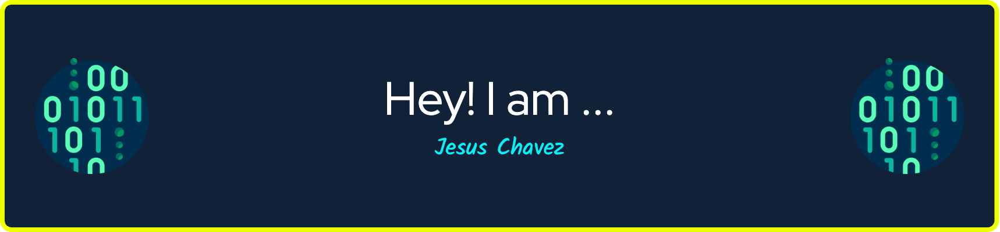

  

## Table of Contents

- [Generative AI](./gen_ai)
- [Machine Learning](./machine_learning)
- [Generative AI and Machine Learning](./ml_and_gen_ai)

## More Resources Like This Repository

As part of this AI/ML community in Google there are other amazing efforts out there to prove the value of managed services, this is my personal repository only (I don't recommend it for production), but here you have one of the best repos I ever seen:

- GitHub [The real AI/ML (vertex-ai-mlops)](https://github.com/statmike/vertex-ai-mlops) by [@statmike](https://github.com/statmike)

Enjoy