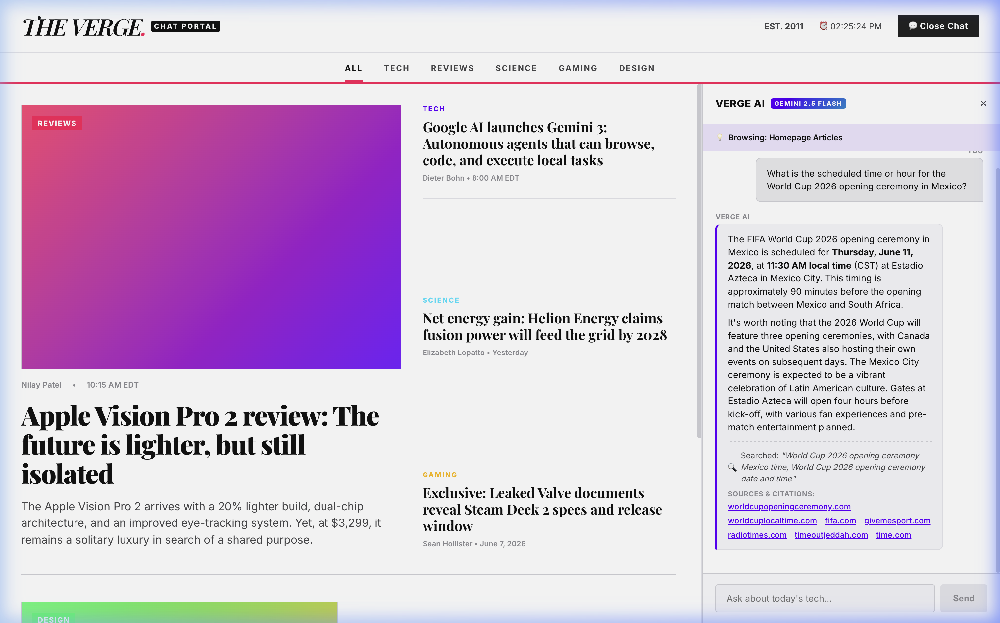
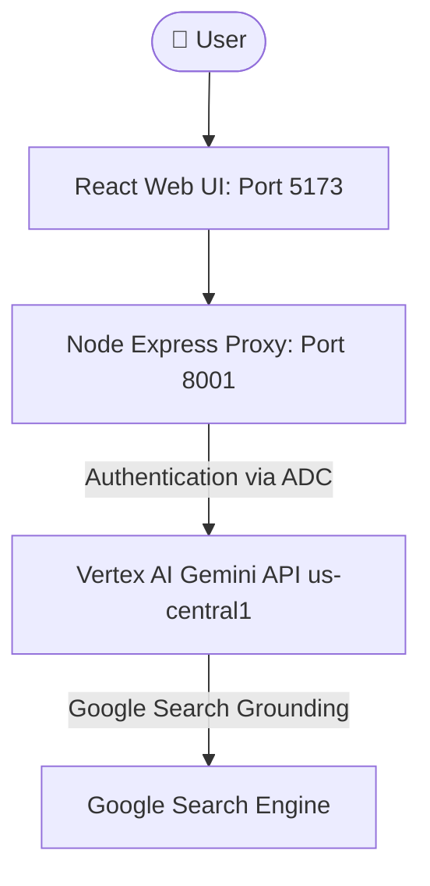

# Recipe: Verge-Inspired Interactive News Chat Portal

This recipe provides the blueprints and detailed workflow to replicate a viewport-locked, tech-journalist-themed news chat clone of **The Verge** from scratch. 

It integrates a local Express proxy backend, connects to Vertex AI using Google Application Default Credentials (ADC), and utilizes **Google Search Grounding** to provide real-time web citations.



---

## 🏛️ Architecture



---

## 🛠️ Replication Blueprint & Runtimes

Replication is achieved with minimal code dependencies by organizing setup, execution, and verification steps into structured **Antigravity Engine** elements:

### 1. Workflows (Markdown Runbooks)
The replication sequence is driven by [replicate_news_portal.md](file:///Users/jesusarguelles/IdeaProjects/vertex-ai-samples/agy-recipes/verge-news-portal/.agent/workflows/replicate_news_portal.md). Rather than a hardcoded script, the workflow acts as a high-freedom runbook. The agent reads the Markdown steps, plans the environment, validates prerequisites, and executes commands dynamically.

### 2. Skills (YAML Capabilities)
Capabilities like project setup, security scanning, and dependency checking are structured as reusable agent Skills. The agent searches and matches active skills (e.g. `managing-recipes` or `secure-development`) to guide code generation:
- Checks port availability and resolves conflicts before launching network services.
- Validates libraries to enforce the **Zero-Leak Protocol** (e.g. preventing `.env` leaks).

### 3. Subagents (Dynamic Child Delegation)
Complex multi-task steps are delegated to specialized subagents using the Agent-to-Agent (A2A) JSON-RPC protocol:
- **Testing Agent**: A headless browser subagent is spawned to load `http://localhost:5173/`, simulate user queries, trigger Google Search grounding, verify that citation links are present, and capture visual confirmations (screenshots).
- **Document Architect**: A writing subagent is defined and invoked dynamically to draft architectural reports in parallel.

### 4. Sidecars & Schedulers (Background Timers)
Long-running development operations or asynchronous check loops are handled via background tasks:
- Background daemons run both the Express proxy API (`8001`) and the Vite frontend dev server (`5173`).
- One-shot reminders are registered via the `/schedule` syntax to wake up the agent and poll background progress without active terminal blocking.

### 5. Artifacts (Persistent Session Outputs)
Execution outputs, system telemetry graphs, browser validation videos, and design reports are structured as Markdown artifacts:
- Screens and UI state changes are saved in the conversation directory (`brain/<id>/`).
- A comprehensive architectural report [antigravity_capabilities_report.md](file:///Users/jesusarguelles/.gemini/jetski/brain/b708b8e5-7016-469c-82ff-14b05fa0a854/antigravity_capabilities_report.md) is created to index the runtime capabilities.

### 6. Agent API CLI (agentapi)
The session CLI utility `/Users/jesusarguelles/.gemini/jetski/bin/agentapi` can be called from shell commands to fetch metadata, send messages between agents, or spawn fresh conversations.

---

## 🚀 Setup & Execution Sequence

To execute this recipe locally:

1. **Verify Environment**:
   ```bash
   node -v && npm -v
   ```
2. **Execute Replication**:
   Trigger the workflow in the Antigravity assistant menu or ask:
   *"Run the replicate_news_portal workflow from the agy-recipes repository."*
3. **Verify Grounding**:
   Confirm that both ports `5173` and `8001` are active, open the portal interface, and submit a search grounding question like *"What hour is the World Cup 2026 opening ceremony in Mexico scheduled for?"* to verify real-time search grounding and citation link render.
