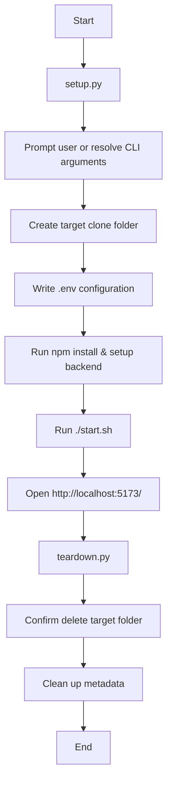

# Deploying the Gemini Enterprise MCP Co-work Portal

This skill provides a self-contained replication playbook to clone the co-work portal, compile dependencies, configure credentials, and run it locally.

## When to use this skill
- Creating a sandbox replication of the Co-work Portal.
- Re-deploying the React frontend and FastAPI backend under a new GCP project or Vertex AI Engine configuration.
- Instantiating a clean copy of the portal for testing new MCP features.

## Workflow

To execute the deployment and verify it:

1. **Replication & Configuration**: Run the interactive setup script `setup.py`. The script copies the core source template to a fresh destination folder, writes a local `.env` with the project settings, and runs package installs.
2. **Startup**: Navigate to the destination directory and launch `./start.sh` to spin up both the FastAPI backend (port `8001`) and React/Vite server (port `5173`).
3. **Browsing**: Navigate to `http://localhost:5173/` and test tools or follow-up recommendation shortcuts.
4. **Teardown**: Run the teardown script `teardown.py` to remove the cloned directory and clear tracking logs.



## Instructions

### 1. Running the Setup
Execute the following command in the workspace root:
```bash
uv run agy-recipes/ge-mcp-cowork/scripts/setup.py
```
*Tip: To run silently (non-interactively) during automation playbooks, pass parameters directly:*
```bash
uv run agy-recipes/ge-mcp-cowork/scripts/setup.py \
  --destination ~/IdeaProjects/my-portal-clone \
  --project-id vtxdemos \
  --project-number 254356041555 \
  --engine-id jira-testing_1778158449701 \
  --non-interactive
```

### 2. Startup & Execution
Go to the target folder and start:
```bash
cd ~/IdeaProjects/my-portal-clone
./start.sh
```

### 3. Cleaning Up
To delete the created portal folder and all files to save space:
```bash
uv run agy-recipes/ge-mcp-cowork/scripts/teardown.py
```

## Resources
- [Setup Script](scripts/setup.py)
- [Teardown Script](scripts/teardown.py)
- [Deployment Workflow](../../.agent/workflows/deploy-ge-mcp-cowork.md)
- [Destroy Workflow](../../.agent/workflows/destroy-ge-mcp-cowork.md)
