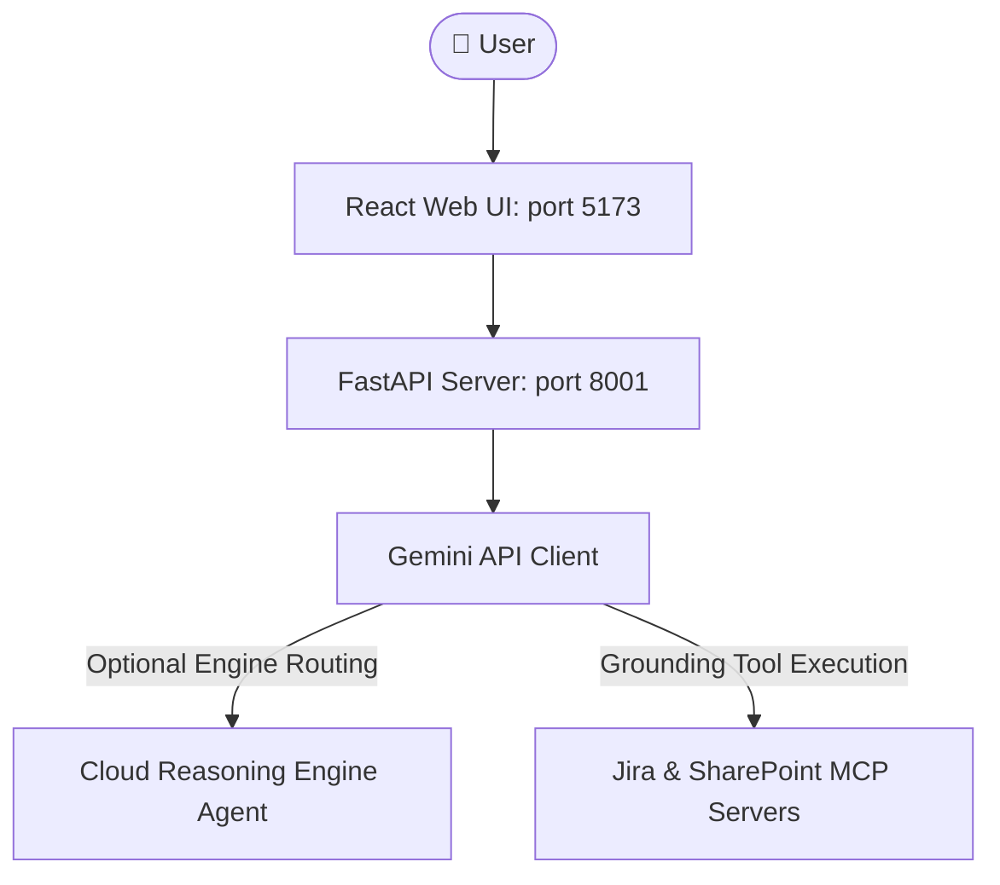

# Recipe Title: Gemini Enterprise MCP Co-work Portal

This recipe structures and deploys a local web portal (FastAPI + React) designed to interface with Gemini Enterprise and exposed MCP connectors (like Jira and SharePoint), allowing users to issue queries and get interactive, grounding-visualized responses.

---

## 🏛️ Architecture



---

## 🛠️ Prerequisites

1. **Python 3.12+** with `uv` installed.
2. **NodeJS 18+** with `npm` installed.
3. **Active GCP Authentication** (ADC credentials configured via `gcloud auth application-default login`).
4. **Vertex AI Gemini Enterprise** enabled in the project.

---

## 🚀 Setup & Replication Sequence

To clone and configure the portal in your active workspace:

### 1. Bootstrap Agent Workflows & Skills
If deploying conversationally with Antigravity, copy the recipe's agent configuration files into your local `.agent` folder first:
```bash
# Create local agent directories
mkdir -p ./.agent/skills/replicating-ge-mcp-cowork
mkdir -p ./.agent/workflows

# Copy workflow and skill instructions from the local repository
cp -r ~/IdeaProjects/vertex-ai-samples/agy-recipes/ge-mcp-cowork/.agent/skills/replicating-ge-mcp-cowork/* ./.agent/skills/replicating-ge-mcp-cowork/
cp -r ~/IdeaProjects/vertex-ai-samples/agy-recipes/ge-mcp-cowork/.agent/workflows/* ./.agent/workflows/
```

### 2. Execute Setup and Replication
Run the setup script using `uv` to replicate the files and configure environment variables:
```bash
uv run agy-recipes/ge-mcp-cowork/scripts/setup.py
```
*(Alternatively, for non-interactive agent execution, pass configuration parameters as arguments)*:
```bash
uv run agy-recipes/ge-mcp-cowork/scripts/setup.py \
  --destination ./ge-mcp-cowork-portal \
  --project-id vtxdemos \
  --project-number 254356041555 \
  --engine-id jira-testing_1778158449701 \
  --jira-url sockcop.atlassian.net \
  --non-interactive
```


### 2. Startup the Portal
Once setup finishes:
1. Navigate to the replicated directory:
   ```bash
   cd ./ge-mcp-cowork-portal
   ```
2. Start the FastAPI backend and Vite frontend servers:
   ```bash
   ./start.sh
   ```
3. Open your browser and navigate to: **`http://localhost:5173`**

---

## 🧹 Teardown

To cleanly remove the replicated application folder and cleanup metadata:
```bash
uv run agy-recipes/ge-mcp-cowork/scripts/teardown.py
```
