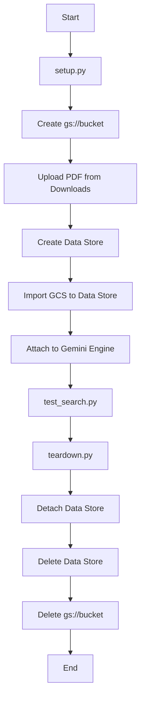

# Integrating WIF, GCS, and StreamAssist

This skill provides recipes and automations to deploy an unstructured Google Cloud Storage (GCS) Data Store, hook it up to a Gemini Enterprise engine, and run testing using Workforce Identity Federation (WIF) or standard Application Default Credentials (ADC).

## When to use this skill
- Setting up a temporary or persistent GCS bucket for document search.
- Indexing PDFs from local storage (like `~/Downloads`) to GCP.
- Connecting unstructured data stores to an existing Gemini Enterprise app.
- Querying the `streamAssist` API with specific data store constraints.
- Cleaning up all resources after testing.

## Workflow

To execute the deployment and verify it:

1.  **Preparation**: Ensure you are logged into GCP and have selected the target project (`vtxdemos`).
2.  **Deployment**: Execute `setup.py` using `uv run`. This creates the bucket, uploads a PDF, creates the Data Store, imports the document, and attaches it.
3.  **Verification**: Execute `test_search.py` using `uv run`. Pass an optional query. By default it uses local ADC, but will auto-detect WIF token if `/tmp/entra_token.txt` is present.
4.  **Teardown**: Execute `teardown.py` using `uv run` to delete the bucket, datastore, and detach it from the engine.



## Instructions

### 1. Running the Setup
Execute the following command in the workspace root:
```bash
uv run agy-recipes/ge_api_wif_gcs/scripts/setup.py
```
This script saves the generated resource names to `last_setup_resources.json` to allow clean teardown.

### 2. Testing the Search
To search the newly created GCS index using standard ADC credentials:
```bash
uv run agy-recipes/ge_api_wif_gcs/scripts/test_search.py "What are the financial highlights?"
```

To test using WIF, write your Microsoft Entra ID JWT token to `/tmp/entra_token.txt` first:
```bash
echo "YOUR_ENTRA_JWT_TOKEN" > /tmp/entra_token.txt
uv run agy-recipes/ge_api_wif_gcs/scripts/test_search.py "What are the financial highlights?"
```

### 3. Cleaning Up
To delete all resources created during setup and avoid any costs:
```bash
uv run agy-recipes/ge_api_wif_gcs/scripts/teardown.py
```

## Resources
- [Setup Script](scripts/setup.py)
- [Teardown Script](scripts/teardown.py)
- [Test Script](scripts/test_search.py)
- [Deployment Workflow](../../.agent/workflows/deploy-ge-wif-gcs.md)
- [Destroy Workflow](../../.agent/workflows/destroy-ge-wif-gcs.md)
