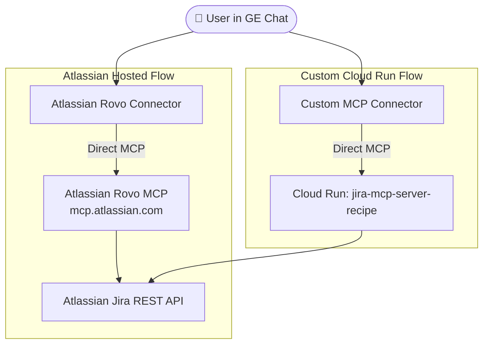

# Jira MCP Direct Recipe

This recipe sets up and configures two direct Jira MCP connectors in Gemini Enterprise (GE):
1. **Atlassian Rovo Hosted MCP Connector**: Direct connection to Atlassian's hosted MCP endpoint (`https://mcp.atlassian.com/v1/mcp`) using Dynamic Client Registration (DCR) credentials.
2. **Custom MCP on Cloud Run Connector**: Direct connection to a private MCP server deployed to Cloud Run, implementing the **Five-Part Recipe** for silent, popup-free search dispatch.

---

## 🏛️ Architecture



---

## 🛠️ Prerequisites

1. **Google Cloud Project** with Gemini Enterprise enabled (default: `vtxdemos` / `254356041555`).
2. **Atlassian Account** with admin access to your Jira site (e.g., `sockcop.atlassian.net`).
3. **Atlassian Developer App** created at [developer.atlassian.com/console](https://developer.atlassian.com/console) with scopes:
   * `read:jira-work`, `write:jira-work`, `read:jira-user`, `offline_access`
   * Obtain the Client ID and Client Secret for the **Custom MCP (Option C)** setup.
4. **Active GCloud SDK Authentication** with Owner/Admin permissions on the GCP project.
5. **Python 3.12+** with `uv` installed.

---

## 🚀 Setup Sequence

### 1. Configure `.env` File
Create a `.env` file inside `agy-recipes/jira-mcp-direct/` (this file is gitignored):
```env
GE_PROJECT_ID=vtxdemos
GE_PROJECT_NUMBER=254356041555
GE_ENGINE_ID=jira-testing_1778158449701
ATLASSIAN_CLIENT_ID=your-option-c-client-id
ATLASSIAN_CLIENT_SECRET=your-option-c-client-secret
```

### 2. Run Setup Script
Execute the setup script using `uv`:
```bash
uv run scripts/setup.py
```
This script will:
* Deploy the custom MCP server `jira-mcp-server-recipe` to Cloud Run.
* Perform Atlassian Dynamic Client Registration (DCR) to generate client credentials for Rovo.
* Programmatically create both Custom MCP datastores in Gemini Enterprise.
* Attach both datastores to your GE Engine.
* Save deployment details to `last_setup_resources.json`.

### 3. Complete Console Steps (Required for OAuth)
Because Atlassian's OAuth 2.1 3LO flow requires interactive user consent, you must complete the final wiring in the Cloud Console:

1. **Atlassian Hosted (Rovo) Connector**:
   * Open the GE Console -> **Data stores** -> select your `jiramcp-rovo-recipe` datastore -> **Actions** tab.
   * Click **Reload custom actions** to discover Rovo's 37 tools. Check the tools you want (e.g. `searchJiraIssuesUsingJql`, `getJiraIssue`) and click **Enable actions**.
   * Click **Re-authenticate** in the dialog. Run `python -c "import json; print(json.load(open('~/.secrets/atlassian-rovo-dcr-ge.json')))"` to print the DCR client ID and Secret, paste them into the dialog, and click **Connect**.
   * Complete the Atlassian consent popup and authorize access to `sockcop.atlassian.net` (Jira only).

2. **Custom MCP on Cloud Run Connector**:
   * Open the GE Console -> **Data stores** -> select your `jiramcp-custom-recipe` datastore -> **Actions** tab.
   * Click **Reload custom actions** to discover the custom tools. Enable the tools and click **Re-authenticate**.
   * Paste your standard Atlassian App Client ID and Secret (from step 1), connect, and complete the OAuth consent popup.

---

## 🧪 Verification & Testing

Once both connectors are authenticated and show as **Active** in the Console, run the verification script:
```bash
uv run scripts/test_recipe.py
```
This will query the `streamAssist` API using both datastores to confirm they return correct Jira tickets and execute queries end-to-end.

---

## 🧹 Teardown

To delete all created resources (Cloud Run service, GE datastores, DCR local configs):
```bash
uv run scripts/teardown.py
```
