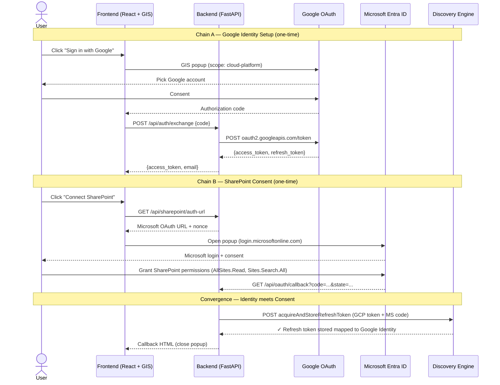
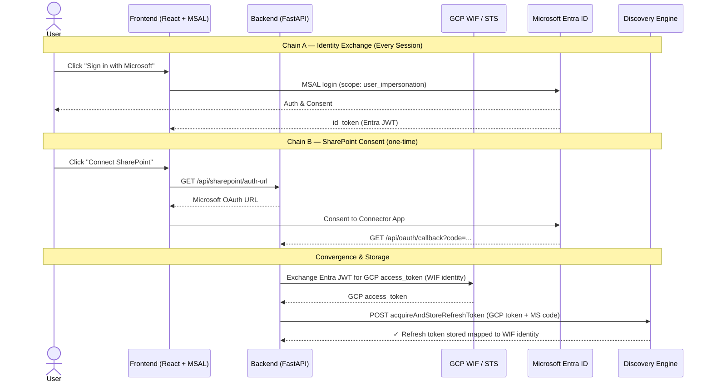

# Reference Guide: SharePoint to GCP Integration & Auth Architectures

This guide documents the two primary architectures for integrating Microsoft SharePoint Online with Google Cloud (specifically Vertex AI Search / Discovery Engine) to enable secure, per-user permission-aware document retrieval. 

---

## 1. WIF vs. GIS Architecture Comparison

Depending on your enterprise identity strategy, you can choose between **Workforce Identity Federation (WIF)** or **Google Cloud Identity (GIS)**.

| Feature | Workforce Identity Federation (WIF) | Google Cloud Identity (GIS) |
| :--- | :--- | :--- |
| **Primary Identity** | Microsoft Entra ID (User logs in via Microsoft) | Google Cloud Identity (User logs in via Google) |
| **Token Exchange** | Entra JWT → GCP STS → GCP Token | Google Auth Code → GCP Token |
| **WIF Configuration** | Yes (Workforce Pool + OIDC Provider) | No |
| **Microsoft Apps** | **2 Apps** (Portal App + Connector App) | **1 App** (Connector App only) |
| **Client Auth Library** | `@azure/msal-browser` | Google Identity Services (GIS) |

---

## 2. Architecture A: Google Cloud Identity (GIS) Flow

This architecture uses Google Cloud Identity as the primary user login. It maps the user's Google session to their SharePoint permissions by storing a Microsoft OAuth refresh token inside Discovery Engine.

### GIS Sequence Diagram



### Key GIS Code Snippets

#### 1. Google OAuth Token Exchange (FastAPI)
Exchanges the Google auth code for a GCP `access_token` representing the user's GCP identity:
```python
resp = requests.post("https://oauth2.googleapis.com/token", data={
    "code": code,
    "client_id": GOOGLE_CLIENT_ID,
    "client_secret": GOOGLE_CLIENT_SECRET,
    "redirect_uri": "postmessage",  # Required for GIS popup flow
    "grant_type": "authorization_code",
})
gcp_token = resp.json().get("access_token")
```

#### 2. SharePoint Refresh Token Convergence
Links the Microsoft authorization code to the user's GCP identity inside Discovery Engine:
```python
resp = requests.post(
    "https://discoveryengine.googleapis.com/v1alpha/projects/{project_number}/locations/global/dataConnectors/{connector_id}:acquireAndStoreRefreshToken",
    headers={"Authorization": f"Bearer {gcp_token}"},
    json={"fullRedirectUri": full_callback_url_with_code},
)
```

---

## 3. Architecture B: Workforce Identity Federation (WIF) Flow

This architecture federates Microsoft Entra ID with GCP IAM. Users sign in exclusively using their corporate Microsoft credentials. GCP trusts the Entra ID token, exchanging it for a short-lived GCP token via the Security Token Service (STS).

### WIF Sequence Diagram



### Key WIF Code Snippets

#### 1. STS Token Exchange (Entra JWT → WIF/GCP Token)
Converts the Microsoft-signed token into a GCP authorization token:
```python
body = {
    "audience": f"//iam.googleapis.com/locations/global/workforcePools/{WIF_POOL_ID}/providers/{WIF_PROVIDER_ID}",
    "grantType": "urn:ietf:params:oauth:grant-type:token-exchange",
    "requestedTokenType": "urn:ietf:params:oauth:token-type:access_token",
    "scope": "https://www.googleapis.com/auth/cloud-platform",
    "subjectToken": entra_jwt,
    "subjectTokenType": "urn:ietf:params:oauth:token-type:id_token",
}
resp = requests.post("https://sts.googleapis.com/v1/token", json=body)
gcp_wif_token = resp.json().get("access_token")
```

---

## 4. Microsoft Graph API Client Best Practices (Python)

When performing custom backend crawling or on-the-fly metadata fetching, use the following `httpx` async patterns.

### Client Implementation

```python
import httpx
import logging

logger = logging.getLogger("sharepoint.client")
GRAPH_BASE_URL = "https://graph.microsoft.com/v1.0"

class GraphClient:
    def __init__(self, bearer_token: str, timeout: float = 60.0):
        self.bearer = bearer_token
        self.timeout = timeout

    def _headers(self) -> dict:
        return {
            "Authorization": f"Bearer {self.bearer}",
            "Accept": "application/json",
            "Content-Type": "application/json"
        }

    async def get_file_content(self, drive_id: str, item_id: str) -> bytes:
        """Download raw file bytes on the fly."""
        url = f"{GRAPH_BASE_URL}/drives/{drive_id}/items/{item_id}/content"
        async with httpx.AsyncClient(timeout=120.0, follow_redirects=True) as client:
            response = await client.get(url, headers=self._headers())
            
            # Handle Microsoft Throttling (HTTP 429)
            if response.status_code == 429:
                retry_after = int(response.headers.get("Retry-After", 5))
                logger.warning(f"Throttled. Backing off for {retry_after}s.")
                raise ThrottledException(retry_after)
                
            response.raise_for_status()
            return response.content
```

---

## 5. Critical Integration Gotchas

1. **Manifest setting for WIF:** The Portal App registration in Microsoft Entra must have `"oauth2AllowIdTokenImplicitFlow": true` set in its manifest file, otherwise WIF validation silently rejects the tokens.
2. **Hardcoded Redirect URI:** Discovery Engine's `acquireAndStoreRefreshToken` endpoint expects the redirect URI to be exactly `https://vertexaisearch.cloud.google.com/oauth-redirect`. Your Microsoft App registration must match this.
3. **Session vs. assistToken:** When implementing multi-turn chats via Vertex AI Search StreamAssist, the API returns an `assistToken` in the response, but rejects it as input in follow-up queries. Always use `sessionInfo.session` (formatted as a path `projects/.../sessions/...`) to maintain conversation context.
4. **Cloud-Platform Scope:** For GIS authentication, you must explicitly request the `https://www.googleapis.com/auth/cloud-platform` scope during Google Sign-In, otherwise calls to Discovery Engine APIs will yield HTTP 403 errors.
