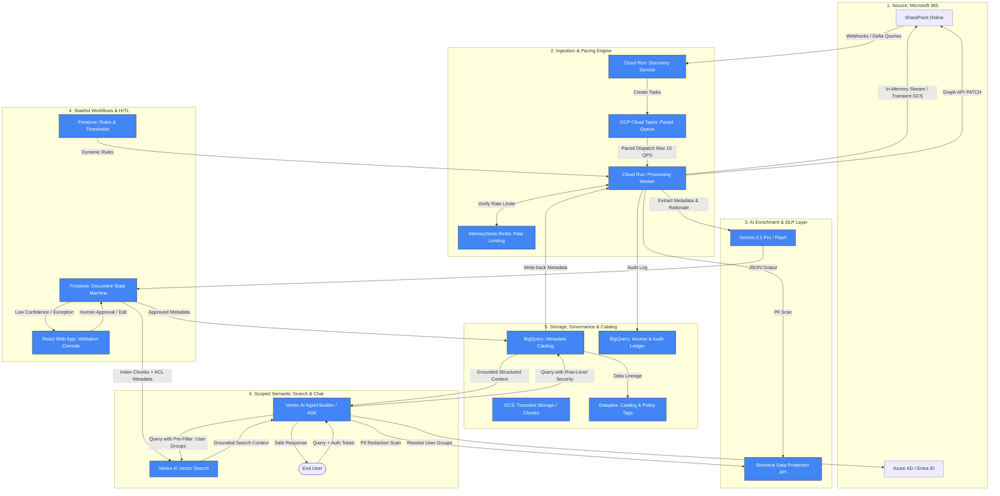

# Enterprise Blueprint: Secure SharePoint Ingestion, AI Classification, & Governance on Google Cloud

This blueprint outlines the final solution architecture designed to ingest, classify, govern, and search SharePoint documents securely on Google Cloud. It integrates all 45 customer functional requirements and incorporates lessons learned from enterprise crawling patterns (e.g., Glean, GWMv3) to resist API throttling.

---

## 1. System Architecture Diagram



---

## 2. Key Components & Implementation Details

### A. Ingestion & Throttling Pacing Engine (Pillar 2)
To bypass SharePoint Online's strict API quotas, the ingestion is decoupled and rate-limited.
*   **App-Only Authentication:** Connects to Microsoft Graph using OIDC-based **Federated Credentials** mapping GCP Service Accounts to Microsoft Entra applications, eliminating credential management.
*   **Rate-Limiter (Redis):** Tracks tenant-level and app-level QPS.
*   **Cloud Tasks Queue:** Distributes execution. If a download worker hits an `HTTP 429` error:
    1. It reads the `Retry-After` header.
    2. It reschedules the ingestion task to retry after the specified delay.
    3. It logs the delay metric to **Cloud Logging**.
*   **Delta Processing:** Subsequent scans utilize Microsoft Graph's delta tokens (`/delta`) to only retrieve changes, avoiding large-scale scans.

### B. Enrichment & Explainable AI Layer (Pillar 3)
*   **Gemini 2.5 Flash/Pro:** Used with strict JSON Schema generation (Structured Outputs).
*   **Explainability (FR12):** The prompt forces the model to return evidence strings alongside extracted properties:
    ```json
    {
      "value": "Confidential",
      "rationale": "Marked as 'Strictly Confidential' on page 1 footer.",
      "confidence_score": 0.98
    }
    ```
*   **Transient Storage for Large Files:** Documents under 15MB are processed directly in Cloud Run memory. Files over 15MB are staged to a transient **GCS Bucket** configured with a 24-hour Auto-Delete lifecycle policy.

### C. Human-in-the-Loop Workflow & QA Console (Pillar 4)
*   **Document State Machine:** Firestore tracks the processing lifecycle (`PENDING_INGESTION`, `EXTRACTED`, `PENDING_HUMAN_QA`, `APPROVED`, `EXCEPTION`).
*   **Routing Logic:** If any critical metadata field has a confidence score lower than the threshold (e.g., `confidence_score < 0.85`), the workflow routes the document to the **QA React Console**.
*   **Negative Approval Workflow (FR18):** Cloud Tasks schedules a timeout task. If an engagement lead does not veto or approve an item within 5 days, the system automatically transitions the state to `APPROVED` and proceeds to downstream indexing.

### D. Governance, Versioning & Access-Aware Search (Pillars 5 & 6)
*   **Dataplex & BQ RLS:** All metadata is cataloged in **BigQuery**. We apply **Row-Level Security (RLS)** using User Azure AD group memberships mapped via Cloud Identity.
*   **Access-Aware Vector Search (FR39):** Chunks stored in **Vertex AI Vector Search** include an attribute list of allowed AD Group IDs. When a user queries the Chat Agent, the agent checks the user's groups and appends them as metadata pre-filters, preventing unauthorized documents from ever entering the LLM prompt context.
*   **Write-Back Service (FR30):** Once metadata is finalized (auto-approved or human-validated), a Cloud Run worker writes the tags back to SharePoint columns using the Microsoft Graph API.

---

## 3. Mapping of the 45 Functional Requirements

| ID | Requirement Name | Architectural Solution & Component |
| :--- | :--- | :--- |
| **FR01** | Document classification | **Gemini 2.5** classifying document types using schema constraints. |
| **FR02** | Lifecycle tagging | **Gemini 2.5** extracting lifecycle metadata (draft, final, archive). |
| **FR03** | Qualifying document identification | **Cloud Run Router** mapping document classifications against inclusion criteria. |
| **FR04** | Duplicate and version handling | **BigQuery Hash Indexing** matching document `content_hash` and tracking GCS generation values. |
| **FR05** | Configurable rules & thresholds | **Firestore Rules Document** storing confidence parameters dynamically. |
| **FR06** | Content ingestion from governed sources | **Cloud Run Discovery Service** with Entra federated connections. |
| **FR07** | Metadata quality rule validation | **Cloud Run Worker** running data validation schemas on extraction JSON. |
| **FR08** | Related content | **Vertex AI Vector Search** performing similarity queries on text chunk embeddings. |
| **FR09** | Search enablement | **Vertex AI Search** indexed with extracted metadata fields as query facets. |
| **FR10** | Engagement letter terms validation | **Gemini 2.5 Pro** scanning engagement letters for signatures and caps. |
| **FR11** | Entity extraction | **Gemini Entity Extraction** mapping entities to taxonomy terms. |
| **FR12** | Tagging evidence and rationale | Gemini JSON response schema requiring `rationale` for each tag. |
| **FR13** | Tag QA workflow | **Firestore State Machine** routing low-confidence tags to QA queue status. |
| **FR14** | Mandatory tagging | **React QA UI** enforcing required metadata inputs before save actions. |
| **FR15** | Tagging ownership | **Dataplex Catalog** metadata records tracking owner roles. |
| **FR16** | Item-level confidence scoring | Gemini JSON schema returning model confidence metrics. |
| **FR17** | Human validation workflow | **React QA UI** permitting manual override, reject, and approval. |
| **FR18** | Negative approval option | **Cloud Tasks** executing automatic approvals after expiration. |
| **FR19** | Action audit trail | **BigQuery Audit Ledger** storing all pipeline events and user overrides. |
| **FR20** | Reviewer feedback loop | QA console overrides saved to BQ to trigger monthly model tuning jobs. |
| **FR21** | Incident logging & tracking | Failures logging alerts to **Cloud Monitoring** & creating items in Exception BQ. |
| **FR22** | Delta processing | Microsoft Graph API **Delta Queries** tracked via synced delta tokens. |
| **FR23** | Tagging at ingestion | Cloud Run runs extraction pipeline immediately during the ingestion stage. |
| **FR24** | Integration | Downstream APIs reading BQ metadata catalog and Vertex Search API. |
| **FR25** | SaveIt handoff options | Custom Cloud Run connector writing files/metadata to SaveIt. |
| **FR26** | End-to-end metadata lineage | **Dataplex Lineage API** tracking ingested files to BQ mappings. |
| **FR27** | Repository context capture | Graph API extracting site, library, folder hierarchy details. |
| **FR28** | Structured metadata ingestion | Ingestion worker mapping existing SharePoint column values into catalog. |
| **FR29** | Metadata mapping to SaveIt | BQ views translating catalog schema into SaveIt input taxonomy formats. |
| **FR30** | Source-system metadata write-back | Cloud Run worker executing Graph API PATCH requests back to SharePoint. |
| **FR31** | Migration support | Dataplex tags mapped dynamically when documents are moved within GCS/BQ. |
| **FR32** | Bulk reprocessing | Cloud Run job that iterates BQ catalog and re-runs Gemini on GCS assets. |
| **FR33** | System of record preservation | Source files left intact in SharePoint; GCP acts as metadata registry. |
| **FR34** | Relationship extraction | Graph database / BQ tables storing parent-child document linkages. |
| **FR35** | EL to deliverable linkage | BQ relational queries matching Engagement ID across deliverables. |
| **FR36** | Validation report | **Looker Studio / React UI Dashboard** reading BQ Catalog + exceptions. |
| **FR37** | Non-standard liability cap flagging | BQ flagging records where Gemini-extracted liability cap != company standard. |
| **FR38** | Scope and date limitation controls | Ingestion job validating dates and sources against Firestore parameters. |
| **FR39** | Access-aware tagging | **Vertex AI Vector Search** filtering results using Entra group lists. |
| **FR40** | Sensitive workspace exclusion | Pre-ingestion check matching SharePoint Site ID against Firestore blacklist. |
| **FR41** | Automated semantic tagging | Pipeline execution using Gemini without human intervention by default. |
| **FR42** | Controlled taxonomy | Gemini schemas matching extractions to list values stored in Firestore. |
| **FR43** | Hierarchy support | Taxonomy rules defined in Firestore structures (e.g., Parent/Child tags). |
| **FR44** | EL processing dependency | Workflow rules blocking deliverable review until linked EL status is `APPROVED`. |
| **FR45** | Exception queue | State routing failed records to `STATUS = EXCEPTION` inside Firestore. |

---

## 4. Implementation Phasing Plan

```
Phase 1: Foundation & Delta Ingestion (Weeks 1-6)
├── Establish Entra Federated authentication mapping
├── Implement Cloud Run Discovery + Cloud Tasks queue pacing
├── Create BigQuery catalog schema and enable Delta processing
└── Deliverable: Robust paced ingestion capturing SharePoint files to GCS/BQ

Phase 2: AI Classification & Rule Engine (Weeks 7-12)
├── Write and validate Gemini 2.5 schemas for tagging (FR01, FR02, FR11)
├── Integrate DLP API for sensitive matter masking (FR40)
├── Implement explains & confidence scoring (FR12, FR16)
└── Deliverable: Automated ingestion pipeline producing classified metadata catalog

Phase 3: Workflows, QA Portal & Write-Back (Weeks 13-18)
├── Build React QA Console for validation (FR17)
├── Implement Firestore state machine & Negative approval jobs (FR13, FR18)
├── Develop Microsoft Graph metadata Write-Back service (FR30)
└── Deliverable: End-to-end governed pipeline with human verification capabilities

Phase 4: Scoped Chat & Search (Weeks 19-24)
├── Establish Vertex AI Vector Search index with metadata filters (FR39)
├── Build Vertex AI ADK chat interface with PII redaction guardrails
├── Implement Looker Studio Validation Reporting (FR36)
└── Deliverable: Secure, compliant, and context-aware enterprise search assistant
```
