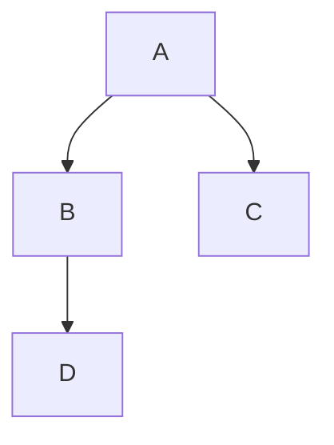

```mermaid
flowchart LR
  subgraph TOP
    direction TB
    subgraph B1
        direction RL
        i1 -->f1
    end
    subgraph B2
        direction BT
        i2 -->f2
    end
  end
  A --> TOP --> B
  B1 --> B2
  ```