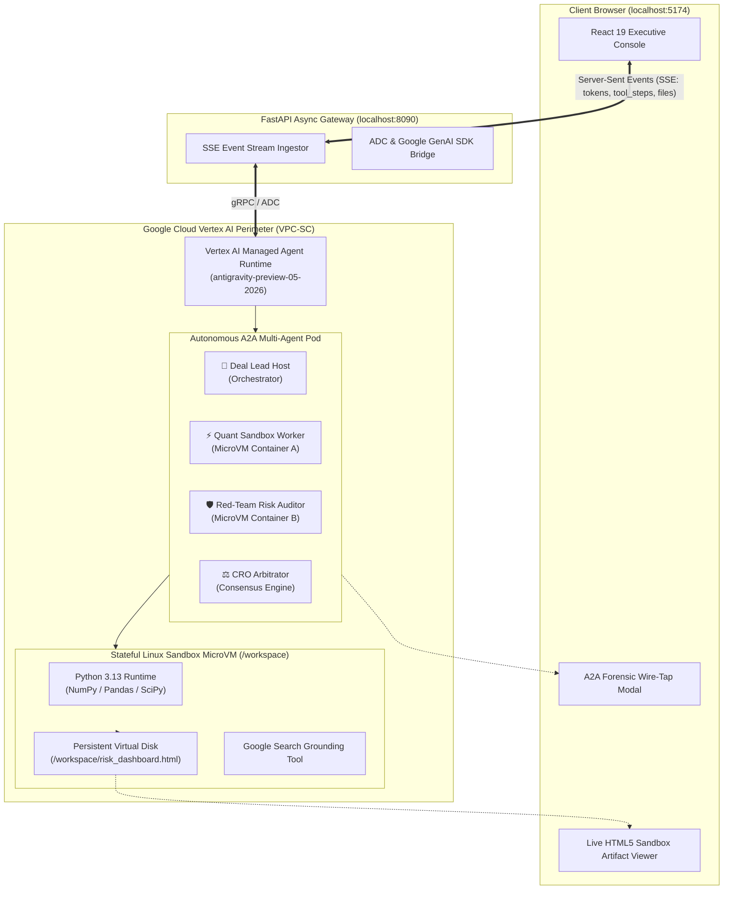

<div align="center">

# ⚡ Vertex AI Managed Agents: Autonomous Cloud Sandbox & A2A Wire-Tap
### *Next-Generation Autonomous Multi-Agent Computing, Dedicated MicroVM Sandboxes, & Adversarial Governance Protocol*

[](https://cloud.google.com/vertex-ai)
[](https://cloud.google.com)
[](https://cloud.google.com)
[](https://cloud.google.com)
[](https://react.dev)

</div>

---

## 🌟 Executive Overview & The "Why"

Standard enterprise chatbots predict text tokens in a vacuum. When tasked with complex mathematical modeling, live web research, or software engineering, they hallucinate because they lack **computational execution environments** and **adversarial verification**.

**Vertex AI Managed Agents** solve this fundamentally by pairing frontier Gemini intelligence with **dedicated, stateful remote Linux microVM containers (`/workspace`)** hosted directly within the customer's Google Cloud perimeter.

### 💎 Key Differentiators for the Boardroom (EBC)

1. **The Tri-Modal Execution Pipeline**:
   - **Live Grounding**: Autonomous Google Search Grounding to extract live macro, earnings, and regulatory data.
   - **Raw Heavy Compute**: Isolated Linux MicroVMs executing 10,000+ iteration Python simulations (`NumPy`, `SciPy`, `Pandas`).
   - **Zero-Parsing Dynamic UI**: Immediate compilation and embedded rendering of self-contained, interactive HTML5/SVG decision dashboards.
2. **A2A (Agent-to-Agent) Adversarial Governance**:
   - Implements **Separation of Duties (SoD)** and **Model Risk Management (SR 11-7)**.
   - A 4-agent digital pod where a **Deal Lead** delegates compute to a **Quant Sandbox Worker**, an adversarial **Red-Team Risk Auditor** challenges assumptions, and a **Chief Risk Officer (CRO)** arbitrates consensus.
3. **Enterprise VPC-SC Perimeter (CISO Proof)**:
   - Unlike 3rd-party SaaS sandboxes where IP and datasets leave the corporate boundary, all microVMs execute within Google Cloud VPC Service Controls with zero training on customer data.
4. **Deterministic Forensic Wire-Tap**:
   - Complete audit trail of every JSON-RPC envelope, tool call, command execution, and file SHA-256 hash.

---

## 🏛️ System Architecture



---

## 🛠️ The Antigravity Recipe: How to Build This System

This section serves as a step-by-step blueprint for Antigravity AI agents and engineers to reproduce or extend this platform.

### Step 1: Authentication & Identity Setup
The system relies strictly on **Google Cloud Application Default Credentials (ADC)**. No hardcoded API keys.

```bash
# Set target Google Cloud project
export GOOGLE_CLOUD_PROJECT="vtxdemos"
export GOOGLE_CLOUD_LOCATION="global"

# Authenticate local environment
gcloud auth application-default login
```

### Step 2: Asynchronous GAOS Python Stream Broker (`backend/main.py`)
Use `google-genai` with `vertexai=True` to create streaming interactions against remote Linux environments:

```python
from google import genai
from fastapi import FastAPI
from sse_starlette.sse import EventSourceResponse

client = genai.Client(vertexai=True, project="vtxdemos", location="global")

@app.post("/api/chat")
async def chat_endpoint(req: ChatRequest):
    async def event_generator():
        # Dispatch interaction to Managed Agent with remote Linux container
        stream_response = client.interactions.create(
            agent="antigravity-preview-05-2026",
            input=req.message,
            environment={"type": "remote"} if not req.environment_id else {"id": req.environment_id},
            stream=True
        )
        for event in stream_response:
            # Yield real-time tokens, tool step executions, and disk artifacts over SSE
            if event.event_type == "content.delta":
                yield {"event": "token", "data": json.dumps({"text": event.delta.text})}
            elif event.event_type == "interaction.completed":
                yield {"event": "done", "data": json.dumps({"status": "completed"})}
                return

    return EventSourceResponse(event_generator())
```

### Step 3: Zero-Parsing React 19 Frontend (`frontend/src/App.tsx`)
1. Ingest SSE streams chunk-by-chunk with state machine preservation.
2. Intercept `create_file` tool arguments and bash heredocs (`cat << 'EOF' > ...`) on the fly.
3. Cache file artifacts into `sandboxFiles` state.
4. Render interactive HTML5 dashboards securely using `srcDoc` within `<iframe sandbox="allow-scripts" />`.

### Step 4: A2A Protocol Implementation (Forensic Wire-Tap)
Construct structured JSON-RPC envelopes representing inter-agent handshakes:

```typescript
interface A2AMessage {
  id: string;
  traceId: string;
  sender: { agentId: string; role: string };
  recipient: { agentId: string; role: string };
  intent: 'DELEGATE_SIMULATION' | 'CHALLENGE_ASSUMPTION' | 'RECALIBRATE_MODEL' | 'CONSENSUS_REACHED';
  status: 'VERIFIED' | 'DISPUTED' | 'RECALIBRATED' | 'SIGNED';
  summary: string;
  hash: string;
  payload: Record<string, any>;
}
```

---

## 🎭 The Executive Briefing (EBC) Playbook: 4 Acts

Use this 4-Act script when presenting to CIOs, CTOs, and CISOs:

| Act | Demo Action | Boardroom Talking Point |
| :--- | :--- | :--- |
| **Act 1: Real-World Search** | Click **"Live M&A Market Intelligence"** | *"The agent accesses live internet data via Google Search Grounding, computes valuation multiples in Python, and saves `/workspace/market_comparison.csv`."* |
| **Act 2: Heavy Simulation** | Click **"10,000-Iteration Monte Carlo Stress Test"** | *"Instead of hallucinating probability distributions, the agent writes and executes raw mathematical models inside its own dedicated Linux microVM container."* |
| **Act 3: One-Click Interactive UI** | Click **`📁 Sandbox Disk`** $\rightarrow$ **`👁 View`** on `risk_dashboard.html` | *"Zero waiting. The agent generated a standalone, interactive board-ready web app. Executives can adjust live sensitivity sliders and shock buttons in real time."* |
| **Act 4: A2A Adversarial Governance** | Click **`🌐 A2A Wire-Tap`** $\rightarrow$ **`▶ Replay Adversarial Audit`** | *"We do not let a single AI approve its own work. Our Red-Team Auditor challenged the Quant Worker's assumptions, forced a recalibration, and the CRO signed a verified consensus memo."* |

---

## 🚀 Quickstart & How to Run

### Prerequisites
- Node.js 18+
- Python 3.11+ & [`uv`](https://github.com/astral-sh/uv)
- Google Cloud ADC configured (`gcloud auth application-default login`)

### One-Command Launch
```bash
cd antigravity-sandbox-chat
./start.sh
```

- **Frontend Console**: [http://localhost:5174](http://localhost:5174)
- **FastAPI Stream Gateway**: [http://127.0.0.1:8090](http://127.0.0.1:8090)

---

## 🔒 Security & Zero-Leak Protocol

- **Zero API Keys in Code**: Pure IAM Application Default Credentials (ADC).
- **VPC Service Controls**: Data and microVM execution stay strictly inside Google Cloud tenant.
- **MicroVM Isolation**: Remote execution environments have root `/workspace` isolation with no cross-tenant memory bleed.
- **SOC2 & SR 11-7 Compliance**: Every inter-agent message carries an immutable cryptographic SHA-256 payload hash and audit trail.

---

<div align="center">
  <sub>Built with ❤️ for Google Cloud Executive Briefing Center (EBC) & Antigravity Proving Grounds</sub>
</div>
