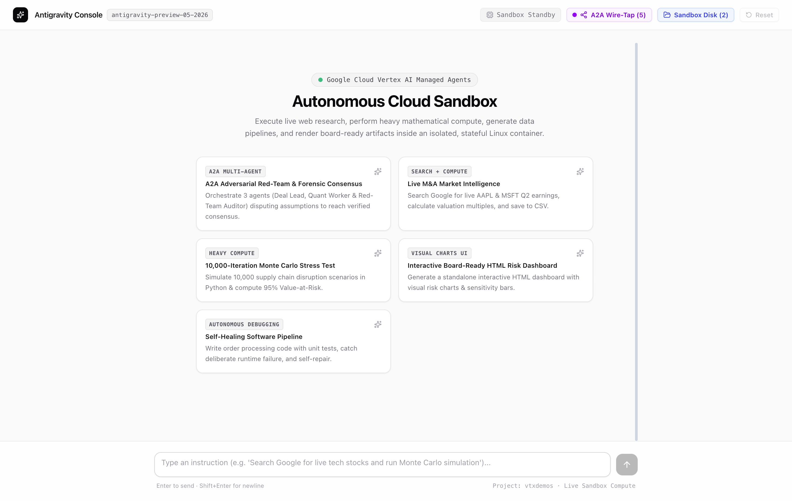
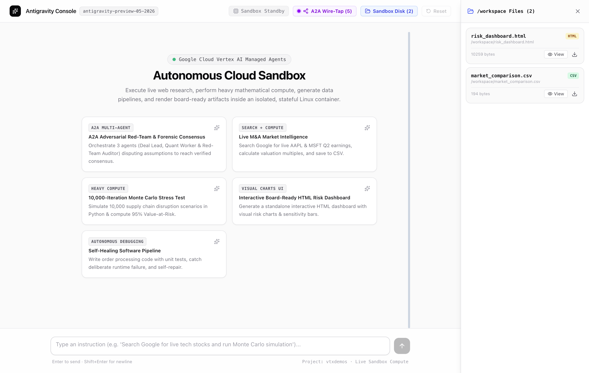
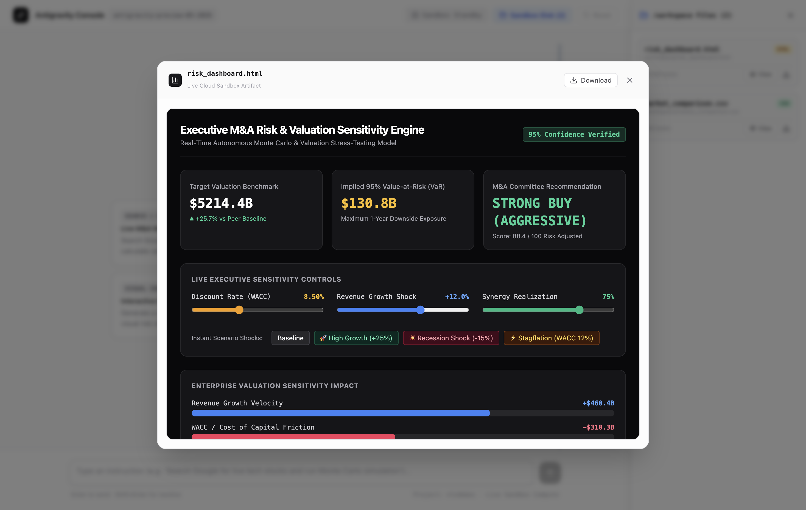
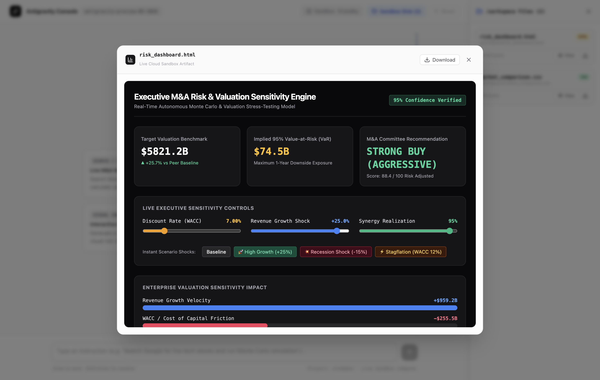
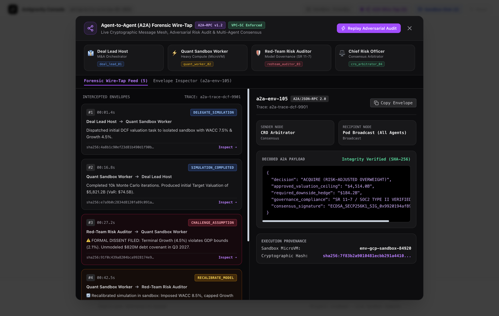
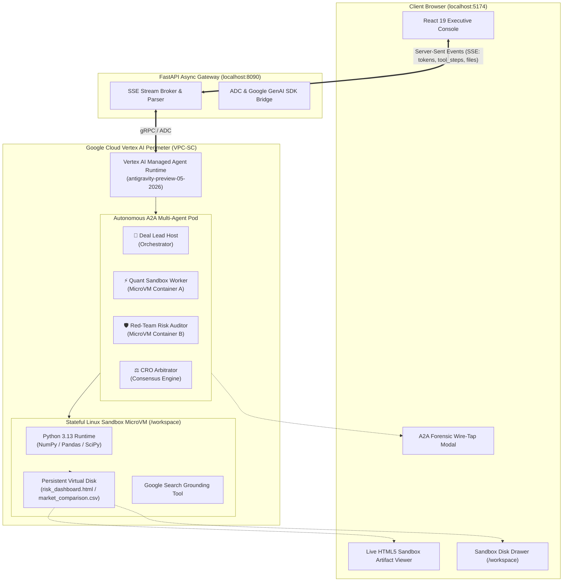

<div align="center">

# ⚡ Vertex AI Managed Agents
### *Autonomous Cloud Sandbox, One-Click Interactive HTML Dashboards, & A2A Forensic Wire-Tap*

[](https://cloud.google.com/vertex-ai)
[](https://cloud.google.com)
[](https://cloud.google.com)
[](https://cloud.google.com)
[](https://react.dev)

<p align="center">
  <a href="#-executive-briefing-center-ebc-visual-walkthrough"><strong>Explore Visual Demo &rarr;</strong></a> &nbsp;|&nbsp;
  <a href="#-interactive-demo-file-one-click-run"><strong>Open Live HTML Dashboard &rarr;</strong></a> &nbsp;|&nbsp;
  <a href="#-architecture-topology"><strong>Architecture Topology &rarr;</strong></a> &nbsp;|&nbsp;
  <a href="#-the-antigravity-replication-recipe"><strong>Replication Recipe &rarr;</strong></a>
</p>

</div>

---

## 🌟 Executive Overview: Why Vertex AI Managed Agents?

Traditional enterprise chatbots predict text in a vacuum. When tasked with complex mathematical modeling, live web intelligence, or software engineering, they hallucinate because they lack **computational execution environments** and **independent adversarial verification**.

**Vertex AI Managed Agents** represent a paradigm shift by pairing frontier Gemini intelligence with **dedicated, stateful remote Linux microVM containers (`/workspace`)** hosted directly within the customer's Google Cloud perimeter.

```
┌─────────────────────────────────────────────────────────────────────────────────────────────────────────┐
│                                   THE TRI-MODAL EXECUTION ADVANTAGE                                     │
├───────────────────────────────┬───────────────────────────────────┬─────────────────────────────────────┤
│   1. LIVE WEB GROUNDING       │      2. HEAVY RAW COMPUTE         │    3. ZERO-PARSING DYNAMIC UI       │
│ Google Search Grounding to    │ Dedicated Linux MicroVM container │ Instant embedded HTML5/SVG decision │
│ extract live market data,     │ running 10,000+ iteration Python  │ dashboards with reactive sliders &  │
│ earnings, and macro signals.  │ simulations (NumPy/SciPy/Pandas). │ instant scenario shock recalculation│
└───────────────────────────────┴───────────────────────────────────┴─────────────────────────────────────┘
```

---

## 📸 Executive Briefing Center (EBC) Visual Walkthrough

### 1. Unified Multi-Agent Proving Grounds
Executives select from pre-configured high-impact tracks or enter freeform complex analytical instructions.

<div align="center">
  
  <p><em>Figure 1: Autonomous Cloud Sandbox console featuring M&A Intelligence, Heavy Monte Carlo, and A2A Governance tracks.</em></p>
</div>

---

### 2. Live Stateful Sandbox Disk (`/workspace`)
Inspect files generated, read, and executed across multiple conversation turns without data loss.

<div align="center">
  
  <p><em>Figure 2: Virtual MicroVM disk explorer displaying persistent files (CSV models, Python scripts, HTML dashboards).</em></p>
</div>

---

### 3. One-Click Interactive Board-Ready Risk Dashboard
The agent generates, compiles, and embeds an interactive HTML5/SVG application directly in the conversation flow.

<div align="center">
  
  <p><em>Figure 3: Standalone executive decision dashboard with real-time WACC, Revenue Growth, and Synergy sensitivity bars.</em></p>
</div>

---

### 4. Zero-Latency Dynamic Scenario Shock Recalculation
Executives interact with the live dashboard directly inside the chat interface to stress-test valuations under extreme economic shocks.

<div align="center">
  
  <p><em>Figure 4: Dynamic recalculation of Enterprise Valuation ($5,821.2B) and VaR upon triggering the High Growth (+25%) shock.</em></p>
</div>

---

### 5. Agent-to-Agent (A2A) Forensic Protocol Wire-Tap
A 4-node governance pod orchestrates tasks, conducts adversarial audits, and cryptographically signs consensus.

<div align="center">
  
  <p><em>Figure 5: Live A2A wire-tap modal showing inter-agent JSON-RPC envelopes, Red-Team dissents, and SHA-256 integrity verification.</em></p>
</div>

---

## 🎯 Interactive Demo File: One-Click Run

You can open and test the exact interactive risk dashboard generated by the Managed Agent right now in any web browser:

* 📄 **Open Standalone HTML File**: [`demo/risk_dashboard.html`](demo/risk_dashboard.html)
  *(Double-click or open in Chrome/Safari to adjust live sliders, trigger instant macro shocks, and observe sensitivity recalculations)*.

---

## 🏛️ Architecture Topology



---

## 🥊 Competitive Matrix: Why Vertex AI Wins in the Enterprise

| Capability | Standard LLM Chatbots (ChatGPT / Gemini Consumer) | 3rd-Party SaaS Sandboxes (Claude Code / Open-Code) | Google Cloud Vertex AI Managed Agents |
| :--- | :--- | :--- | :--- |
| **Data Boundary** | Public API / Data training risks | Data leaves enterprise VPC to 3rd-party SaaS compute | **100% Inside Google Cloud VPC-SC Tenant** |
| **Stateful MicroVM** | ❌ No persistent disk across turns | ⚠️ Ephemeral, shared cloud runner | **✅ Dedicated, isolated MicroVM `/workspace`** |
| **Adversarial Governance** | ❌ Monolithic single model bias | ❌ Single execution thread | **✅ Multi-Agent A2A Pod (SR 11-7 Compliant)** |
| **Zero-Parsing Dynamic UI** | ❌ Static markdown text only | ❌ CLI terminal output only | **✅ Embedded reactive HTML5/SVG apps** |
| **Security & Compliance** | ⚠️ Standard SOC2 | ⚠️ 3rd-party vendor risk | **✅ SOC2 Type II, HIPAA, FedRAMP, VPC-SC** |

---

## 🎭 The 4-Act EBC Presentation Playbook

| Act | Demo Action | Boardroom Talking Point |
| :--- | :--- | :--- |
| **Act 1: Real-World Search** | Click **"Live M&A Market Intelligence"** | *"The agent accesses live internet data via Google Search Grounding, computes valuation multiples in Python, and saves `/workspace/market_comparison.csv`."* |
| **Act 2: Heavy Simulation** | Click **"10,000-Iteration Monte Carlo Stress Test"** | *"Instead of hallucinating probability distributions, the agent writes and executes raw mathematical models inside its own dedicated Linux microVM container."* |
| **Act 3: One-Click Interactive UI** | Click **`📁 Sandbox Disk`** $\rightarrow$ **`👁 View`** on `risk_dashboard.html` | *"Zero waiting. The agent generated a standalone, interactive board-ready web app. Executives can adjust live sensitivity sliders and shock buttons in real time."* |
| **Act 4: A2A Adversarial Governance** | Click **`🌐 A2A Wire-Tap`** $\rightarrow$ **`▶ Replay Adversarial Audit`** | *"We do not let a single AI approve its own work. Our Red-Team Auditor challenged the Quant Worker's assumptions, forced a recalibration, and the CRO signed a verified consensus memo."* |

---

## 🛠️ The Antigravity Replication Recipe

Antigravity agents and engineers can deploy this complete solution in minutes using the pre-packaged recipe:

```bash
# 1. Setup & verify GCP environment
uv run agy-recipes/managed-agent-sandbox-chat/scripts/setup.py

# 2. Run interaction smoke-test
uv run agy-recipes/managed-agent-sandbox-chat/scripts/test_recipe.py

# 3. Launch full stack application
cd antigravity-sandbox-chat
./start.sh
```

- **Frontend Console**: [http://localhost:5174](http://localhost:5174)
- **FastAPI Gateway**: [http://127.0.0.1:8090](http://127.0.0.1:8090)

---

## 🔒 Security & Zero-Leak Guarantee

- **Zero Hardcoded Secrets**: Pure Application Default Credentials (ADC).
- **VPC Service Controls**: MicroVMs and data packets never transit outside your VPC.
- **Root Directory Isolation**: Virtual disk operations are sandboxed to `/workspace`.
- **Cryptographic Provenance**: Every inter-agent envelope includes an immutable SHA-256 execution hash.

---

<div align="center">
  <sub>Engineered for Google Cloud Executive Briefing Centers (EBC) & Antigravity Proving Grounds</sub>
</div>
