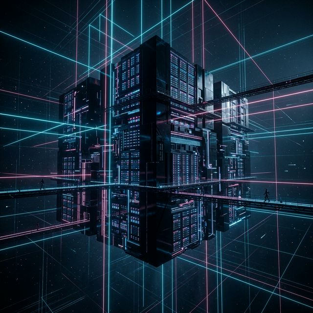
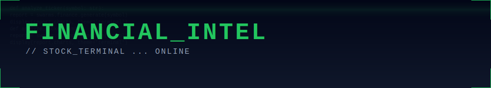
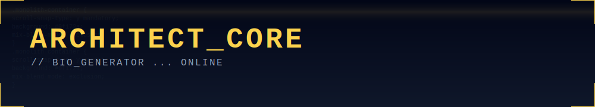

  

  

  <h3>SYSTEM STATUS: <strong>ONLINE</strong> // SECURITY_LEVEL: <strong>OMEGA</strong></h3>
  

    Welcome to the <strong>Antigravity Hub</strong>. This is the testing ground for advanced agentic patterns, 
    neo-monolith UIs, and sovereign AI architectures. Here we break the laws of traditional development 
    to build the future.
  

 

<table width="100%" border="0" cellspacing="0" cellpadding="20">
  <!-- ROW 1: SEARCH & FINANCE -->
  <tr>
    <td width="50%" valign="top">
      
        
      <strong>PROJECT: SOCKCOP SEARCH</strong> 
      The next-generation search interface. Implements the "Neo-Monolith" design system, 
      Workload Identity Federation (WIF) bridging, and Gemini Enterprise integration. 
       
      <a href="./sockcop_search/">Example: ACCESS_TERMINAL &rarr;</a>
    </td>
    <td width="50%" valign="top">
      
        
      <strong>PROJECT: STOCK TERMINAL</strong> 
      Autonomous market surveillance system. Features agentic swarms for financial reporting, 
      PDF synthesis, and real-time market data analysis. 
       
      <a href="./stock-terminal/">Example: ACCESS_TERMINAL &rarr;</a>
    </td>
  </tr>

  <!-- ROW 2: BIO & MCP -->
  <tr>
    <td width="50%" valign="top">
      
        
      <strong>PROJECT: ARCHITECT BIO</strong> 
      Experimental architectural identity systems. Explores "Digital-Organic", "Modern Cave", 
      and "Parametric Glass" web aesthetics. 
       
      <a href="./bio/">Example: ACCESS_TERMINAL &rarr;</a>
    </td>
    <td width="50%" valign="top">
      
        
      <strong>PROJECT: SHAREPOINT MCP</strong> 
      Enterprise knowledge graph connector. Bridges SharePoint data into the Gemini context 
      using Model Context Protocol (MCP) and Graph API. 
       
      <a href="./classificator_mcp_sharepoint/">Example: ACCESS_TERMINAL &rarr;</a>
    </td>
  </tr>

  <!-- ROW 3: ADK & ASYNC -->
  <tr>
    <td width="50%" valign="top">
      
        
      <strong>PROJECT: ADK LABS</strong> 
      Google Agent Development Kit (ADK) pilots. Demonstrates function calling, 
      grounding, and multi-agent coordination patterns. 
       
      <a href="./adk_pilots/">Example: ACCESS_TERMINAL &rarr;</a>
    </td>
    <td width="50%" valign="top">
      
        
      <strong>PROJECT: ASYNC CORE</strong> 
      High-throughput parallel processing units. Patterns for offloading long-running 
      agent tasks to background workers. 
       
      <a href="./async_agents_offloading/">Example: ACCESS_TERMINAL &rarr;</a>
    </td>
  </tr>
</table>

 

  
  
POWERED_BY: <strong>GEMINI_2.5_PRO</strong> // ARCHITECTURE: <strong>NEO_MONOLITH</strong>

