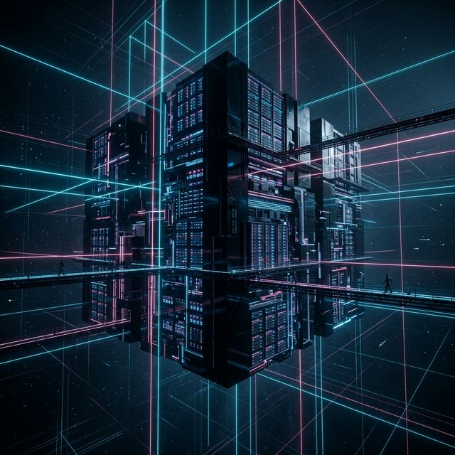
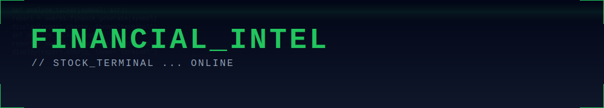
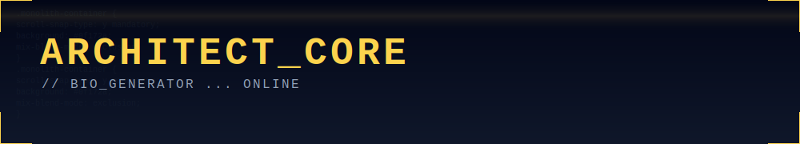
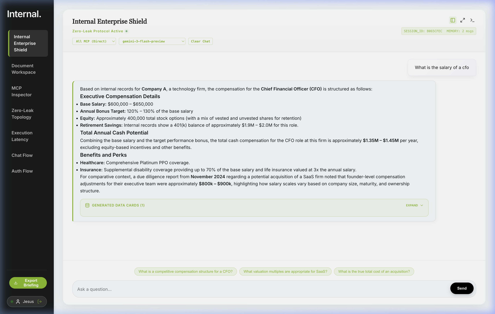
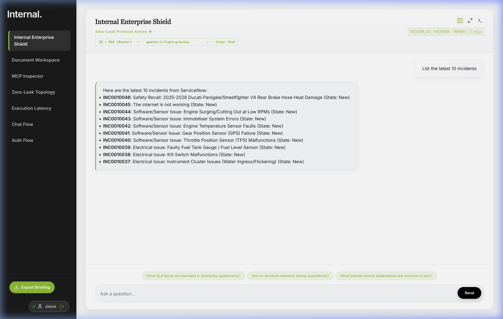

  

  

  <h3>SYSTEM STATUS: <strong>ONLINE</strong> // SECURITY_LEVEL: <strong>OMEGA</strong></h3>
  

    Welcome to the <strong>Antigravity Hub</strong>. This is the testing ground for advanced agentic patterns, 
    neo-monolith UIs, and sovereign AI architectures. Here we break the laws of traditional development 
    to build the future.
  

 

## 🌐 ANTIGRAVITY SYSTEMS INDEX

<table width="100%" border="0" cellspacing="0" cellpadding="20">
  <!-- ROW 1: SEARCH & FINANCE -->
  <tr>
    <td width="50%" valign="top">
      
        
      <strong>PROJECT: NEXUS SEARCH CORE</strong> 
      The next-generation search interface. Implements the "Neo-Monolith" design system, 
      Workload Identity Federation (WIF) bridging, and Gemini Enterprise integration. 
       
      <a href="./nexus_search_core/">ACCESS_TERMINAL &rarr;</a>
    </td>
    <td width="50%" valign="top">
      
        
      <strong>PROJECT: MARKET SWARM TERMINAL</strong> 
      Autonomous market surveillance system. Features agentic swarms for financial reporting, 
      PDF synthesis, and real-time market data analysis. 
       
      <a href="./market_swarm_terminal/">ACCESS_TERMINAL &rarr;</a>
    </td>
  </tr>

  <!-- ROW 2: NEXTGEN FINANCE & MCP -->
  <tr>
    <td width="50%" valign="top">
      
        
      <strong>PROJECT: MARKET SWARM NEXTGEN</strong> 
      The evolved iteration of the financial intelligence terminal utilizing the Gatekeeper Pattern. 
       
      <a href="./market_swarm_nextgen/">ACCESS_TERMINAL &rarr;</a>
    </td>
    <td width="50%" valign="top">
      
        
      <strong>PROJECT: SHAREPOINT SENTINEL MCP</strong> 
      Enterprise knowledge graph connector. Bridges SharePoint data into the Gemini context 
      using Model Context Protocol (MCP) and Graph API. 
       
      <a href="./sharepoint_sentinel_mcp/">ACCESS_TERMINAL &rarr;</a>
    </td>
  </tr>

  <!-- ROW 3: MULTIMODAL & ADK LABS -->
  <tr>
    <td width="50%" valign="top">
      
        
      <strong>PROJECT: MULTIMODAL DOCUMENT NEXUS</strong> 
      Enterprise Intelligence Platform for multimodal document chat, embedding, and intelligence extraction. 
       
      <a href="./multimodal_document_nexus/">ACCESS_TERMINAL &rarr;</a>
    </td>
    <td width="50%" valign="top">
      
        
      <strong>PROJECT: ADK LABORATORY NEXUS</strong> 
      Google Agent Development Kit (ADK) experimental proving grounds. Demonstrates function calling, 
      grounding, and multi-agent coordination patterns. 
       
      <a href="./adk_laboratory_nexus/">ACCESS_TERMINAL &rarr;</a>
    </td>
  </tr>

  <!-- ROW 4: VIDEO GEN & SECURITY PROXY -->
  <tr>
    <td width="50%" valign="top">
      
        
      <strong>PROJECT: VEO GENERATION MATRIX</strong> 
      Generative Video Interface. Powered by Veo 2.0 and Google ADK. Features "Modern Cave" 
      UI and real-time generation feedback. 
       
      <a href="./veo_generation_matrix/">ACCESS_TERMINAL &rarr;</a>
    </td>
    <td width="50%" valign="top">
      
        
      <strong>PROJECT: ZERO-LEAK SECURITY PROXY</strong> 
      Zero-Leak Enterprise Protocol. Enforces strict authentication, 
      masked structured outputs using Google ADK orchestration over deep Microsoft SharePoint data. 
       
      <a href="./zero_leak_security_proxy/">ACCESS_TERMINAL &rarr;</a>
    </td>
  </tr>

  <!-- ROW 5: AI AVATARS & GE COGNITIVE -->
  <tr>
    <td width="50%" valign="top">
      
        
      <strong>PROJECT: AVATAR SYNTHESIS ENGINE</strong> 
      Next-gen avatar generation and deployment module using Web UIs and Google GenAI. 
       
      <a href="./avatar_synthesis_engine/">ACCESS_TERMINAL &rarr;</a>
    </td>
    <td width="50%" valign="top">
      
        
      <strong>PROJECT: GE COGNITIVE UNDERSTANDING</strong> 
      Deep analysis and insight extraction engine to comprehend massive unstructured datasets. 
       
      <a href="./ge_cognitive_understanding/">ACCESS_TERMINAL &rarr;</a>
    </td>
  </tr>

  <!-- ROW 6: VAIS COMPARISON & GE UNDERSTANDING -->
  <tr>
    <td width="50%" valign="top">
      
        
      <strong>PROJECT: VAIS AGENT COMPARISON</strong> 
      A full-stack application comparing standard ADK tools with custom low-level Vertex AI Search implementations. 
       
      <a href="./vais_agent_comparison/">ACCESS_TERMINAL &rarr;</a>
    </td>
    <td width="50%" valign="top">
      
        
      <strong>PROJECT: GE UNDERSTANDING</strong> 
      Foundational pipeline demonstrating document processing, text extraction, and metadata tagging. 
       
      <a href="./ge_understanding/">ACCESS_TERMINAL &rarr;</a>
    </td>
  </tr>
  <!-- ROW 7: VERITY NEXUS -->
  <tr>
    <td width="50%" valign="top">
      
        
      <strong>PROJECT: VERITY NEXUS V2.0</strong> 
      Cinematic AI-to-Agent forensic swarm platform. Features real-time materiality load visualization, 
      neural discovery shards, and Tier-3 Direct Binary Pipe (Agentless) for zero-latency data streams. 
       
      <a href="./verity-nexus/">ACCESS_TERMINAL &rarr;</a>
    </td>
    <td width="50%" valign="top">
      
        
      <strong>PROJECT: DYNAMIC WORKFLOW ORCHESTRATOR</strong> 
      Demonstrates real-time event streaming across sequential agentic steps using Google ADK and FastAPI SSE. 
       
      <a href="./dynamic_workflow_orchestrator/">ACCESS_TERMINAL &rarr;</a>
    </td>
  </tr>
  <!-- ROW 10: INTERNAL PORTAL -->
  <tr>
    <td width="50%" valign="top">
      
        
      <strong>PROJECT: INTERNAL COMPONENTS PORTAL</strong> 
      Advanced Latency Benchmarking. Features real-time profile visualization and 
      dynamic thinking budget optimization for Enterprise search. 
       
      <a href="./internal_components_portal/">ACCESS_TERMINAL &rarr;</a>
    </td>
    <td width="50%" valign="top">
      
        
      <strong>PROJECT: OBSERVABILITY NEXUS</strong> 
      Centralized real-time telemetry and monitoring interface. Aggregates deep execution latency and neural event traces across the Antigravity suite using WebSockets. 
       
      <a href="./observability_nexus/">ACCESS_TERMINAL &rarr;</a>
    </td>
  </tr>
  <!-- ROW 11: INTERNAL PORTAL LOCAL -->
  <tr>
    <td width="50%" valign="top">
      
        
      <strong>PROJECT: INTERNAL_COMPONENTS_PORTAL_LOCAL</strong> 
      Sovereign developer interface for advanced component experimentation. Features isolated port mapping (8011/5181) and direct neural session debugging.  
       
      
      
        
      <a href="./internal_components_portal_local/">ACCESS_TERMINAL &rarr;</a>
    </td>
    <td width="50%" valign="top">
      
        
      <strong>PROJECT: GEMMA STRATOS</strong> 
      Minimalistic testing UI for Gemma 4. Features a Claude-like chat interface with markdown support and streaming responses. 
       
      <a href="./gemma-stratos/">ACCESS_TERMINAL &rarr;</a>
    </td>
  <!-- ROW 12: TAX DEMOS (CONSOLIDATED) -->
  <tr>
    <td width="50%" valign="top">
      
        
      <strong>PROJECT: ACCENTURE TAX CATALYST</strong> 
      Advanced AI-driven tax research methodology. Consolidates with KPMG under a shared load balancer. 
       
      <a href="./accenture_tax_catalyst/">ACCESS_TERMINAL &rarr;</a>
    </td>
    <td width="50%" valign="top">
      
        
      <strong>PROJECT: GLOBAL TAX INTELLIGENCE (KPMG)</strong> 
      Chief Tax Copilot and document search workspace features. Shares LB with Accenture. 
       
      <a href="./global_tax_intelligence/">ACCESS_TERMINAL &rarr;</a>
    </td>
  </tr>
  <!-- ROW 13: SEMIAUTONOMOUS AGENTS -->
  <tr>
    <td width="50%" valign="top">
      
        
      <strong>PROJECT: SEMIAUTONOMOUS AGENTS</strong> 
      Experimental proving ground for semiautonomous agentic patterns. Includes ADK script generation, hierarchical RAG, Discovery Engine tests, and MCP cloud portals. 
       
      <a href="../semiautonomous-agents/">ACCESS_TERMINAL &rarr;</a>
    </td>
    <td width="50%" valign="top">
      
        
      <strong>PROJECT: ADK SECRET MANAGER DEMO</strong> 
      Semiautonomous agent demo showcasing secure secret handling with Google ADK and Secret Manager. Light theme UI. 
       
    </td>
  </tr>
  <!-- ROW 13b: PAYROLL TOPOLOGIES & OUTLOOK APPROVAL -->
  <tr>
    <td width="50%" valign="top">
      
        
      <strong>PROJECT: PAYROLL AGENT TOPOLOGIES</strong> 
      ADK 2.0 and MCP scalability evaluation. Compares a single monolithic agent vs. a workflow-routed specialized agent team for 148k concurrent request scenarios. 
       
      <a href="../semiautonomous-agents/payroll_agent_topologies/">ACCESS_TERMINAL &rarr;</a>
    </td>
    <td width="50%" valign="top">
      
        
      <strong>PROJECT: OUTLOOK APPROVAL CHATBOT</strong> 
      Executive Dashboard split-view. Semiautonomous chatbot powered by Gemini Enterprise streamAssist paired with a Microsoft Graph-integrated inbox. Scans emails and performs actual approvals via Graph API replies. 
       
      <a href="../semiautonomous-agents/outlook-approval-chatbot/">ACCESS_TERMINAL &rarr;</a>
    </td>
  </tr>
  <!-- ROW 14: CREATIVE NEXUS -->
  <tr>
    <td width="50%" valign="top">
      
        
      <strong>PROJECT: SOVEREIGN ELEMENTS</strong> 
      Advanced clone of Envato Elements search experience. Features rich aesthetics, dynamic hover effects, and a mock search engine backend. 
       
      <a href="./sovereign-elements/">ACCESS_TERMINAL &rarr;</a>
    </td>
    <td width="50%" valign="top">
      
        
      <strong>PROJECT: CAJA ANDES CLONE</strong> 
      High-fidelity clone of Caja de los Andes targeting executive sales demos. Integrates futuristic AI Quantum Hub and Gemini Live API mocks. 
       
      <a href="./andes-agentic-pilot/">ACCESS_TERMINAL &rarr;</a>
    </td>
  </tr>
  <!-- ROW 15: SHUTTER VIBE ENGINE -->
  <tr>
    <td width="50%" valign="top">
      
        
      <strong>PROJECT: SHUTTER VIBE ENGINE</strong> 
      Futuristic multi-modal search and serverless video ingestion pipeline. Powered by Google Cloud (FastAPI, FFmpeg, Eventarc, Vertex AI Embeddings, Firestore). 
       
      <a href="../semiautonomous-agents/shutter-vibe-engine/antigravity/">ACCESS_TERMINAL &rarr;</a>
    </td>
    <td width="50%" valign="top">
      <strong>RECIPE: SHAREPOINT DOCUMENT RESTRUCTURE</strong> 
      Throttling-resistant SharePoint document ingestion, Gemini metadata extraction, and access-aware retrieval. 
       
      <a href="../agy-recipes/sharepoint-doc-restructure/">ACCESS_TERMINAL &rarr;</a>
    </td>
  </tr>
  <!-- ROW 16: SHAREPOINT RESTRUCTURE PORTAL & WIF -->
  <tr>
    <td width="50%" valign="top">
      
        
      <strong>PROJECT: SHAREPOINT DOC RESTRUCTURE PORTAL</strong> 
      Interactive governance dashboard and console chat. Integrates human-in-the-loop workflows, access-aware search, and crawler pacing logs under a minimalistic light theme UI. 
       
      📚 <strong>RESOURCES:</strong> 
      • <a href="./sharepoint_doc_restructure_portal/GCP_ARCHITECTURE.md">GCP Architecture & Component Justifications</a> 
      • <a href="./sharepoint_doc_restructure_portal/ACL_MAPPING.md">SharePoint to GCP ACL Inheritance Strategy</a> 
      • <a href="./sharepoint_doc_restructure_portal/UI_SPECIFICATION.md">Visual Mockup & Layout Specification Guide</a> 
      • <a href="./sharepoint_doc_restructure_portal/PERFORMANCE_AUDIT.md">Gemini 3.5 Flash Latency & Ingestion Performance Audit</a> 
      • <a href="./sharepoint_doc_restructure_portal/LOW_LEVEL_DESIGN.md">Detailed Low-Level Infrastructure & Logic Design Document</a> 
      • <a href="./sharepoint_doc_restructure_portal/scripts/pipeline_poc.py">Ingestion & Extraction Pipeline PoC Script</a> 
       
      <a href="./sharepoint_doc_restructure_portal/">ACCESS_TERMINAL &rarr;</a>
    </td>
    <td width="50%" valign="top">
      
        
      <strong>RECIPE: WIF + GCS + GEMINI ENTERPRISE</strong> 
      Reproducible deployment setup for indexing Google Cloud Storage documents dynamically, enabling search-grounding via streamAssist and Workforce Identity Federation. 
       
      <a href="../agy-recipes/ge_api_wif_gcs/">ACCESS_TERMINAL &rarr;</a>
    </td>
  </tr>
  <!-- ROW 17: JIRA MCP DIRECT RECIPE -->
  <tr>
    <td width="50%" valign="top">
      
        
      <strong>RECIPE: JIRA MCP DIRECT INTEGRATION</strong> 
      Reproducible deployment setup for registering two direct Atlassian Jira MCP connectors in Gemini Enterprise (Hosted Rovo MCP + Custom Cloud Run MCP). 
       
      <a href="../agy-recipes/jira-mcp-direct/">ACCESS_TERMINAL &rarr;</a>
    </td>
    <td width="50%" valign="top">
      
        
      <strong>PROJECT: BAIN & COMPANY AGENT PLATFORM</strong> 
      End-to-end showcase of Gemini Enterprise Agent Platform. Demonstrates Google ADK financial practice agents, Agent Gateway DLP governance, Agent Identity two-pillar auth over SharePoint, and Yazdani minimalist UI. 
       
      <a href="./bain_ge_agent_platform/">ACCESS_TERMINAL &rarr;</a>
    </td>
  </tr>
</table>

 

## 📚 Shared Core Libraries

<table width="100%">
  <tr>
    <td width="30%"><strong>Module</strong></td>
    <td width="70%"><strong>Description</strong></td>
  </tr>
  <tr>
    <td><a href="./nexus_telemetry/"><code>nexus_telemetry</code></a></td>
    <td>Standalone, strictly non-blocking Observability Nexus client package. Features zero-latency queuing, decoupled ASGI tracking middleware, and pure HTTPX streaming interception for system-wide APM.</td>
  </tr>
</table>

 

  
  
POWERED_BY: <strong>GEMINI_2.5_PRO</strong> // ARCHITECTURE: <strong>NEO_MONOLITH</strong>

