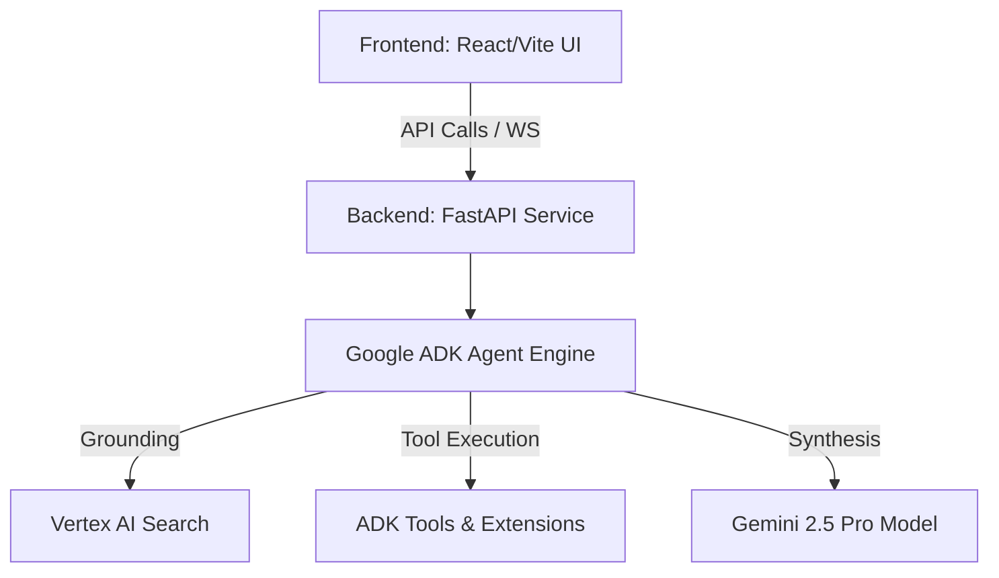

<div align="center">
  
</div>

<div align="center">
  <h1>ADK LABORATORY NEXUS</h1>
  <h3>SYSTEM STATUS: <strong>ONLINE</strong> // SECURITY_LEVEL: <strong>GAMMA</strong></h3>
  <p>
    <em>Experimental proving grounds for Google Agent Development Kit (ADK) and Interactive UIs.</em>
  </p>
</div>

<br/>

## 🪐 ARCHITECTURE & SPECS

> **Core Engine:** Google ADK, Python (Backend) | React, Vite, TS (Frontend)

Demonstrates advanced function calling, grounding, and multi-agent coordination patterns. A sandbox for pushing the limits of autonomous execution.



## 📂 PROJECT STRUCTURE

```text
adk_laboratory_nexus/
├── backend/            # Google ADK Agents & Services (Python, uv)
├── frontend/           # Modern React/Vite User Interface
├── docs/               # Architecture diagrams and documentation
└── README.md           # This file
```

## 🚀 QUICK START GUIDE

### 1. Backend Ignition

The backend leverages `uv` for lightning-fast Python dependency management. Make sure you have your `.env` configured properly with the necessary Google Cloud credentials.

```bash
cd adk_laboratory_nexus/backend
uv run pilot_adk_agent.py
```

### 2. Frontend Launch

The frontend is a beautifully designed interface tailored to interact with the ADK backend.

```bash
cd adk_laboratory_nexus/frontend
npm install
npm run dev
```

## 🛡️ SECURITY PROTOCOLS

- **Zero-Leak Compliant:** `.env` structures are sealed and isolated.
- **Identity:** Authenticated operations only.

<br/>

<div align="center">
  
  <p>POWERED_BY: <strong>GEMINI_2.5_PRO</strong> // ARCHITECTURE: <strong>NEO_MONOLITH</strong></p>
</div>
