# 🪨 The Modern Cave: Agentic UX Pilot

> **A Neofuturistic Architectural Consultant powered by Google Agent Development Kit (ADK) & Gemini 3.**


---

## 🚀 Overview

The **Modern Cave** is an experimental pilot demonstrating **Structured Agentic UX**. Instead of simple text bubbles, this application uses **Google ADK** to enforce a strict data contract (`DesignAdvice`), allowing the frontend to render complex, themed components (Design Cards) directly from the model's structured output.

### ✨ Key Features
*   **🧠 Structured Output**: Uses `Pydantic` schemas in the backend to drive specialized UI components.
*   **🌑 Modern Cave Aesthetic**: A brutalist, monolithic interface with horizontal transitions and glassmorphism.
*   **🚀 Gemini 3 Powered**: High-speed reasoning with the latest `gemini-3-flash-preview` model.
*   **⚡ Smooth Interaction**: Integrated with `Lenis` for smooth scrolling and `GSAP` for neofuturistic animations.

---

## 🏗️ Architecture & Workflow

The system follows a Zero-Parsing philosophy where the AI orchestrates the UI through a shared data contract.

```mermaid
graph TD
    %% Styling Definitions
    classDef base fill:#fff,stroke:#333,stroke-width:1px,color:#333;
    classDef ui fill:#f8fafc,stroke:#1e293b,stroke-width:2px,color:#0f172a,rx:10,ry:10;
    classDef adk fill:#faf5ff,stroke:#a855f7,stroke-width:2px,color:#6b21a8,rx:10,ry:10;
    classDef gemini fill:#fdf4ff,stroke:#d946ef,stroke-width:3px,color:#86198f,rx:15,ry:15;
    classDef store fill:#ecfdf5,stroke:#10b981,stroke-width:2px,color:#065f46,rx:10,ry:10;

    subgraph FE ["Frontend Layer (Modern Cave UI)"]
        direction TB
        Input["✍️ Centered User Input"]:::ui
        Render["📑 Structural Card Renderer"]:::ui
    end

    subgraph BE ["Backend Layer (FastAPI + ADK)"]
        direction TB
        Endpoint["🔌 /chat (Async)"]:::adk
        Runner["🚀 ADK Runner"]:::adk
        Schema["📜 Pydantic Schema (DesignAdvice)"]:::adk
    end

    subgraph AI ["Intelligence Layer"]
        Model["✨ Gemini 3 Flash Preview"]:::gemini
    end

    Input -->|User Query| Endpoint
    Endpoint -->|Session Context| Runner
    Schema -.->|Enforce Contract| Runner
    Runner -->|Structured Prompt| Model
    Model -->|JSON Object| Runner
    Runner -->|is_structured: true| Render
    Render -->|Visualize| Input

    %% Link Styling
    linkStyle default stroke:#64748b,stroke-width:1px,fill:none;

    %% Subgraph Styling
    style FE fill:#f9fafb,stroke:#d1d5db,stroke-width:1px,stroke-dasharray: 5 5
    style BE fill:#fcfaff,stroke:#c084fc,stroke-width:1px,stroke-dasharray: 5 5
    style AI fill:#fdf4ff,stroke:#f0abfc,stroke-width:1px,stroke-dasharray: 5 5
```



---

## 📸 Visual References

### Hero Experience
The landing experience focuses on the "Monolith" concept, with scroll-triggered navigation.


### Agentic UX: Design Cards
When the agent provides advice, it is rendered as a "Design Card" with distinct sections for the Pillar, Suggestion, and Implementation Hint.


---

## 🛠️ Setup & Execution

### 1. Requirements
*   **Python 3.12+**
*   **uv** (Python package & project manager)
*   **Google Cloud Project** with Vertex AI enabled.
*   **Gemini 3** access in the `global` region.

### 2. Installation
The project is managed with `uv`. To install dependencies and set up the virtual environment:
```bash
uv sync
```

### 3. Running the Pilot
```bash
# Set mandatory environment variables
export GOOGLE_CLOUD_PROJECT="your-project-id"
export GOOGLE_CLOUD_LOCATION="global"
export GOOGLE_GENAI_USE_VERTEXAI="true"

# Run with uv
uv run python app.py
```
Visit `http://localhost:8001` to enter the cave.

---
*Developed as a high-fidelity pilot for Advanced Agentic UX interactions.*
