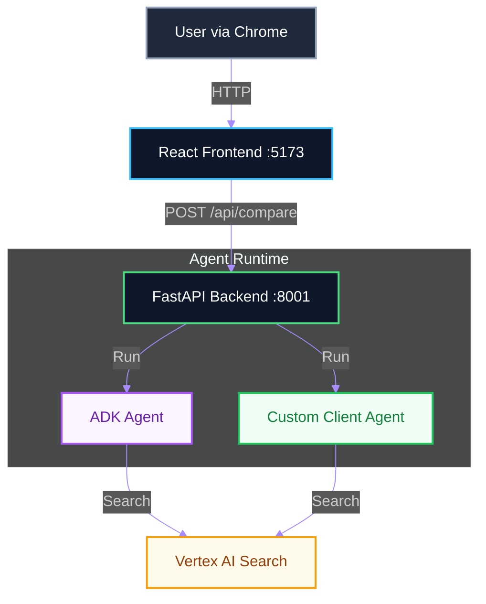

# Vertex AI Search Agent Comparison

A modern, full-stack application comparing two agent implementation strategies for Vertex AI Search:
1.  **Standard ADK Tool**: Uses the official Google Agent Development Kit (High-level abstraction).
2.  **Custom Discovery Client**: Uses the `google-cloud-discoveryengine` client directly (Low-level control).

This project demonstrates how to build a premium, agentic interface with distraction-free debugging capabilities.

## Architecture



## Solution Screenshots

### Full App Interface
The interface allows you to search once and see how both implementations respond in real-time.


### Distraction-Free Debugging
Maximize the debug terminal to inspect raw JSON logs, tool traces, and backend events without distraction.


## Quick Start

### Prerequisites
*   Python 3.10+
*   Node.js 18+
*   Google Cloud Project with Vertex AI Search enabled

### 1. Configure Environment
Create a `.env` file in the root directory:
```bash
GOOGLE_GENAI_USE_VERTEXAI=True
GOOGLE_CLOUD_PROJECT=your-project-id
GOOGLE_CLOUD_LOCATION=us-central1
# Use EITHER Data Store ID OR Search Engine ID
# DATA_STORE_ID=projects/.../locations/global/collections/default_collection/dataStores/YOUR_DATA_STORE_ID
SEARCH_ENGINE_ID=projects/.../locations/global/collections/default_collection/engines/YOUR_ENGINE_ID
```

### 2. Run Backend
```bash
cd backend
# Create and activate venv
uv venv
source .venv/bin/activate
# Install dependencies
uv pip install -r requirements.txt
# Run server
uvicorn main:app --reload --port 8001
```

### 3. Run Frontend
```bash
cd frontend
npm install
npm run dev
```

### 4. Access Application
Navigate to [http://localhost:5173](http://localhost:5173) in your browser.
