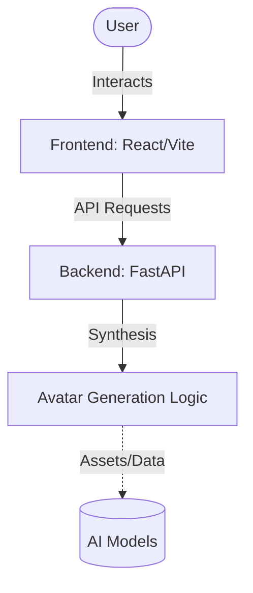

<div align="center">
  
</div>

<div align="center">
  <h1>AVATAR SYNTHESIS ENGINE</h1>
  <h3>SYSTEM STATUS: <strong>ONLINE</strong></h3>
  <p>
    <em>A powerful full-stack application for bringing digital avatars to life.</em>
  </p>
</div>

<br/>

## 🪐 ARCHITECTURE & SPECS

> **Core Engine:** FastAPI (Backend) | React, Vite, TS (Frontend)

The Avatar Synthesis Engine connects a dynamic frontend UI with a robust Python backend to process, generate, and animate digital avatars.



## 📂 PROJECT STRUCTURE

```text
avatar_synthesis_engine/
├── backend/            # FastAPI Backend & Synthesis Logic (Python, uv)
├── frontend/           # Modern React/Vite User Interface
├── docs/               # Architecture diagrams and documentation
└── README.md           # This file
```

## 🚀 QUICK START GUIDE

### 1. Prerequisites
- [Node.js](https://nodejs.org/) (for frontend)
- [uv](https://github.com/astral-sh/uv) (for backend execution and dependency management)

### 2. Environment Variables
Ensure you have a `.env` file in the **root** `backend/` directory with your required keys:
```env
GEMINI_API_KEY="your-gemini-key"
GOOGLE_API_KEY="your-google-key"
```

### 3. Backend Ignition
The backend leverages `uv` for ultra-fast dependency management.

```bash
cd avatar_synthesis_engine/backend
uv sync
uv run main.py
```

### 4. Frontend Launch
The frontend operates on Vite for HMR and rapid development.

```bash
cd avatar_synthesis_engine/frontend
npm install
npm run dev
```

<br/>

<div align="center">
  
  <p>POWERED_BY: <strong>GEMINI_2.5_PRO</strong> // ARCHITECTURE: <strong>NEO_MONOLITH</strong></p>
</div>
