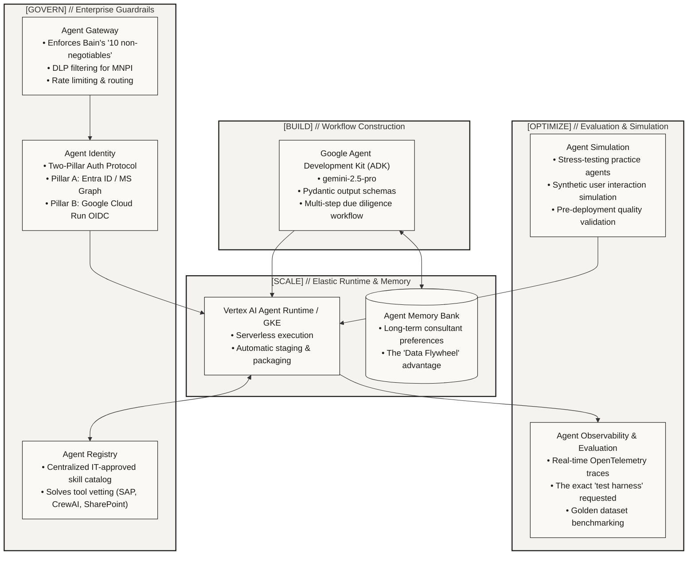
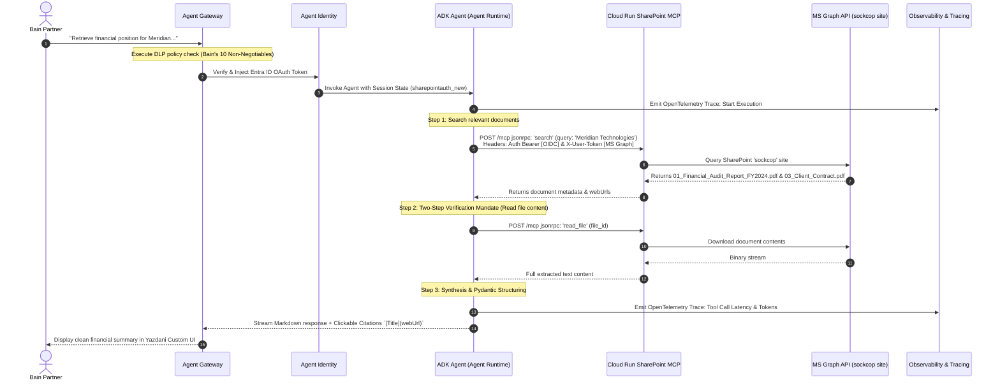

# Architectural Research & Scenario Design // Bain & Company Financial Analysis Agent

## 1. Executive Context & Scenario Objective

Bain & Company is seeking to accelerate its agentic innovation by transitioning from exploratory, ad-hoc generative AI experiments to **"industrialized" practice agents**. These agents must adhere to rigorous corporate governance, maintain a verifiable audit trail, and integrate securely into Bain’s established Microsoft-centric infrastructure (specifically SharePoint Online).

The selected core use case is **Option 1: Financial Analysis Agent**. The foundational due-diligence prompt representing Bain’s workflows is:
> *"You’ve been asked for a position on this company, how can you get there?"*

To successfully deliver this capability, the architecture must provide a secure, open governance layer that addresses Bain's technical leadership concerns across four key pillars: **Build, Scale, Govern, and Optimize**.

---

## 2. Mapping Bain's Requirements to the Gemini Enterprise Agent Platform

The Gemini Enterprise Agent Platform provides an end-to-end, sovereign suite of enterprise capabilities that directly answer each question and technical prerequisite raised in the Bain & Company deep dive document.

---

## 3. Deep Dive into the Four Platform Pillars

### 3.1 `[BUILD]` // Google Agent Development Kit (ADK)
* **Bain's Need**: Mapping out complex, multi-step consulting workflows for "industrialized" practice agents.
* **Architectural Solution**: The agent is constructed using the Google ADK in Python. 
  * **Model Selection**: Configured with `gemini-2.5-pro` to ensure state-of-the-art long-context reasoning and financial synthesis.
  * **Structured Outputs**: Implements Pydantic schemas to strictly enforce valid JSON generation for downstream financial charts and tables, eliminating regex parsing fragility.
  * **Anti-Hallucination Guardrails**: Enforces a strict two-step verification protocol (`search` followed by `fetch`/`read_file`) and requires explicit markdown citation generation (`[Document Title](webUrl)`).

### 3.2 `[SCALE]` // Agent Runtime & Agent Memory Bank
* **Bain's Need**: Secure hosting that scales to clients while storing long-term context and consultant preferences to build a compounding "data flywheel".
* **Agent Runtime (GKE)**: The ADK application is packaged using `vertexai.agent_engines.AdkApp` and deployed directly to Vertex AI Agent Runtime. This provides isolated, serverless container execution backed by Google Kubernetes Engine, capable of scaling dynamically with consulting workload demands.
* **Agent Memory Bank**: Integrates a persistent session memory store. When a Bain consultant investigates a specific sector (e.g., healthcare technology or renewable energy), the Memory Bank securely retains the consultant's custom framing preferences, formatting rules, and prior sector insights, creating a compounding knowledge flywheel across engagements.

### 3.3 `[GOVERN]` // Registry, Gateway, & Identity
* **Bain's Need**: Solves concerns over vetting external tools (SAP, CrewAI), enforces Bain’s **"10 non-negotiables"** via global security policies, and provides a verifiable audit trail.
* **Agent Registry**: Serves as the centralized, IT-approved tool catalog. Rather than allowing agents unvetted access to the open web or experimental plugins, Bain IT curates and publishes specific enterprise connectors (such as the Cloud Run SharePoint MCP server).
* **Agent Gateway**: Acts as the intelligent interceptor and governance firewall for all agent invocations. It executes pre-execution and post-execution policy checks:
  * **DLP (Data Loss Prevention)**: Scans input prompts and tool outputs for Material Non-Public Information (MNPI), client names, or unredacted financial identifiers, blocking or masking them dynamically.
  * **Audit Trail**: Streams every request, tool call, and latency metric to Cloud Logging and BigQuery for verifiable regulatory compliance.
* **Agent Identity (Two-Pillar Auth)**: Manages end-to-end zero-trust access:
  * **Pillar A (End-User Delegation - OAuth 2.0)**: Captures the consultant's Entra ID / Microsoft Graph OAuth token in the session state (`sharepointauth_new`). The agent extracts this token and places it in the `X-User-Token` header, ensuring that SharePoint enforces native access control lists (ACLs) at the source.
  * **Pillar B (Service-to-Service - OIDC)**: Generates a Google Cloud OIDC identity token for the runtime service account, placing it in the `Authorization: Bearer` header to authorize ingress through the Cloud Run IAM proxy.

### 3.4 `[OPTIMIZE]` // Observability, Evaluation, & Simulation
* **Bain's Need**: Providing the exact "test harness" requested to trace agent reasoning, continuously evaluate output quality, and safely stress-test practice agents against synthetic user interactions.
* **Agent Observability & Evaluation**: By initializing `AdkApp(agent=root_agent, enable_tracing=True)`, the runtime automatically emits OpenTelemetry-compliant execution traces. The test harness records the exact tool calls, intermediate LLM thinking, and token consumption, benchmarking them against Bain's golden Q&A datasets.
* **Agent Simulation**: Provides an automated stress-testing environment. Before deploying a new practice agent to active consulting teams, the simulation engine spins up synthetic user personas (e.g., an aggressive private equity client or a skeptical audit partner) to bombard the agent with edge-case prompts, multi-turn follow-ups, and prompt injection attempts, guaranteeing production readiness.

---

## 4. Scenario Walkthrough: "Formulating a Position on a Company"

When a Bain partner logs into the custom UI and submits the query:
> *"Retrieve the financial position and latest contracts for Meridian Technologies (from our sockcop SharePoint site) and formulate an investment position."*

The architecture executes the following unified sequence:

---

## 5. Success Criteria & "Definition of Done"

To prove out this PoC for Bain & Company's technical leaders, the following success criteria are established:

1. **Zero Hallucination Guarantee**: Every claim regarding financial health, corporate officers, or contract terms must be directly grounded in files retrieved from the `sockcop` SharePoint site.
2. **Clickable Citations**: Every factual statement must conclude with a functional markdown link `[Filename](webUrl)` that opens directly in Microsoft 365.
3. **Sovereign Governance**: Agent Gateway must actively log all invocations and successfully intercept unauthorized attempts to extract unredacted client secrets.
4. **Verifiable Traceability**: Full visibility into intermediate agent reasoning, tool call payloads, and latency breakdowns inside Google Cloud Observability.
