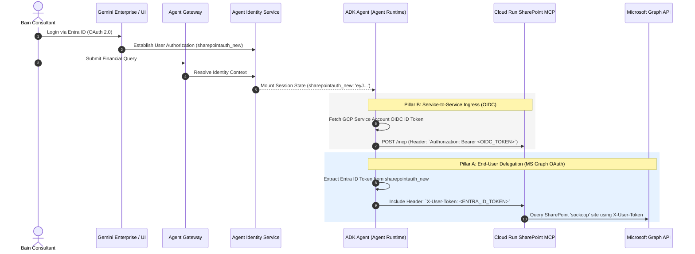

# Agent Gateway & Agent Identity // Step-by-Step Configuration Guide

This guide details the precise, step-by-step configuration required to establish enterprise-grade visibility, governance, and identity federation within the Gemini Enterprise Agent Platform. These steps directly implement **Bain & Company's "10 non-negotiables"** for secure agentic operations.

---

## 1. Agent Gateway Configuration (Governance & Visibility)

Agent Gateway functions as an intelligent interceptor and policy enforcement point (PEP) that wraps the Vertex AI Agent Runtime. It ensures that no prompt reaches the LLM and no tool executes without full policy verification and verifiable audit logging.

```mermaid
flowchart LR
    In["Incoming Prompt<br/>(from Custom UI / GE)"]:::input --> GW["Agent Gateway"]:::gw
    
    subgraph Gateway Engine ["Agent Gateway Governance Pipeline"]
        direction TB
        P1["1. Authentication & API Key Binding"]:::step
        P2["2. DLP Interceptor (MNPI / Secrets)"]:::step
        P3["3. Rate Limiting & Quota Enforcement"]:::step
        P4["4. Cloud Logging & Audit Trail Sync"]:::step
        
        P1 --> P2 --> P3 --> P4
    end
    
    GW --> Gateway Engine
    Gateway Engine --> Out["Vertex AI Agent Runtime<br/>(Bain Financial Agent)"]:::output

    classDef input fill:#1a1a19,stroke:#d8d6d0,stroke-width:1px,color:#faf9f6
    classDef gw fill:#ea4335,stroke:#b31412,stroke-width:2px,color:#fff
    classDef step fill:#faf9f6,stroke:#1a1a19,stroke-width:1px,color:#1a1a19
    classDef output fill:#34a853,stroke:#137333,stroke-width:2px,color:#fff
```

### Step 1.1: Provision the Gateway Policy Endpoint
Configure the Agent Gateway routing policy in your Google Cloud project (`vtxdemos`). This links the incoming request path to the underlying Vertex AI Reasoning Engine.

```bash
gcloud beta ai agent-gateway create bain-governance-gateway \
    --project=vtxdemos \
    --location=us-central1 \
    --display-name="Bain & Company Governance Gateway" \
    --routing-target="projects/254356041555/locations/us-central1/reasoningEngines/SHAREPOINT_AGENT_ENGINE"
```

### Step 1.2: Configure Data Loss Prevention (DLP) for Bain's "10 Non-Negotiables"
To satisfy Bain’s strict confidentiality rules, configure a DLP inspection policy to block or mask Material Non-Public Information (MNPI), client social security numbers, credit card numbers, or unredacted financial account identifiers.

Create a policy configuration file `gateway_dlp_rules.json`:
```json
{
  "dlpInspectionRule": {
    "inspectConfig": {
      "infoTypes": [
        { "name": "CREDIT_CARD_NUMBER" },
        { "name": "US_SOCIAL_SECURITY_NUMBER" },
        { "name": "FINANCIAL_ACCOUNT_NUMBER" },
        { "name": "PERSON_NAME" }
      ],
      "minLikelihood": "LIKELY",
      "ruleSet": [
        {
          "infoTypes": [{ "name": "FINANCIAL_ACCOUNT_NUMBER" }, { "name": "US_SOCIAL_SECURITY_NUMBER" }],
          "exclusionRule": {
            "matchingType": "MATCHING_TYPE_FULL_MATCH"
          }
        }
      ]
    },
    "action": "BLOCK_AND_ALERT",
    "alertDestination": {
      "cloudLogging": true,
      "pubsubTopic": "projects/vtxdemos/topics/bain-security-alerts"
    }
  }
}
```

Apply the DLP policy to the Gateway:
```bash
gcloud beta ai agent-gateway update bain-governance-gateway \
    --project=vtxdemos \
    --location=us-central1 \
    --dlp-rules-file=gateway_dlp_rules.json
```

### Step 1.3: Enforce Rate Limiting & Quota Management
Prevent abusive token consumption and ensure equitable availability of practice agents across Bain consulting teams by enforcing rate limiting at the Gateway tier.

```bash
gcloud beta ai agent-gateway update bain-governance-gateway \
    --project=vtxdemos \
    --location=us-central1 \
    --quota-config="maxRequestsPerMinute=120,maxTokensPerMinute=400000"
```

### Step 1.4: Configure Verifiable Audit Logging
Enable complete audit traceability. Agent Gateway automatically syncs request metadata, tool call payloads, and latency breakdowns to Google Cloud Logging under the `logName`: `projects/vtxdemos/logs/agent-gateway-audit`.

To export these audit logs to BigQuery for long-term compliance and governance review:
```bash
gcloud logging sinks create bain_agent_audit_bigquery \
    bigquery.googleapis.com/projects/vtxdemos/datasets/agent_audit_logs \
    --log-filter='resource.type="ai_agent_gateway" AND severity>=INFO' \
    --project=vtxdemos
```

---

## 2. Agent Identity Configuration (Two-Pillar Auth Protocol)

Agent Identity manages zero-trust execution contexts. For the Bain Financial Analysis Agent, it implements a highly secure **Two-Pillar Authentication Protocol** that bridges end-user Microsoft 365 permissions with server-to-server Google Cloud Run ingress.



### Step 2.1: Configure Pillar A (End-User Delegation via Entra ID OAuth)
Pillar A ensures that when the agent calls the Cloud Run SharePoint MCP server, it acts on behalf of the individual Bain consultant. If a consultant does not have permission to view a specific document library in SharePoint, the Microsoft Graph API will reject the request at the source.

1. **Register the Entra ID Application**:
   - Navigate to the Microsoft Entra admin center.
   - Register a new application: `Bain Gemini Enterprise MCP Connector`.
   - Add Redirect URI: `https://vertexaisearch.cloud.google.com/oauth-redirect`.
   - Note the `Application (client) ID` (e.g., `030b6aac-63d1-40e9-8d80-7ce928b839b8`) and generate a Client Secret.
   - Add Delegated Permissions: `Sites.ReadWrite.All`, `Files.ReadWrite.All`, `User.Read`.

2. **Register the Authorization in Agent Identity**:
   Use the Discovery Engine API to create the authorization binding (`sharepointauth_new`) that Gemini Enterprise will use to trigger the OAuth consent flow.

   ```bash
   curl -X POST \
     -H "Authorization: Bearer $(gcloud auth print-access-token)" \
     -H "Content-Type: application/json" \
     -H "x-goog-user-project: vtxdemos" \
     "https://discoveryengine.googleapis.com/v1alpha/projects/254356041555/locations/global/authorizations?authorizationId=sharepointauth_new" \
     -d '{
       "name": "projects/254356041555/locations/global/authorizations/sharepointauth_new",
       "serverSideOauth2": {
         "clientId": "030b6aac-63d1-40e9-8d80-7ce928b839b8",
         "clientSecret": "YOUR_ENTRA_CLIENT_SECRET",
         "authorizationUri": "https://login.microsoftonline.com/de46a3fd-0d68-4b25-8343-6eb5d71afce9/oauth2/v2.0/authorize?client_id=030b6aac-63d1-40e9-8d80-7ce928b839b8&scope=openid%20profile%20email%20offline_access%20https%3A%2F%2Fgraph.microsoft.com%2FSites.ReadWrite.All%20https%3A%2F%2Fgraph.microsoft.com%2FFiles.ReadWrite.All&redirect_uri=https%3A%2F%2Fvertexaisearch.cloud.google.com%2Foauth-redirect&response_type=code&prompt=consent",
         "tokenUri": "https://login.microsoftonline.com/de46a3fd-0d68-4b25-8343-6eb5d71afce9/oauth2/v2.0/token"
       }
     }'
   ```

### Step 2.2: Configure Pillar B (Service-to-Service Ingress via OIDC)
Pillar B secures the network ingress of the Cloud Run SharePoint MCP server. The MCP server is deployed with `--no-allow-unauthenticated`, preventing any public access. Only the specific runtime service account of the ADK agent is permitted to invoke it.

1. **Assign Cloud Run Invoker Role to the Agent Service Account**:
   The ADK agent runs under the compute service account `254356041555-compute@developer.gserviceaccount.com`. Grant this service account permission to invoke the Cloud Run MCP service.

   ```bash
   gcloud run services add-iam-policy-binding ge-custom-sharepoint-mcp-rxhrarbbrq-uc \
       --project=vtxdemos \
       --region=us-central1 \
       --member="serviceAccount:254356041555-compute@developer.gserviceaccount.com" \
       --role="roles/run.invoker"
   ```

2. **Verify OIDC Token Generation in `agent.py`**:
   The ADK agent automatically fetches an OIDC identity token using the target Cloud Run URL as the audience, inserting it into the `Authorization: Bearer` header:

   ```python
   import google.auth.transport.requests
   from google.oauth2 import id_token

   request = google.auth.transport.requests.Request()
   audience = "https://ge-custom-sharepoint-mcp-rxhrarbbrq-uc.a.run.app"
   cloud_run_token = id_token.fetch_id_token(request, audience)
   headers["Authorization"] = f"Bearer {cloud_run_token}"
   ```

---

## 3. Verification & Governance Audit

Once Agent Gateway and Agent Identity are configured, verify the complete governance loop:

1. **Verify Gateway Rejection**: Submit a test prompt attempting to extract unredacted client financial account numbers. Verify that Agent Gateway instantly blocks the request with a `403 Forbidden` / `POLICY_BLOCKED` error before it reaches the Agent Runtime.
2. **Examine Cloud Logging**:
   Run the following query in the Logs Explorer to view the clean, structured audit trail of your agent's execution:
   ```text
   resource.type="ai_agent_gateway"
   jsonPayload.action="ALLOW" OR jsonPayload.action="BLOCK_AND_ALERT"
   ```
3. **Verify Identity Context**: Check the ADK agent logs in Cloud Run / Agent Runtime to confirm that `sharepointauth_new` successfully populated the `X-User-Token` header, successfully retrieving files from the `sockcop` SharePoint site.
