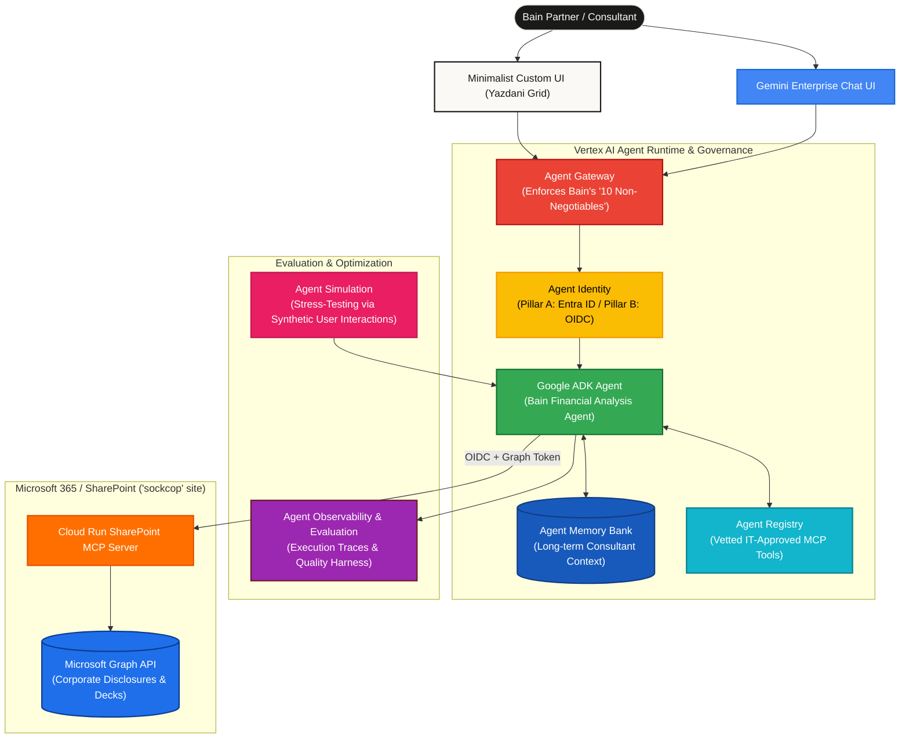

# Bain & Company // Gemini Enterprise Agent Platform Deep Dive

  <h3>SYSTEM STATUS: <strong>ONLINE</strong> // Target: <strong>Bain & Company Financial Analysis Agent</strong></h3>
  

    Showcase demonstrating the Gemini Enterprise Agent Platform as an enterprise-grade, flexible, open governance layer equipped with rigorous guardrails to securely accelerate Bain's agentic innovation.
  

---

## 📑 Master Hub & Navigation

This repository contains the end-to-end implementation, architectural research, governance specifications, replication playbook, and custom UI designed specifically for the **Bain & Company Deep Dive** working session.

| Section | Description | Quick Link |
| :--- | :--- | :--- |
| **1. Deep Research & Scenario Design** | Architectural mapping of Bain's needs (ADK, Agent Runtime, Memory Bank, Registry, Gateway, Identity, Observability, Simulation) to the Financial Analysis Agent. | [`ARCHITECTURE.md`](ARCHITECTURE.md) |
| **2. Google ADK Agent Code & Deployer** | Fully factored Google ADK Python project (`bain_financial_agent`) with `enable_tracing=True`, Pydantic output schemas, and two-pillar auth. | [`adk-agent/README.md`](adk-agent/README.md) |
| **3. Agent Gateway & Agent Identity Guide** | Step-by-step configuration for enforcing Bain's "10 non-negotiables" (DLP rules, global security policies, audit logging, Entra ID OAuth binding). | [`GATEWAY_AND_IDENTITY_GUIDE.md`](GATEWAY_AND_IDENTITY_GUIDE.md) |
| **4. SharePoint MCP Integration** | Connects the Cloud Run MCP server to Bain's `sockcop` SharePoint site using Microsoft Graph OAuth 2.0 and Service Account OIDC. | [`adk-agent/agent.py`](adk-agent/agent.py) |
| **5. Concise Replication Playbook** | Step-by-step point-by-point instructions to replicate the entire environment from scratch. | [`REPLICATION_PLAYBOOK.md`](REPLICATION_PLAYBOOK.md) |
| **6. Minimalist Custom UI** | Light-themed, minimalist custom UI following the Yazdani Architectural Grid and Zero-Parsing streaming financial widget protocol. | [`custom-ui/README.md`](custom-ui/README.md) |

---

## 🌟 Executive Summary: Tackling Bain's Requirements

### The Vision
Bain & Company requires a highly secure, governable, and scalable platform to build and deploy "industrialized" practice agents. The primary Proof of Concept (PoC) selected is the **Financial Analysis Agent**, designed to answer complex corporate due diligence questions such as: *"You've been asked for a position on this company, how can you get there?"*

To achieve this in a Microsoft-centric, Bain-specific context, the Gemini Enterprise Agent Platform provides an unparalleled suite of enterprise capabilities:

---

## 🛠️ Highlights of the Bain Scenario

1. **`[BUILD] Agent Development Kit (ADK)`**: Features a multi-step financial due-diligence workflow built on `gemini-2.5-pro`. The agent enforces strict anti-hallucination guardrails, mandating a two-step verification process (`search` followed by `fetch`/`read_file`) and returning premium clickable citations (`[Doc Title](webUrl)`).
2. **`[SCALE] Agent Runtime & Memory Bank`**: Hosted on Vertex AI Agent Runtime/GKE for elastically scaling to Bain's client base. Integrates the Agent Memory Bank to store long-term context and individual consultant preferences, directly driving Bain's desired "data flywheel" compounding advantage.
3. **`[GOVERN] Agent Registry, Gateway & Identity`**:
   - **Agent Registry**: Solves Bain's concern over vetting external tools (e.g., SAP, CrewAI, SharePoint) by providing a centralized, IT-approved skill catalog.
   - **Agent Gateway**: Enforces Bain's "10 non-negotiables" via global security policies (DLP filtering of Material Non-Public Information, rate limiting, and real-time audit logs).
   - **Agent Identity**: Implements the **Two-Pillar Authentication Protocol** (Pillar A: per-user Entra ID OAuth tokens for SharePoint; Pillar B: Google OIDC identity tokens for Cloud Run ingress).
4. **`[OPTIMIZE] Observability, Evaluation & Simulation`**:
   - **Observability & Evaluation**: Delivers the exact "test harness" Bain requested to trace agent reasoning (`enable_tracing=True`) and continuously evaluate output quality against golden datasets.
   - **Agent Simulation**: Allows Bain to safely stress-test practice agents against synthetic user interactions to guarantee quality before live deployment.

---

## 🚀 Getting Started

To explore the exact configuration and start running the showcase, please refer to the dedicated guides:
- 📖 **[Deep Research & Architecture](ARCHITECTURE.md)**
- 🔐 **[Agent Gateway & Agent Identity Setup](GATEWAY_AND_IDENTITY_GUIDE.md)**
- 📋 **[Step-by-Step Replication Playbook](REPLICATION_PLAYBOOK.md)**
- 💻 **[Custom UI Deployment Guide](custom-ui/README.md)**

---

  
POWERED_BY: <strong>GEMINI_2.5_PRO</strong> // ARCHITECTURE: <strong>YAZDANI_ARCHITECTURAL_GRID & ZERO_PARSING</strong>

