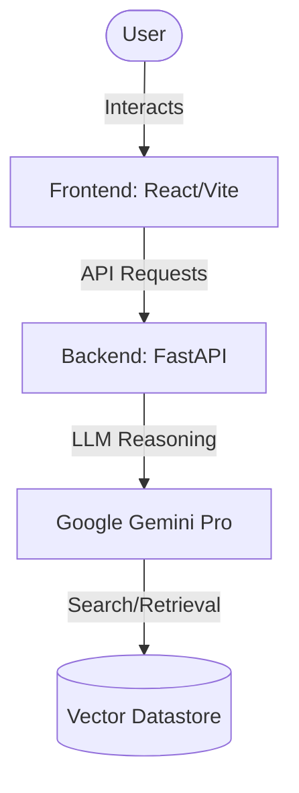

<div align="center">
  
</div>

<br/>

<div align="center">
  <h3>SYSTEM STATUS: <strong>ONLINE</strong> // SECURITY_LEVEL: <strong>SIGMA</strong></h3>
  <p>
    <em>A powerful system for reasoning over enterprise knowledge bases and extracting actionable insights.</em>
  </p>
</div>

<br/>

## 🪐 ARCHITECTURE & SPECS

> **Core Engine:** FastAPI (Backend) | React, Vite, TS (Frontend)

This module handles complex queries against structured and unstructured datastores.



## 📂 PROJECT STRUCTURE

```text
ge_understanding/
├── backend/            # FastAPI Backend & LLM Routing (Python, uv)
├── frontend/           # Modern React/Vite User Interface
├── docs/               # Architecture diagrams and documentation
└── README.md           # This file
```

## 🚀 QUICK START GUIDE

### 1. Backend Ignition

The backend leverages `uv` for ultra-fast dependency management.

```bash
cd ge_understanding/backend
uv sync
uv run main.py
```

### 2. Frontend Launch

The frontend operates on Vite for HMR and rapid development.

```bash
cd ge_understanding/frontend
npm install
npm run dev
```

## 🛡️ SECURITY PROTOCOLS

- **Zero-Leak Compliant:** `.env` structures are sealed and isolated.
- **Identity:** Authenticated operations only.

<br/>

<div align="center">
  
  <p>POWERED_BY: <strong>GEMINI_2.5_PRO</strong> // ARCHITECTURE: <strong>NEO_MONOLITH</strong></p>
</div>
