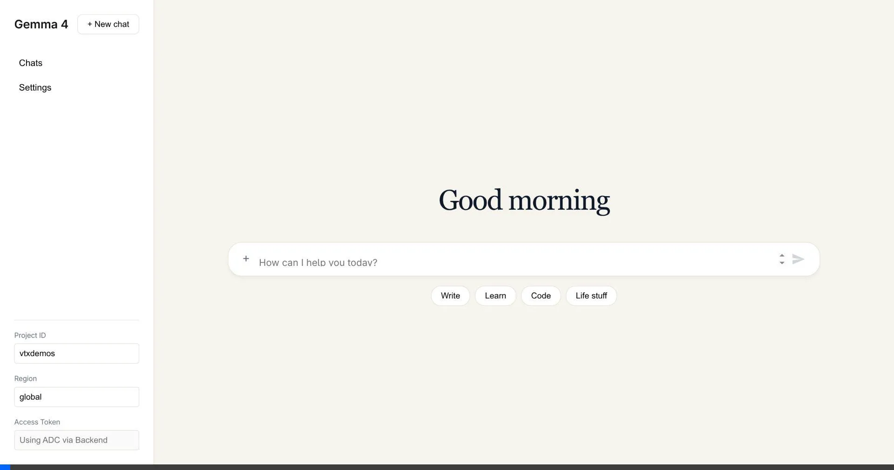

# Gemma Stratos

A minimalistic, Claude-inspired chat interface for testing the **Gemma 4 26B A4B IT** model on Vertex AI.

## Features

- **Claude-Style UI**: Centered chat, sidebar navigation, and bubble-less assistant responses.
- **ADC Support**: Uses Google Application Default Credentials via a local FastAPI backend, eliminating the need for manual token entry.
- **Markdown Rendering**: Supports rich text rendering for model outputs.
- **Streaming**: Real-time response streaming.

## Demo



## Getting Started

### Prerequisites

- Node.js (v18+)
- Python (v3.11+)
- UV (Python package manager)
- Google Cloud SDK configured with Application Default Credentials.

### Running the Backend

1.  Navigate to the project directory:
    ```bash
    cd antigravity/gemma-stratos
    ```
2.  Run the backend server using `uv`:
    ```bash
    uv run main.py
    ```
    The backend will start on `http://localhost:8000`.

### Running the Frontend

1.  In a new terminal, navigate to the project directory.
2.  Install dependencies if not already done:
    ```bash
    npm install
    ```
3.  Start the development server:
    ```bash
    npm run dev
    ```
    The UI will be accessible at `http://localhost:5173`.
