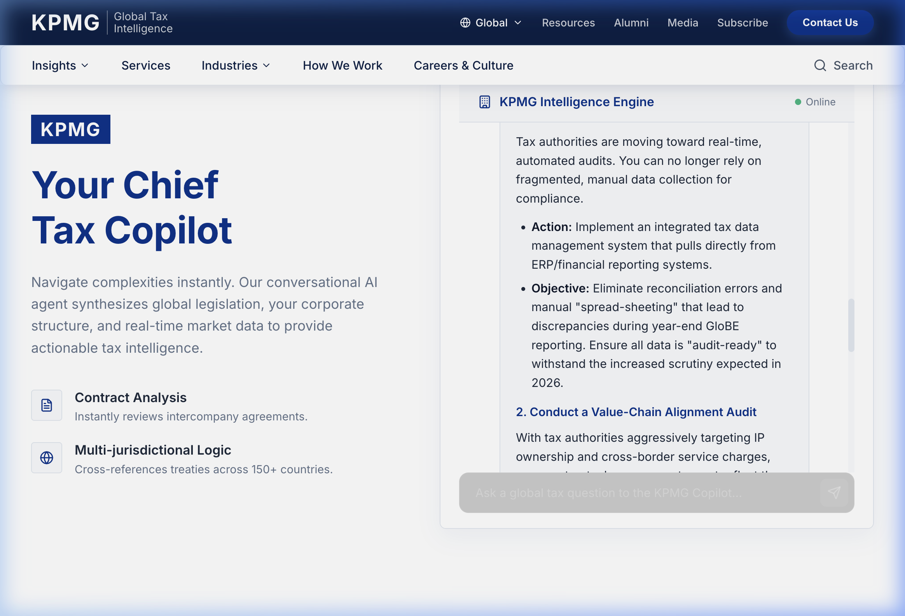
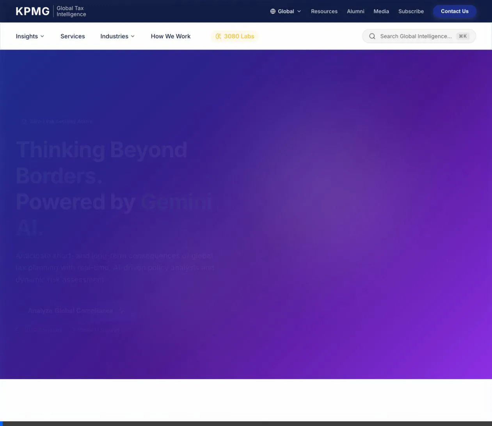

# Global Tax Intelligence - AI Demo Walkthrough

Global Tax Intelligence is an advanced, AI-driven corporate tax research methodology and copilot designed for corporate executives (CFOs, Heads of Tax). It replicates a modern corporate experience and infuses it with real-time **Generative AI** superpowers powered by Google Vertex AI and the Gemini model family.

---

## 📈 Enhancement Matrix: Before vs. After Google AI

| Capability | Previous Standard | Enhanced with Google AI |
| :--- | :--- | :--- |
| **Document Search** | Keyword-based matching, manual indexing | **Generative Synthesis**: Automatic layout previews and abstract summarization via Vertex AI Search. |
| **Tax Advisory** | Static portals and manual report lookups | **Chief Tax Copilot**: Real-time multi-turn advice with live Google Search reference grounding. |
| **Strategic Modeling** | Manual desk research & forecasting decks | **Swarm Boardroom Simulation**: Live multi-agent debate to critique restructuring scenarios dynamically. |

---

## 🚀 Key Modules & Capabilities

### 1. Global Tax Dashboard
The entry point presents a high-level, interactive dashboard. It provides **Live Strategic Insights** regarding global tax policies and compliance metrics utilizing modern layout frameworks.

*Figure 1: Landing Page showcasing Live Strategic Insights panels and modern dark-mode landing interface.*

### 2. Chief Tax Copilot
At the heart of the experience is the **Chief Tax Gemini**, an elite AI advisor that leverages **Google Search Grounding** to answer complex queries regarding OECD Pillar Two, transfer pricing, and legislative changes with real-world accuracy.

*   **Multi-Turn Interaction**: Floating conversational design streamlines workflow.
*   **Search-Grounded Synthesis**: Keeps responses anchored to current events with robust citations rather than static model data alone.

### 3. Vertex AI Search (VAIS) Integration
The dashboard provides powerful search tools designed for analyzing global documents. It hits **Vertex AI Search datasets** and renders generative overviews summarizing search snippets efficiently.

*Figure 2: Grounded Document Search leveraging layout parsing layout tools for analysis.*

### 4. Autonomous Swarm Boardroom _(Future labs module)_
Found under the "3080 Labs" page in the navigation bar, this feature simulates a multi-agent debate consisting of:
*   **The Aggressive Strategist**: Loops for maximizing efficiency at any cost.
*   **The Conservative Auditor**: Strict rule keeper auditing for compliance risks.
*   **The Global Economist**: Synthesizes macro verdict trends.
This provides a mock advisory loop useful for validating tax restructuring strategies with distinct strategic perspectives.

---

## 🛠️ Architecture

### Zero-Leak Framework
Strict adherence to absolute security constraints ensuring API keys are isolated, and execution environment preserves strict containment protocols.

*   **Backend**: Python FastAPI with the new `google.genai` SDK using `vertexai=True`.
*   **Frontend**: React (Vite) with `Framer Motion` and rich glassmorphism token design systems.

---

### 🎥 Demo Walkthrough Recording
Below is a live walkthrough captured locally showcasing seamless scrolling, chat interaction updates, and feature traversal:

*Figure 3: Browser Interactive traversal demonstrating visual responsiveness and text generation streaming flows.*
