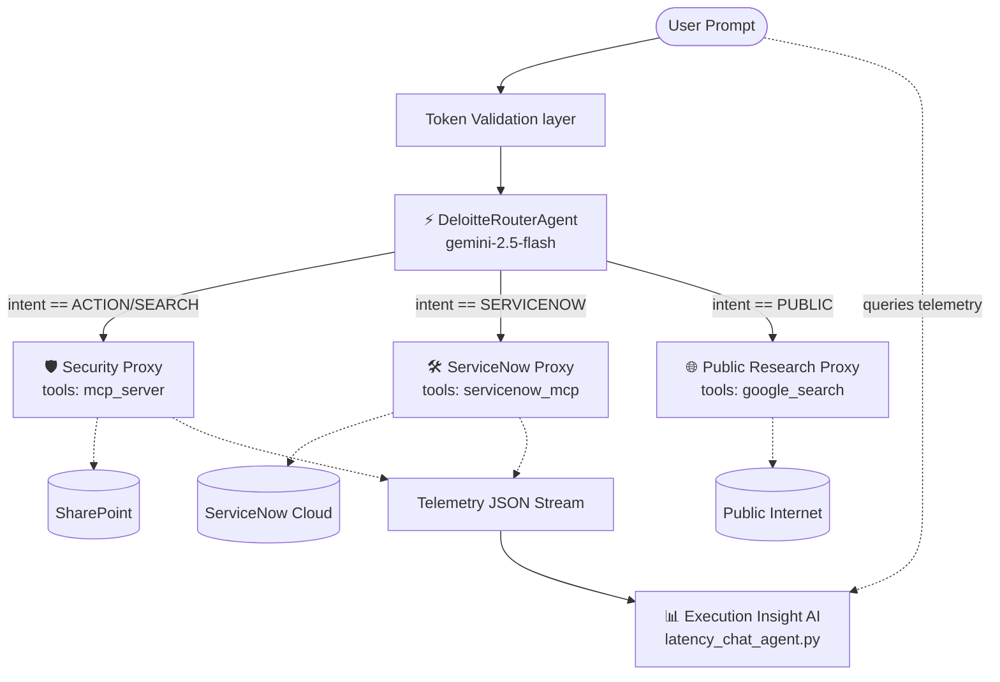

# The Internal Component Portal: Agent Swarm Architecture

Welcome to the ADK `backend/agents/` orchestration layer. 

This directory contains the brains of the Zero-Leak Portal. Instead of just one monolithic AI answering everything, the architecture utilizes a "Swarm" of highly specialized, isolated proxy agents. Each agent serves a unique purpose, governed by strict identity propagation and zero-leak environment protocols.

## Explore the Swarm

* **[The Intent Router & Orchestrator](docs/router.md)** (`agent.py` & `router_agent.py`)
  The multiplexing engine. Evaluates user intent and dynamically pipes session state across specialized proxies without losing history.
  
* **[The Security Proxy Agent](docs/security_proxy.md)** (`agent.py`)
  The iron-clad enterprise searcher. Connected to SharePoint via MCP, forces numerical fuzzing, entity redaction, and requires active Azure AD authentication.

* **[The ServiceNow Proxy Agent](docs/servicenow_proxy.md)** (`agent.py`)
  The IT Service Management specialist. Can self-heal missing infrastructure details using Google Web Search before writing destructive actions via the ServiceNow MCP.

* **[The Public Research Proxy](docs/public_research.md)** (`public_agent.py`)
  The ultra-fast internet gatherer. Runs outside the enterprise enclave utilizing `gemini-2.5-flash` active browsing to provide real-time global consensus and news.

* **[The Analytics & Latency Agents](docs/analytics_agents.md)** (`latency_chat_agent.py` & `analyze_latency_agent.py`)
  The performance engineers. Used strictly in the Telemetry tab to analyze execution JSON footprints and identify bottlenecked tools or TTFT drops.

## How It Works (The Execution Flow)

## Core Tenets
1. **Zero-Leak Initialization**: MCP definitions are dynamically created per request (`uv run python -m ...`), terminating as soon as the session dies. No data leaks.
2. **Context Passing**: Swarms share memory in-memory via ADK `SessionService` instances isolated strictly via unique AppNames and Session IDs.
3. **Execution Streams**: All outputs are Server-Sent Events (SSE). We capture functions, tools, thoughts, and outputs in real-time, feeding UI elements.
