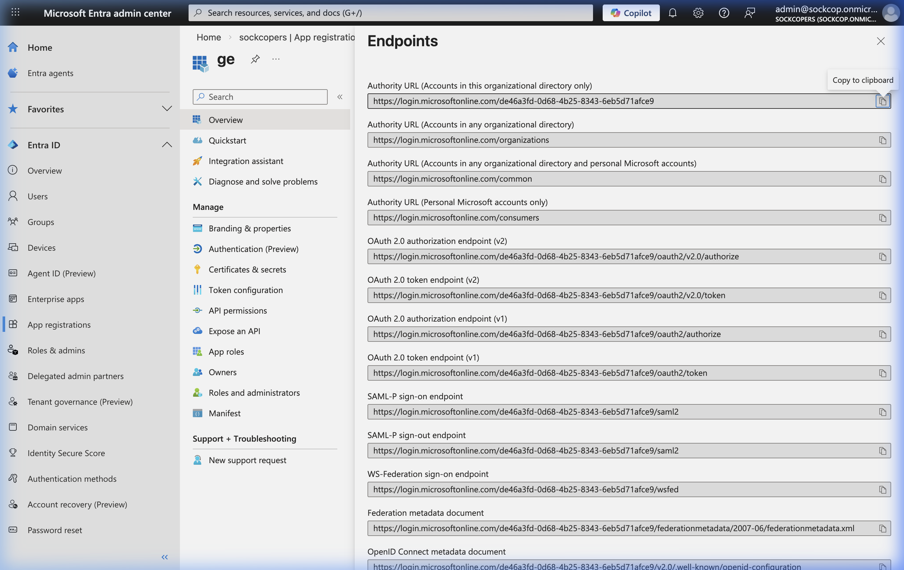
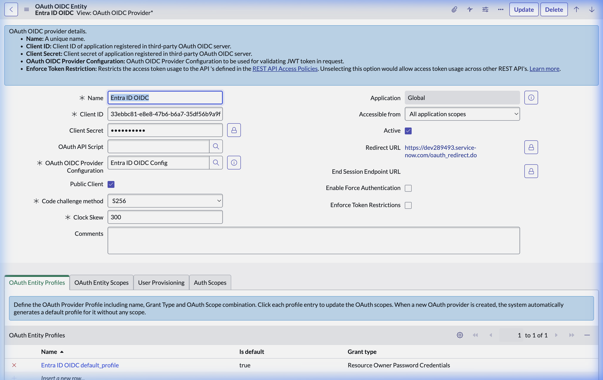
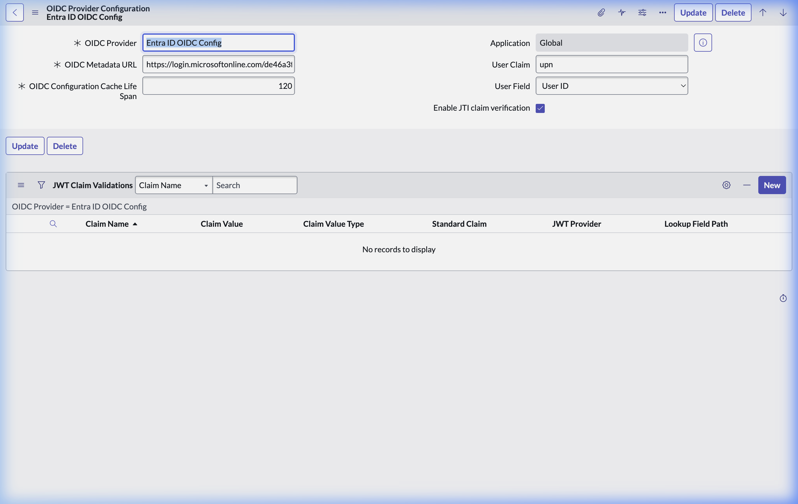

# Microsoft Entra ID & ServiceNow OIDC Replication Guide

This guide walks through configuring ServiceNow to trust Microsoft Entra ID as an Identity Provider via OIDC. When complete, API calls using a Microsoft Workload Identity JWT will be executed by ServiceNow under the privileges of the mapped human user, instead of a Service Account.

---

## Part 1: Gather Entra ID Application Details

You must first locate the Application (Client) ID and the OpenID Connect metadata link in your Azure/Entra ID tenant.

1. Navigate to the **Microsoft Entra admin center** (`entra.microsoft.com`).
2. Go to **Applications > App registrations**, and select your Portal application (e.g., `ge`).
3. Click on the **Endpoints** tab on the Overview page.
4. Copy the **OpenID Connect metadata document** URL.

> [!TIP]
> Make sure you also copy the **Application (client) ID**. For this example, our Client ID is `33ebbc81-e8e8-47b6-b6a7-35df56b9a9f0` and our OIDC metadata URL is `https://login.microsoftonline.com/de46a3fd-0d68-4b25-8343-6eb5d71afce9/v2.0/.well-known/openid-configuration`.

---

## Part 2: Create the ServiceNow OIDC Application Registry

Next, tell ServiceNow to accept authentication tokens from this Entra ID Application.

1. Log into your ServiceNow instance (`https://dev289493.service-now.com`).
2. Using the Filter Navigator, type **Application Registries** and select **System OAuth > Application Registries**.
3. Click **New** and choose **Create an OAuth OIDC Provider**.
4. Configure the entity:
   - **Name**: `Entra ID OIDC` (or similar)
   - **Client ID**: Paste the Client ID from Part 1 (`33ebbc81-e8e8-47b6...`)
   - **Public Client**: Check this box (if we are strictly passing inbound bearer tokens without an explicit secret mapping in the MCP).

> [!IMPORTANT]
> To link the OIDC metadata, you must create a new **OAuth OIDC Provider Configuration** via the magnifying glass lookup icon next to the field.

---

## Part 3: Map User Claims (JWT Provider)

The most critical step: mapping the Microsoft token subject to a ServiceNow `sys_user` record. 

1. Within the **OAuth OIDC Provider Configuration** creation popup (or linked record):
   - **OIDC Metadata URL**: Paste the URL copied from Entra ID (`https://login.microsoftonline.com/.../v2.0/.well-known/openid-configuration`).
   - **User Claim**: `upn` (This instructs ServiceNow to extract the User Principal Name from the Entra ID JWT payload).
   - **User Field**: `User ID` (This instructs ServiceNow to search the `sys_user` table for a record where `user_name` matches the `upn` claim).

2. Save your configurations.

---

## Conclusion

Your environment is now completely configured!

When the internal component portal passes an Entra ID JWT into the ServiceNow REST API using the `Authorization: Bearer <token>` header, ServiceNow will natively resolve the user, validate the cryptographic signature against Entra ID, and execute the Incident queried under the exact permissions, ACLs, and visibility rules of that specific employee!
