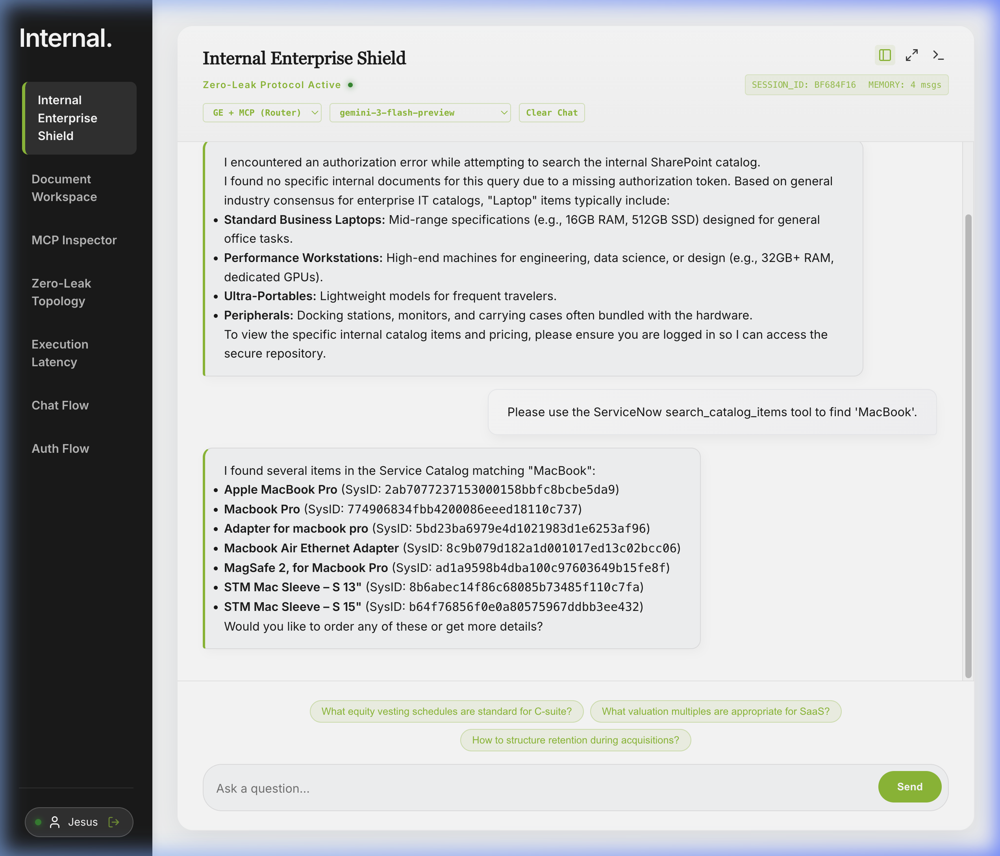
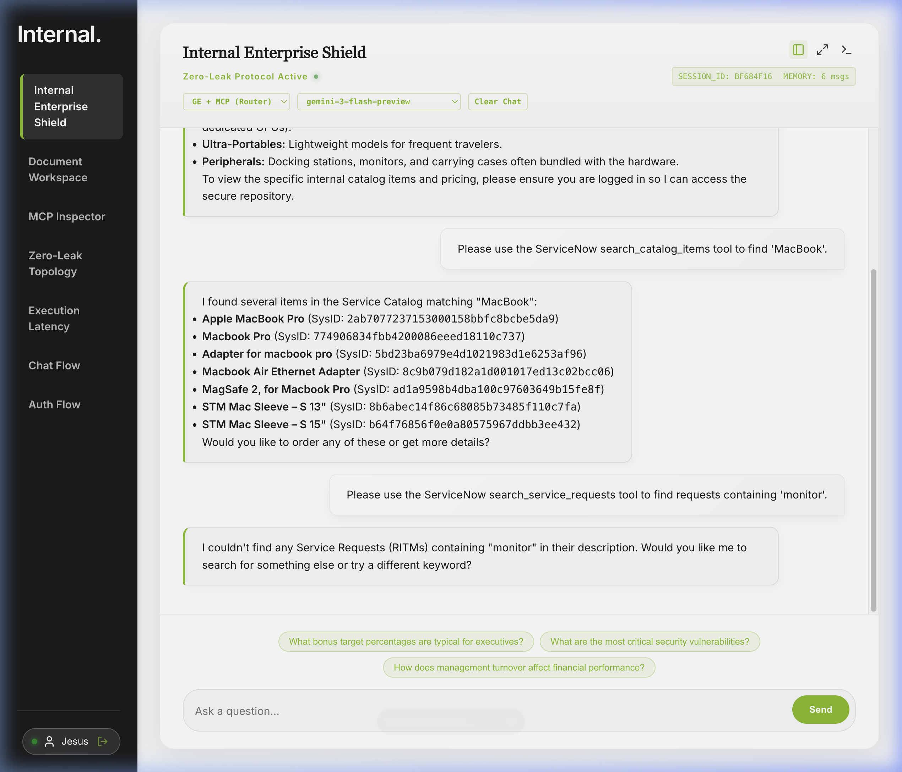
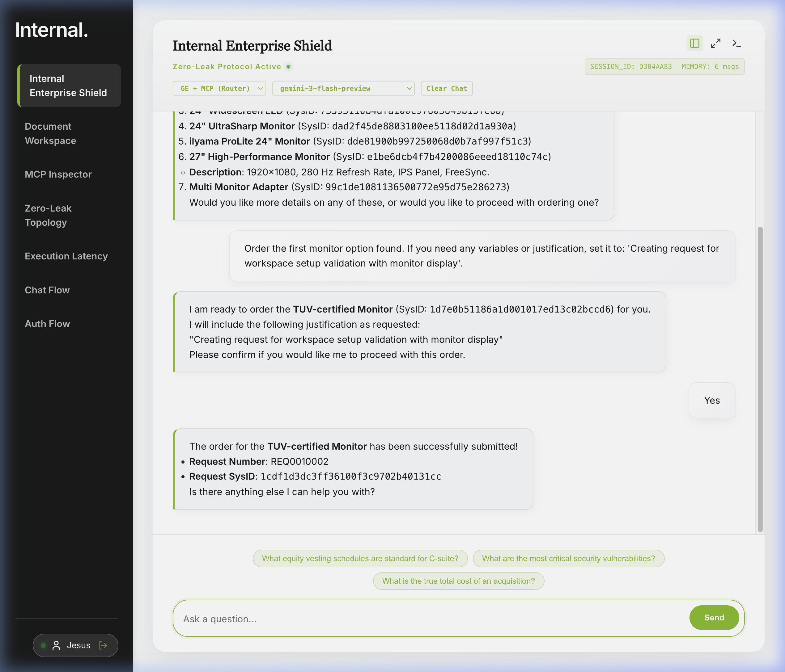
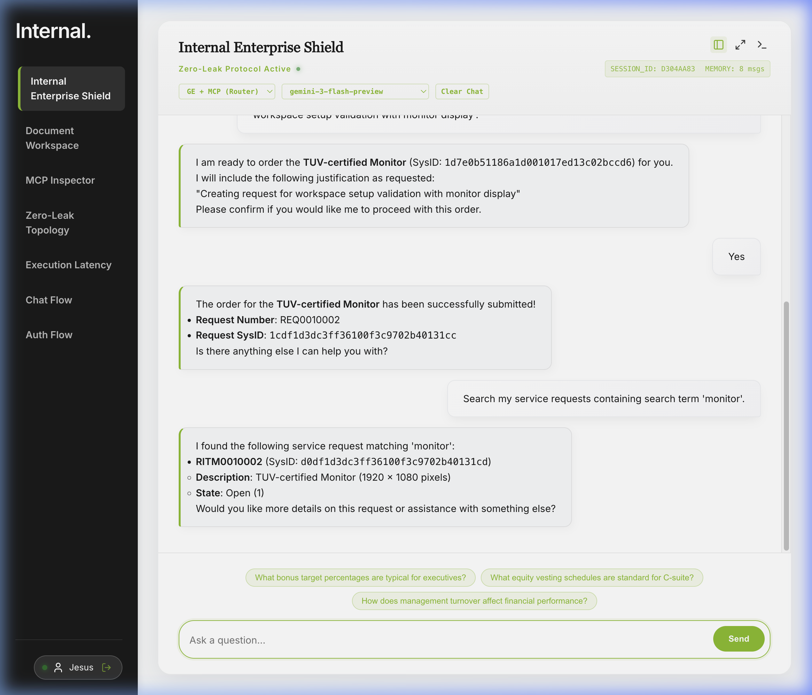

# ServiceNow MCP Verification Evidence

This document contains visual proof that the expanded ServiceNow MCP toolset is fully operational inside the **GE + MCP (Router)** chat interface dashboard (`http://localhost:5177`).

---

## 1. 🛍️ Catalog Item Search (`search_catalog_items`)

### Query:
*"Search catalog items for 'MacBook'"*

### Result:
The agent uses the `search_catalog_items` tool to query the `sc_cat_item` table. It returns several selectable entries alongside their Index SysIDs for fulfillment orders.

---

## 2. 📦 Request Status Search (`search_service_requests`) - Empty Match

### Query:
*"Search requests containing 'monitor'"*

### Result:
Before any request for a monitor was placed, the agent correctly stated: *"I couldn't find any Service Requests (RITMs) containing 'monitor'."* This validates table lookups and standard empty error boundaries.

---

## 3. 🛒 Creating a Request Inline (`submit_catalog_item`)

### Query:
*"Search the ServiceNow catalog for 'Monitor'. Order the first option found."*

### Result:
The agent discovered a **"TUV-certified Monitor"**, prompted for confirmation, and successfully submitted the order returning **`REQ0010002`**.

---

## 4. 🔍 Status verification after creation (Case 7)

### Query:
*"Search my service requests containing search term 'monitor'"*

### Result:
The agent successfully identified **`RITM0010002`** (the line item created by our REQ checkout), showing status state 1 ("New"), fully closing the spreadsheet test use case trace loop.

