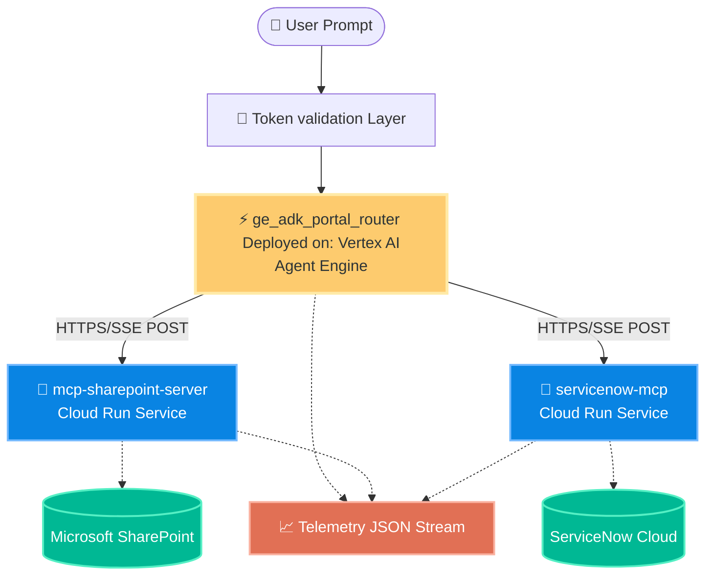

# Zero-Leak Internal Portal: Remote Architecture Guide

Welcome to the comprehensive guide for replicating and understanding the **Remote Architecture** of the Internal Component Portal. 

This guide walks through how the components are structured, how the MCP (Model Context Protocol) servers manage connection integrity over Cloud Run, and how the Vertex AI Agent Engine coordinates requests securely with strict identity propagation.

---

## 🗺️ High-Level Remote Topology

The remote environment splits processing load across isolated Google Cloud Run instances interconnected via Server-Sent Events (SSE) instead of local thread-spawning for maximum security and Horizontal scaling.



---

## 📂 Backend Folder Directory Walkthrough

To replicate this setup, each service lives inside its own isolated folder container scope:

### 1. **[SharePoint Security Proxy MCP](backend/mcp_service/)**
The iron-clad enterprise searcher connecting the Agent Engine to SharePoint file schemas without exposing raw keys.
- **Role**: Secure Document Discovery, Parallel Fan-out searching, Project Card emission using PII masking (`<redact>`).
- **[View Documentation & Code Explanations](backend/mcp_service/README.md)**

### 2. **[ServiceNow Proxy MCP](backend/servicenow_mcp/)**
The IT Service Management specialist carrying out ticketing queries and request submissions safely.
- **Role**: Generic query tools on incidents/tasks table, catalog submits, and closed loop governance actions.
- **[View Documentation & Code Explanations](backend/servicenow_mcp/README.md)**

### 3. **[Intent Router & Agent Engine Orchestration](backend/agents/)**
The brains multiplexing intentions into relevant endpoints. Deployed on Vertex AI with dynamic sessions memory.
- **Role**: Classify user intent -> stream parallel payloads setup via httpx.
- **[View Documentation & Code Explanations](backend/agents/README.md)**

---

## 🚀 Replicating to Production (Step-by-Step)

To deploy the entire Remote Mesh stack correctly, follow this standard continuous deployment sequence:

### **Step 1: Environmental Bindings**
Ensure your `.env` contains the globally routable URL of your deployments:
```bash
SERVICENOW_MCP_URL="https://servicenow-mcp-<hash>.us-central1.run.app/sse"
SHAREPOINT_MCP_URL="https://mcp-sharepoint-server-<hash>.us-central1.run.app/sse"
```

### **Step 2: Deploying the MCP Backends**
Packaged via Dockerfiles, deploy your SSE listeners to Cloud Run:
```bash
# Deploys SharePoint backend 
gcloud run deploy mcp-sharepoint-server --source .
```

### **Step 3: Registering with Agent Engine (Vertex AI)**
Deploy the ADK router agent using `deploy_agent_engine.py`:
```bash
uv run python deploy_agent_engine.py
```

Clickable deep-dives are accessible in the folder links above for detailed walkthroughs of logic layouts and SSE connections structure buffers.
