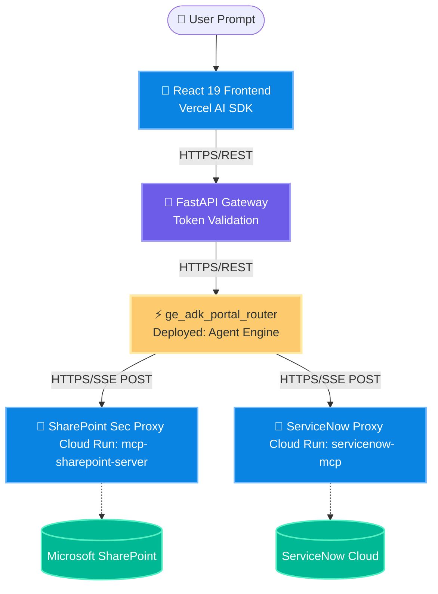

# 🛡️ Remote Zero-Leak Enterprise Portal

> **Zero-Leak Protocol Enforced**: This project implements a secure consulting intelligence portal leveraging a Middleman architecture between confidential SharePoint/ServiceNow documents and user endpoints. It guarantees users can query enterprise intelligence safely without exposing sensitive client data, PII, or raw account specifics to model parsing layers.

This application runs purely on **Cloud Run** and **Vertex AI Agent Engine**, coordinating secure delegated search loops via the **Model Context Protocol (MCP)** powered by **Google ADK (Agent Development Kit)** and the **React 19 Vercel AI SDK**.

---

## 🗺️ Master Component Architecture (Interactive)

The diagram below outlines the core service boundaries deployed in production. **Clicking any node inside the mesh navigates directly to its code repository or full documentation structure.**



---

## 🚀 Step-by-Step Replication Guide

To deploy the entire Remote Mesh stack correctly, follow this standard deployment sequence:

### **Step 1: Environment Bindings**
Ensure your root `.env` (excluded from git) contain metadata endpoints references supporting deployments routing mesh securely:
```env
# Cloud Run endpoints (Hydrate these after triggering Step 2)
SERVICENOW_MCP_URL="https://servicenow-mcp-<hash>.us-central1.run.app/sse"
SHAREPOINT_MCP_URL="https://mcp-sharepoint-server-<hash>.us-central1.run.app/sse"

# Targets (Non-secret IDs for Entra authentication layer)
TENANT_ID="your-azure-tenant-id"
CLIENT_ID="your-azure-app-client-id"
SITE_ID="your-sharepoint-site-id"
DRIVE_ID="your-sharepoint-drive-id"
```

### **Step 2: Deploying the Backends (Cloud Run)**
Each specialized target listener gets wrapped inside its isolated execution context container:

1. **Deploy SharePoint Sec Proxy**:
   ```bash
   cd backend
   # Build image and publish listening endpoints
   gcloud run deploy mcp-sharepoint-server --source . --file Dockerfile_sharepoint
   ```

2. **Deploy ServiceNow Proxy**:
   ```bash
   cd backend
   gcloud run deploy servicenow-mcp --source . --file Dockerfile
   ```

### **Step 3: Registering with Vertex AI Agent Engine**
Register the master `LlmAgent` mesh router on Vertex AI reasoning engines to unify intent classifying:
```bash
cd backend
uv run python deploy_agent_engine.py
```

---

## 📂 isolated Directory Navigation
Click a subfolder directory to view component diagrams framing internal triggers and loop sequences absolute links nodes ranges correctly:
*   [🎨 frontend/](frontend/) : Vite standard setup housing local routing hooks.
*   [🐋 backend/mcp_service/](backend/mcp_service/) : Logic for delegated Parallel SharePoint node.
*   [🐋 backend/servicenow_mcp/](backend/servicenow_mcp/) : Logic for specialized tickets emission node.
*   [⚡ backend/agents/](backend/agents/) : Google ADK orchestrators framing prompt streams node.
