# SharePoint MCP: Security Proxy Documentation

The SharePoint MCP service serves as an authenticated high-velocity bridge between the `ge_adk_portal_router` and Microsoft Graph API schemas. It enforces Numerical Fuzzing, Static Entity Masking, and Zero-Leak redaction models.

---

## 🛠️ Implementation Architecture

The SharePoint MCP utilizes the **`FastMCP`** framework provided by context routing pipelines. It exposes SSE transports to listen for dynamic JSON bundles emitted by the orchestration layer.

### 🌐 The SSE Bridge (`mcp_server_sharepoint_sse.py`)
This file is the **Entrypoint** for Cloud Run server listeners. It binds the container port to listen for incoming stream-events:
```python
if __name__ == "__main__":
    port = int(os.environ.get("PORT", 8080))
    # Run using SSE transport bound to 0.0.0.0
    mcp.run(transport="sse", port=port, host="0.0.0.0")
```

---

## 🔧 Tools definitions (`mcp_server.py`)

The actual tools coordinates follow isolated authentication scopes and emit parallel payloads. **Click a tool to view its source code implementation:**

```mermaid
graph TD
    classDef tool fill:#fdeff2,stroke:#f06292,stroke-width:2px,color:#d81b60;
    
    T1[🔍 search_documents \n Parallel Fan-out Discovery]:::tool
    T2[📋 emit_project_card \n Structured Card + PII Masking]:::tool
    T3[📄 read_document_content \n Full Text Streaming]:::tool
    T4[🛡️ secure_document_governance \n Auto-Relocate to Vault]:::tool
    
    click T1 "https://github.com/jchavezar/vertex-ai-samples/blob/main/antigravity/internal_components_portal_remote/backend/mcp_service/mcp_server.py#L79" "View Code"
    click T2 "https://github.com/jchavezar/vertex-ai-samples/blob/main/antigravity/internal_components_portal_remote/backend/mcp_service/mcp_server.py#L99" "View Code"
    click T3 "https://github.com/jchavezar/vertex-ai-samples/blob/main/antigravity/internal_components_portal_remote/backend/mcp_service/mcp_server.py#L124" "View Code"
    click T4 "https://github.com/jchavezar/vertex-ai-samples/blob/main/antigravity/internal_components_portal_remote/backend/mcp_service/mcp_server.py#L157" "View Code"
```



### 🛡️ Core Governance Persona Prompt
The server exports a continuous instruction guide forcing the Agent to use `<redact>` tags whenever exact salaries or sensitive metrics are accessed:
```python
@mcp.prompt()
def governance_persona(context: str = "") -> str:
    """Exports instruction persona wrapper for grounding."""
    return f"{GOVERNANCE_INSTRUCTIONS}\nContext: {context}"
```

---

## 🚀 Replicating to Cloud Run

Each time you deploy the SharePoint server to Cloud Run, ensure the `.env` carries the **Site & Drive IDs** used to ground the search queries:

1. Create a `Dockerfile_sharepoint` targeting the `mcp_server_sharepoint_sse.py` entrypoint script.
2. Push container to Artifact Registry to build continuous stream response buffers:
```bash
gcloud run deploy mcp-sharepoint-server --source . --allow-unauthenticated
```
3. Test locally or via `curl`:
```bash
curl -i https://mcp-sharepoint-server-<hash>.us-central1.run.app/sse
```
If you get `200 OK` or `EventSource` header logs, your secure proxy endpoint excels connecting!
