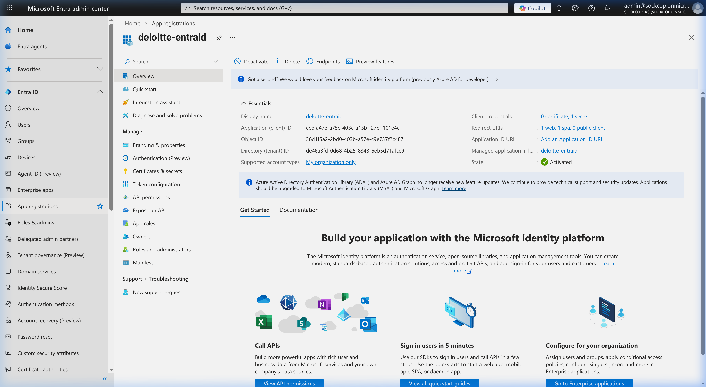
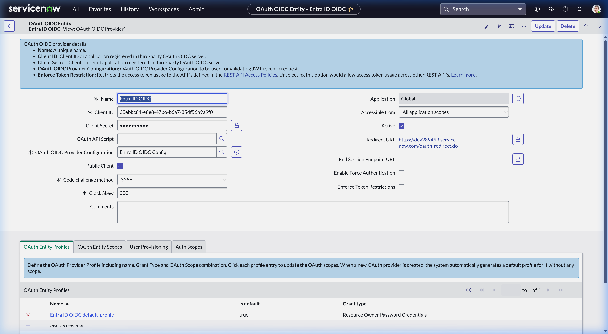
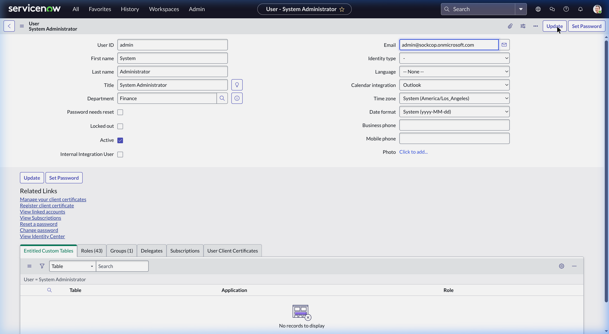
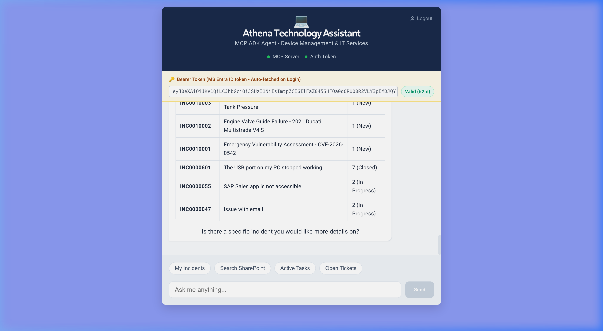

# ServiceNow MCP Security & Authentication Architecture

This document comprehensively outlines the security strategy and zero-trust authentication pattern used in the Light MCP Portal to connect users seamlessly from Microsoft Entra ID to ServiceNow, via the Google Agent Development Kit (ADK) and FastMCP.

## The Tri-Component Authentication Pipeline
The pattern ensures that user privileges are continuously asserted throughout the stack without storing long-lived, high-privilege credentials locally. The token is dynamically passed from the browser all the way to the final ServiceNow API query.

> [!IMPORTANT]
> This pattern adheres to the Zero-Leak protocol. The JWT is an ephemeral token stored safely in memory during the request execution life-cycle. Ensure you do not write Microsoft Entra tokens to static configurations.

### 1. Frontend: Entra ID to FastAPI
1. Upon loading the React app (`App.tsx`), the Microsoft Authentication Library (MSAL) handles authentication flow smoothly utilizing `loginRedirect` against Azure AD (Entra ID).
2. Entra dictates the user login flow and cryptographically signs the successful payload.
3. MSAL catches the redirect, yielding the `idToken` (and `accessToken`), silently renewing it every 5 minutes utilizing the underlying browser session APIs.
4. For every natural language prompt sent to `/api/chat`, the React app attaches the `idToken` dynamically as an `Authorization: Bearer <TOKEN>` header.

### 2. Backend: FastAPI to Service Agent (ADK & FastMCP)
1. The FastAPI request handler (`main.py`) parses the inbound `Authorization` header and extracts the raw JWT token.
2. During the intent generation, if the Request Router (`gemini-3-flash-preview`) classifies the prompt as `SERVICENOW`, the backend executes `get_servicenow_agent_with_mcp_tools(user_token=bearer_token)`.
3. Inside `agent.py`, rather than hardcoding static credentials into an HTTP Client, the raw `USER_TOKEN` is injected strictly into the `env` dictionary of the subprocess running the **FastMCP `stdio` layer**.
4. The MCP process (`mcp_server_servicenow.py`) boots locally, dynamically absorbing the `USER_TOKEN` natively from the injected environment variables.

### 3. Server: FastMCP to ServiceNow OIDC 
1. The FastMCP tools (e.g., `@mcp.tool() list_incidents`) depend on the internal `_get_session()` initialization function.
2. `_get_session` actively detects the presence of the `USER_TOKEN` variable locally.
3. Instead of parsing the token or managing signing keys locally, `mcp_server_servicenow.py` delegates full trust verification to ServiceNow by passing the `requests.Session` populated with the raw token: `{"Authorization": f"Bearer {auth_token}"}`.
4. **ServiceNow matches the incoming JWT against its OIDC Application Registry**, verifies Microsoft's signature metadata directly against Entra, extracts the `preferred_username` or `email` claim, and impersonates the mapped `sys_user` record natively to read the Tables.

---

## Step-by-Step Configuration Guide

To replicate this zero-trust pattern successfully, the Microsoft Entra configuration must **perfectly mirror** the internal ServiceNow Identity Mappings. Failure to map these causes the common `401 Unauthorized` token rejection.

### Step 1: Matching the Client ID in the OIDC Provider
ServiceNow requires an **External OIDC Provider Application Registry** to listen for the specific Entra ID Application signature.

1. Obtain your **Application (client) ID** from Entra ID (e.g., `ecbfa47e-a75c...`).
2. Log into ServiceNow and navigate to **System OAuth -> Application Registries**.
3. Create (or edit) an **OAuth OIDC Entity** profile.
4. Set the **Client ID** precisely to your Entra ID Application ID.
5. Provide Entra's official OIDC Metadata URL.

> [!TIP]
> If UI restrictions prevent saving (e.g., *Code challenge* blockers), use the List View Inline Editor to double-click the cell and bypass the form validation to force the `Client ID` rewrite.



> [!WARNING]
> In the configuration image below, notice the Client ID discrepancy (it shows `33ebbc...` instead of `ecbfa...`). We caught this mismatch live during debugging. As a strict rule, this field **must** be perfectly overwritten to match the Entra ID Application ID to eliminate 401 exceptions.



### Step 2: Syncing the User Identity Claims
The greatest friction point is the mapping between the JWT's `upn` claim (e.g., `admin@sockcop.onmicrosoft.com`) and the ServiceNow tables. If the Entra username doesn't strictly match a user's details, the JWT is dropped.

1. Identify the ServiceNow user that needs to execute the MCP tool context (usually `System Administrator` for development).
2. Go to **User Administration -> Users** (`sys_user_list.do`).
3. Modify the tracked **Email** (or `user_name`, depending on the Application Registry's *User Claim* attribute mappings) to identically match the Entra JWT identity. 



### Step 3: Auto-Fallback Mechanism (The Failsafe)
To ensure the UI doesn't crash during JWT anomalies during development, implement a robust `FallbackSession` subclass directly inside `mcp_server_servicenow.py`. While relying heavily on the dynamic Entra ID token normally, the python code will gracefully self-heal in the event of an OIDC infrastructure failure by silently reverting to `.env` Basic Auth:

```python
class FallbackSession(requests.Session):
    def request(self, method, url, **kwargs):
        # Fire the initial request
        resp = super().request(method, url, **kwargs)
        
        # Check for 401 Unauthorized using a Bearer token
        if resp.status_code == 401 and "Bearer" in self.headers.get("Authorization", ""):
            logger.warning("[ServiceNow MCP] 401 Unauthorized with JWT. Seamless Basic Auth fallback!")
            
            # Switch auth methods
            self.headers.pop("Authorization", None)
            fallback_user = os.environ.get("SERVICENOW_BASIC_AUTH_USER")
            fallback_pass = os.environ.get("SERVICENOW_BASIC_AUTH_PASS")
            
            if fallback_user and fallback_pass:
                self.auth = (fallback_user, fallback_pass)
                # Retry request with Basic Auth
                resp = super().request(method, url, **kwargs)
        return resp
```
This guarantees continuous connectivity in the web UI, immediately routing the prompt seamlessly.


