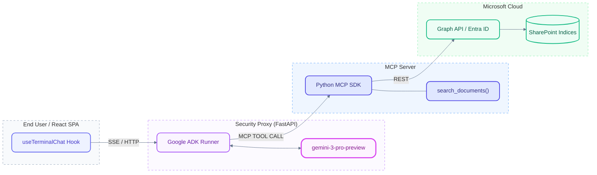

# PWC LLM Security Proxy: SharePoint Integration

This project is a secure, generalized consulting intelligence proxy. It acts as a middleman between confidential SharePoint documents and a chat interface, allowing users to query intelligence without ever exposing sensitive client data, PII, or raw financial specifics.

This project implements the **Zero-Parsing Architecture** using FastAPI, Google ADK (Agent Development Kit), and the React 19 Vercel AI SDK. It also provides a beautiful, modern **Topology UI** to inspect the end-to-end trace.

## 🔐 Zero-Leak Protocol

This repository adheres to strict Zero-Leak protocols.
- **NEVER** commit `.env` files.
- **NEVER** hardcode credentials (e.g., `client_id`, `client_secret`, `tenant_id`).
- Secrets are managed entirely in your local environment.
- The `.gitignore` includes mandatory exclusion rules for all standard credential files.

---

## 🏗️ Architecture Topology

The application enforces a secure offloading architecture using the Model Context Protocol (MCP).



### Flow Breakdown:
1. **End User (React SPA):** The user types a query in the beautifully designed "Modern Cave" chat interface.
2. **Security Proxy:** The Vercel AI SDK streams the request to a FastAPI backend running a Google ADK `LlmAgent`.
3. **LLM Evaluation:** `gemini-3-pro-preview` evaluates the query and delegates extraction to the MCP Server if external knowledge is required.
4. **MCP Server:** Executes the `search_documents()` tool via the standard Model Context Protocol.
5. **Microsoft Graph:** Authenticates using OAuth 2.0 Client Credentials and accesses protected SharePoint directories.
6. **Zero-Parsing Delivery:** The Proxy returns sanitized markdown (`0:`) and structured data cards (`2:`) back to the frontend dynamically.

---

## 🚀 Environment Setup

At the root of the project (`llm_security_proxy_sharepoint/`), create a `.env` file containing your Azure credentials and SharePoint targets:

```env
# Microsoft Graph API Credentials
TENANT_ID=your_tenant_id
CLIENT_ID=your_client_id
CLIENT_SECRET=your_client_secret

# SharePoint Targets
SITE_ID=your_site_id
DRIVE_ID=your_drive_id

# Google Cloud (For LLM and ADK)
GOOGLE_CLOUD_PROJECT=your_gcp_project
```

Ensure your Entra ID application has `Sites.Read.All` and `Files.Read.All` with **Admin Consent Granted**.

---

## 📦 Installation & Execution

We strictly use `uv` for Python dependency management.

### Backend Start
```bash
cd backend
uv sync
uv run python main.py
```
*(Runs on port 8001)*

### Frontend Start
```bash
cd frontend
npm install
npm run dev
```
*(Runs on port 5173)*

### Standalone MCP Server
You can run the SharePoint connector natively as a standalone server for the MCP Inspector:
```bash
cd backend
uv run python mcp_server.py
```

### Serverless Cloud Run Deployment
You can deploy the FastMCP server securely on Google Cloud Run to provide streaming endpoints across any interface:
```bash
cd backend
gcloud run deploy mcp-sharepoint-server \
  --source . \
  --region us-central1 \
  --allow-unauthenticated \
  --env-vars-file=../.env
```
Once deployed, simply copy the URL and update your `McpInspector.tsx` state variable to consume your new edge-running MCP connection.

---

## 🎨 UI/UX Highlights
- **Topology View:** A built-in architecture viewer inside the application (`Topology` toggle in the header).
- **Responsive PWC Chat Sidebar:** Dark glassmorphism, contextual cards, and a sophisticated prompt input overlay.
- **Enterprise Grade Look:** Authentic layout based on corporate guidelines, ensuring robust navigation and aesthetic spacing.
