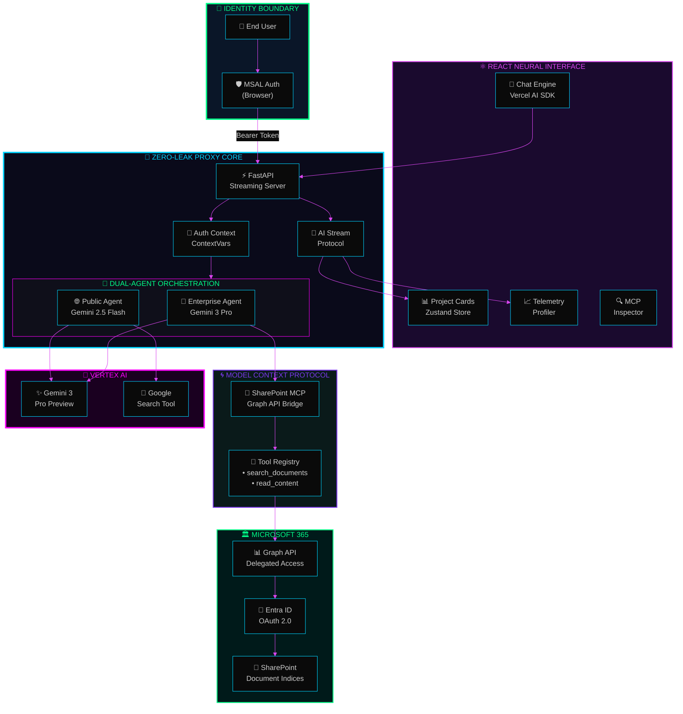
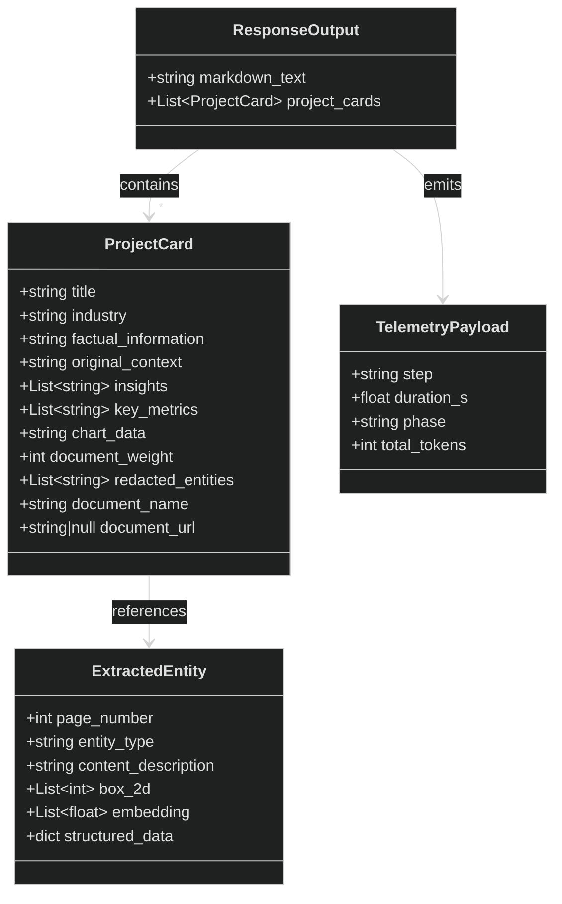

<![CDATA[<div align="center">

```
    ╔══════════════════════════════════════════════════════════════════════════════════╗
    ║                                                                                  ║
    ║   ███████╗███████╗██████╗  ██████╗       ██╗     ███████╗ █████╗ ██╗  ██╗       ║
    ║   ╚══███╔╝██╔════╝██╔══██╗██╔═══██╗      ██║     ██╔════╝██╔══██╗██║ ██╔╝       ║
    ║     ███╔╝ █████╗  ██████╔╝██║   ██║█████╗██║     █████╗  ███████║█████╔╝        ║
    ║    ███╔╝  ██╔══╝  ██╔══██╗██║   ██║╚════╝██║     ██╔══╝  ██╔══██║██╔═██╗        ║
    ║   ███████╗███████╗██║  ██║╚██████╔╝      ███████╗███████╗██║  ██║██║  ██╗       ║
    ║   ╚══════╝╚══════╝╚═╝  ╚═╝ ╚═════╝       ╚══════╝╚══════╝╚═╝  ╚═╝╚═╝  ╚═╝       ║
    ║                                                                                  ║
    ║            ██████╗ ██████╗  ██████╗ ████████╗ ██████╗  ██████╗ ██████╗ ██╗       ║
    ║            ██╔══██╗██╔══██╗██╔═══██╗╚══██╔══╝██╔═══██╗██╔════╝██╔═══██╗██║       ║
    ║            ██████╔╝██████╔╝██║   ██║   ██║   ██║   ██║██║     ██║   ██║██║       ║
    ║            ██╔═══╝ ██╔══██╗██║   ██║   ██║   ██║   ██║██║     ██║   ██║██║       ║
    ║            ██║     ██║  ██║╚██████╔╝   ██║   ╚██████╔╝╚██████╗╚██████╔╝███████╗  ║
    ║            ╚═╝     ╚═╝  ╚═╝ ╚═════╝    ╚═╝    ╚═════╝  ╚═════╝ ╚═════╝ ╚══════╝  ║
    ║                                                                                  ║
    ║                    Enterprise Intelligence Security Proxy                        ║
    ║                    ══════════════════════════════════════                        ║
    ║                                                                                  ║
    ║                 "Query Everything. Expose Nothing. Trust Zero."                  ║
    ║                                                                                  ║
    ╚══════════════════════════════════════════════════════════════════════════════════╝
```

[](.)
[](.)
[](.)
[](.)
[](.)
[](.)

</div>

---

<div align="center">

## `[ CLASSIFIED: ENTERPRISE INTELLIGENCE MIDDLEWARE ]`

**A next-generation security proxy that enables confidential enterprise document querying through AI-powered intelligence synthesis—without ever exposing sensitive data, PII, or raw financial specifics to any external system.**

</div>

---

## ⚡ QUANTUM OVERVIEW

This repository implements a **Zero-Leak Protocol Security Proxy**—a sophisticated middleware layer that sits between confidential SharePoint documents and users, enabling them to extract actionable consulting insights while maintaining complete data sovereignty.

```
┌─────────────────────────────────────────────────────────────────────────────────────────┐
│                                                                                         │
│   ┌─────────────┐     ┌─────────────┐     ┌─────────────┐     ┌─────────────┐          │
│   │   QUERY     │ ──► │   PROXY     │ ──► │   MASK      │ ──► │   DELIVER   │          │
│   │  Enterprise │     │  Intercept  │     │  Sensitive  │     │   Insights  │          │
│   │  Documents  │     │  & Validate │     │    Data     │     │    Only     │          │
│   └─────────────┘     └─────────────┘     └─────────────┘     └─────────────┘          │
│                                                                                         │
│   ════════════════════════════════════════════════════════════════════════════════════ │
│                         🔒 ZERO TOKENS STORED • ZERO DATA LEAKED                        │
│                                                                                         │
└─────────────────────────────────────────────────────────────────────────────────────────┘
```

---

## 🌌 SYSTEM ARCHITECTURE

### Neural Mesh Topology



---

## 🔐 ZERO-LEAK SECURITY PROTOCOL

### Quantum-Grade Data Protection

```mermaid
%%{init: {'theme': 'dark', 'themeVariables': { 'primaryColor': '#00ff88', 'primaryTextColor': '#fff', 'primaryBorderColor': '#00ff88', 'lineColor': '#d946ef', 'secondaryColor': '#7c3aed', 'tertiaryColor': '#0a0a0a' }}}%%
sequenceDiagram
    autonumber

    participant U as 👤 User Browser
    participant M as 🛡️ MSAL
    participant E as 🔷 Entra ID
    participant F as ⚡ FastAPI
    participant C as 🔑 ContextVars
    participant A as 🤖 ADK Agent
    participant S as 📁 SharePoint MCP
    participant G as 📊 Graph API

    rect rgb(10, 22, 40)
        Note over U,E: 🔐 AUTHENTICATION PHASE
        U->>M: Login Request
        M->>E: OAuth 2.0 Redirect
        E-->>M: Access Token (Delegated)
        M-->>U: Token Stored (SessionStorage)
    end

    rect rgb(26, 10, 46)
        Note over U,A: 🔮 QUERY PHASE
        U->>F: POST /chat + Bearer Token
        F->>C: set_user_token(token)
        F->>A: Initialize Runner
        A->>A: before_agent_callback()
        Note right of A: ⚠️ Reject if token null
    end

    rect rgb(10, 26, 26)
        Note over A,G: 📡 RETRIEVAL PHASE
        A->>S: search_sharepoint_documents()
        S->>C: get_user_token()
        S->>G: Search Request + Token
        G-->>S: Hit Highlights + Metadata
        S-->>A: Document Results
    end

    rect rgb(10, 10, 26)
        Note over A,U: 🛡️ SANITIZATION PHASE
        A->>A: Mask PII & Financials
        A->>A: Wrap in <redact> tags
        A-->>F: ResponseOutput (Masked)
        F-->>U: Stream: 0: text + 2: cards
    end
```



### Seven Pillars of Zero-Leak

```
╔══════════════════════════════════════════════════════════════════════════════════════╗
║                                                                                      ║
║  ┌────────────────┐  ┌────────────────┐  ┌────────────────┐  ┌────────────────┐     ║
║  │   🔒 PILLAR 1  │  │   🔒 PILLAR 2  │  │   🔒 PILLAR 3  │  │   🔒 PILLAR 4  │     ║
║  │   ───────────  │  │   ───────────  │  │   ───────────  │  │   ───────────  │     ║
║  │   No Stored    │  │   Stateless    │  │   Before-Agent │  │   Data         │     ║
║  │   Tokens       │  │   Proxying     │  │   Callback     │  │   Masking      │     ║
║  │                │  │                │  │                │  │                │     ║
║  │ .env contains  │  │ Each request   │  │ Rejects if no  │  │ PII → Roles    │     ║
║  │ only non-      │  │ brings its own │  │ token before   │  │ $$$  → Ranges  │     ║
║  │ secret IDs     │  │ short-lived    │  │ LLM executes   │  │ Names → [Co.]  │     ║
║  │                │  │ token          │  │                │  │                │     ║
║  └────────────────┘  └────────────────┘  └────────────────┘  └────────────────┘     ║
║                                                                                      ║
║  ┌────────────────┐  ┌────────────────┐  ┌────────────────┐                         ║
║  │   🔒 PILLAR 5  │  │   🔒 PILLAR 6  │  │   🔒 PILLAR 7  │                         ║
║  │   ───────────  │  │   ───────────  │  │   ───────────  │                         ║
║  │   Strict       │  │   URL          │  │   Scoped       │                         ║
║  │   Grounding    │  │   Validation   │  │   Access       │                         ║
║  │                │  │                │  │                │                         ║
║  │ Answer only    │  │ Exact webUrl   │  │ User can only  │                         ║
║  │ from retrieved │  │ from tool or   │  │ access sites   │                         ║
║  │ documents      │  │ null           │  │ they own       │                         ║
║  │                │  │                │  │                │                         ║
║  └────────────────┘  └────────────────┘  └────────────────┘                         ║
║                                                                                      ║
╚══════════════════════════════════════════════════════════════════════════════════════╝
```

---

## 🔧 TOOL & FUNCTION REGISTRY

### Backend Neural Pathways

```mermaid
%%{init: {'theme': 'dark', 'themeVariables': { 'primaryColor': '#00ff88', 'primaryTextColor': '#fff', 'lineColor': '#00d4ff' }}}%%
graph TB
    subgraph MAIN["main.py — FastAPI Orchestrator"]
        direction TB
        CHAT_EP["chat_endpoint()\n━━━━━━━━━━━━━\nPOST /chat\nExtract Bearer token\nSet user context"]

        STREAM["_chat_stream()\n━━━━━━━━━━━━━\nAsync generator\nDual-agent spawn\nSSE streaming"]

        CHAT_EP --> STREAM
    end

    subgraph AGENT["agent.py — Enterprise Intelligence"]
        direction TB
        GET_AGENT["get_agent(model_name)\n━━━━━━━━━━━━━\nFactory: LlmAgent\nModel: gemini-3-pro\nOutput: ResponseOutput"]

        AUTH_CB["check_auth_callback()\n━━━━━━━━━━━━━\nBEFORE agent runs\nReject null tokens\nZero-leak gate"]

        SEARCH_TOOL["search_sharepoint_documents()\n━━━━━━━━━━━━━\nTool: Graph Search\nParams: query, limit\nReturn: highlights"]

        READ_TOOL["read_document_content()\n━━━━━━━━━━━━━\nTool: Download + OCR\nParams: item_id\nReturn: text (15k max)"]
    end

    subgraph PUBLIC["public_agent.py — Web Intelligence"]
        direction TB
        GET_PUB["get_public_agent()\n━━━━━━━━━━━━━\nModel: gemini-2.5-flash\nTool: GoogleSearchTool\nConcurrent execution"]
    end

    subgraph MCP["mcp_sharepoint.py — Protocol Bridge"]
        direction TB
        MCP_CLASS["SharePointMCP(token)\n━━━━━━━━━━━━━\nConstructor\nValidate token\nStore SITE/DRIVE"]

        SEARCH_DOC["search_documents()\n━━━━━━━━━━━━━\nGraph: /search/query\nKQL scoped to drive\nReturn highlights"]

        GET_CONTENT["get_document_content()\n━━━━━━━━━━━━━\nGraph: /items/{id}\nMarkItDown OCR\nTruncate 15k"]

        GET_DRIVE["get_drive_web_url()\n━━━━━━━━━━━━━\nGraph: /drives/{id}\nDecode JWT claims\nReturn webUrl"]
    end

    subgraph AUTH_CTX["auth_context.py — Token Vault"]
        direction TB
        SET_TOKEN["set_user_token(token)\n━━━━━━━━━━━━━\nStore in ContextVar\nRequest-scoped\nThread-safe"]

        GET_TOKEN["get_user_token()\n━━━━━━━━━━━━━\nRetrieve from context\nCurrent request only\nNo leakage"]
    end

    subgraph PROTOCOL["protocol.py — Stream Format"]
        direction TB
        TEXT_FN["text(content)\n━━━━━━━━━━━━━\nType 0: markdown\nVercel AI format"]

        DATA_FN["data(payload)\n━━━━━━━━━━━━━\nType 2: JSON\nCards/telemetry"]
    end

    %% Connections
    STREAM --> GET_AGENT
    STREAM --> GET_PUB
    GET_AGENT --> AUTH_CB
    GET_AGENT --> SEARCH_TOOL
    GET_AGENT --> READ_TOOL
    SEARCH_TOOL --> MCP_CLASS
    READ_TOOL --> MCP_CLASS
    MCP_CLASS --> SEARCH_DOC
    MCP_CLASS --> GET_CONTENT
    MCP_CLASS --> GET_DRIVE
    SEARCH_DOC --> GET_TOKEN
    CHAT_EP --> SET_TOKEN
    STREAM --> TEXT_FN
    STREAM --> DATA_FN

    %% Styling
    classDef mainStyle fill:#0a1628,stroke:#00ff88,stroke-width:2px
    classDef agentStyle fill:#1a0a2e,stroke:#d946ef,stroke-width:2px
    classDef publicStyle fill:#0a2620,stroke:#00d4ff,stroke-width:2px
    classDef mcpStyle fill:#1a1a0a,stroke:#ffaa00,stroke-width:2px
    classDef authStyle fill:#2a0a0a,stroke:#ff4444,stroke-width:2px
    classDef protocolStyle fill:#0a0a2a,stroke:#7c3aed,stroke-width:2px

    class MAIN mainStyle
    class AGENT agentStyle
    class PUBLIC publicStyle
    class MCP mcpStyle
    class AUTH_CTX authStyle
    class PROTOCOL protocolStyle
```



---

## 📊 DATA FLOW PIPELINE

### End-to-End Intelligence Synthesis

```mermaid
%%{init: {'theme': 'dark', 'themeVariables': { 'primaryColor': '#00ff88', 'lineColor': '#d946ef' }}}%%
flowchart LR
    subgraph INPUT["📥 INPUT"]
        Q["User Query"]
        T["Bearer Token"]
    end

    subgraph PROXY["🔮 PROXY CORE"]
        V["Validate"]
        S["Spawn Agents"]
    end

    subgraph PARALLEL["⚡ PARALLEL EXECUTION"]
        direction TB
        E["🏢 Enterprise\nSharePoint"]
        P["🌐 Public\nGoogle"]
    end

    subgraph SHAREPOINT["📁 SHAREPOINT PIPELINE"]
        direction TB
        KQL["KQL Search"]
        DL["Download"]
        OCR["MarkItDown OCR"]
        MASK["Data Masking"]
    end

    subgraph OUTPUT["📤 OUTPUT"]
        direction TB
        MD["Markdown\nType 0:"]
        CARDS["Project Cards\nType 2:"]
        TEL["Telemetry\nType 2:"]
    end

    Q --> V
    T --> V
    V --> S
    S --> E
    S --> P
    E --> KQL
    KQL --> DL
    DL --> OCR
    OCR --> MASK
    MASK --> MD
    MASK --> CARDS
    P --> TEL
    E --> TEL

    %% Styling
    style INPUT fill:#0a1a28,stroke:#00ff88,stroke-width:2px
    style PROXY fill:#1a0a2e,stroke:#d946ef,stroke-width:2px
    style PARALLEL fill:#0a0a1a,stroke:#00d4ff,stroke-width:2px
    style SHAREPOINT fill:#1a1a0a,stroke:#ffaa00,stroke-width:2px
    style OUTPUT fill:#0a2a1a,stroke:#00ff88,stroke-width:2px
```



---

## 🎨 OUTPUT SCHEMA ARCHITECTURE

### ResponseOutput Neural Map



---

## ⚛️ FRONTEND NEURAL INTERFACE

### Component Topology

```mermaid
%%{init: {'theme': 'dark', 'themeVariables': { 'primaryColor': '#d946ef' }}}%%
graph TB
    subgraph APP["App.tsx — Master Controller"]
        direction TB
        MSAL_AUTH["🔐 MSAL Auth\nMicrosoftProvider"]
        NAV["📑 Tab Navigation\n• Enterprise Proxy\n• MCP Inspector\n• Topology\n• Telemetry"]
    end

    subgraph HOOKS["Custom Hooks"]
        direction TB
        USE_CHAT["useTerminalChat()\n━━━━━━━━━━━━━\n@ai-sdk/react\nStream parsing\nEvent handling"]
        USE_STORE["useDashboardStore\n━━━━━━━━━━━━━\nZustand state\nProject cards\nTelemetry data"]
    end

    subgraph COMPONENTS["UI Components"]
        direction TB
        CARD_WIDGET["ProjectCardWidget\n━━━━━━━━━━━━━\nRedact display\nChart rendering\nDocument links"]
        PROMPT_GAL["PromptGallery\n━━━━━━━━━━━━━\n5 categories\nPre-built queries"]
        TELEM_TAB["TelemetryTab\n━━━━━━━━━━━━━\nLatency timeline\nReasoning trace"]
        MCP_INSP["McpInspector\n━━━━━━━━━━━━━\nSSE connection\nTool explorer"]
    end

    subgraph FEATURES["Special Features"]
        direction TB
        PDF_EXP["📄 PDF Export\nhtml2canvas + jsPDF"]
        STREAM["📡 Real-time\nStreaming"]
        GEMINI_ANIM["✨ Gemini\nThinking Animation"]
    end

    APP --> HOOKS
    HOOKS --> COMPONENTS
    COMPONENTS --> FEATURES
    USE_CHAT --> CARD_WIDGET
    USE_STORE --> CARD_WIDGET
    USE_CHAT --> TELEM_TAB

    %% Styling
    style APP fill:#1a0a2e,stroke:#d946ef,stroke-width:2px
    style HOOKS fill:#0a1a28,stroke:#00ff88,stroke-width:2px
    style COMPONENTS fill:#0a0a1a,stroke:#00d4ff,stroke-width:2px
    style FEATURES fill:#2a1a0a,stroke:#ffaa00,stroke-width:2px
```



---

## 🌐 CONCURRENT EXECUTION MODEL

### Dual-Agent Orchestration

```mermaid
%%{init: {'theme': 'dark', 'themeVariables': { 'primaryColor': '#00ff88', 'lineColor': '#d946ef' }}}%%
gantt
    title Parallel Agent Execution Timeline
    dateFormat X
    axisFormat %s

    section Request
    Token Validation           :a1, 0, 100
    Context Setup             :a2, 100, 200

    section Enterprise Agent
    SharePoint Search         :e1, 200, 2500
    Document Download         :e2, 2500, 5000
    OCR Processing           :e3, 5000, 8000
    Data Masking             :e4, 8000, 10000
    LLM Synthesis            :e5, 10000, 18000

    section Public Agent
    Google Search            :p1, 200, 3000
    Result Analysis          :p2, 3000, 6000
    Summary Generation       :p3, 6000, 9000

    section Streaming
    Status Updates           :s1, 200, 18000
    Card Emission            :s2, 15000, 18000
    Telemetry Flush          :s3, 18000, 19000
```



---

## 🚀 TECHNOLOGY MATRIX

### Hyperdimensional Stack

```
╔══════════════════════════════════════════════════════════════════════════════════════╗
║                              🔮 TECHNOLOGY MATRIX                                    ║
╠══════════════════════════════════════════════════════════════════════════════════════╣
║                                                                                      ║
║  ┌─────────────────────────────────────────────────────────────────────────────┐    ║
║  │ 🧠 AI / ML LAYER                                                            │    ║
║  │ ═══════════════════════════════════════════════════════════════════════════ │    ║
║  │                                                                             │    ║
║  │   ┌─────────────┐   ┌─────────────┐   ┌─────────────┐   ┌─────────────┐    │    ║
║  │   │ Gemini 3    │   │ Gemini 2.5  │   │ Google ADK  │   │ Vertex AI   │    │    ║
║  │   │ Pro Preview │   │ Flash       │   │ 1.25+       │   │ Platform    │    │    ║
║  │   │ ─────────── │   │ ─────────── │   │ ─────────── │   │ ─────────── │    │    ║
║  │   │ Enterprise  │   │ Public Web  │   │ Agent       │   │ Cloud       │    │    ║
║  │   │ Synthesis   │   │ Research    │   │ Runtime     │   │ Inference   │    │    ║
║  │   └─────────────┘   └─────────────┘   └─────────────┘   └─────────────┘    │    ║
║  │                                                                             │    ║
║  └─────────────────────────────────────────────────────────────────────────────┘    ║
║                                                                                      ║
║  ┌─────────────────────────────────────────────────────────────────────────────┐    ║
║  │ ⚡ BACKEND LAYER                                                            │    ║
║  │ ═══════════════════════════════════════════════════════════════════════════ │    ║
║  │                                                                             │    ║
║  │   ┌─────────────┐   ┌─────────────┐   ┌─────────────┐   ┌─────────────┐    │    ║
║  │   │ FastAPI     │   │ FastMCP     │   │ MarkItDown  │   │ MSAL        │    │    ║
║  │   │ 0.129+      │   │ 2.14+       │   │ 0.1.4+      │   │ 1.34+       │    │    ║
║  │   │ ─────────── │   │ ─────────── │   │ ─────────── │   │ ─────────── │    │    ║
║  │   │ Async       │   │ Model       │   │ Multi-fmt   │   │ Microsoft   │    │    ║
║  │   │ Streaming   │   │ Context     │   │ OCR         │   │ Auth        │    │    ║
║  │   └─────────────┘   └─────────────┘   └─────────────┘   └─────────────┘    │    ║
║  │                                                                             │    ║
║  └─────────────────────────────────────────────────────────────────────────────┘    ║
║                                                                                      ║
║  ┌─────────────────────────────────────────────────────────────────────────────┐    ║
║  │ ⚛️ FRONTEND LAYER                                                           │    ║
║  │ ═══════════════════════════════════════════════════════════════════════════ │    ║
║  │                                                                             │    ║
║  │   ┌─────────────┐   ┌─────────────┐   ┌─────────────┐   ┌─────────────┐    │    ║
║  │   │ React 19    │   │ Vercel AI   │   │ Zustand     │   │ Recharts    │    │    ║
║  │   │ + Vite      │   │ SDK         │   │ State       │   │ Viz         │    │    ║
║  │   │ ─────────── │   │ ─────────── │   │ ─────────── │   │ ─────────── │    │    ║
║  │   │ Component   │   │ Streaming   │   │ Global      │   │ Data        │    │    ║
║  │   │ Framework   │   │ Protocol    │   │ Store       │   │ Charts      │    │    ║
║  │   └─────────────┘   └─────────────┘   └─────────────┘   └─────────────┘    │    ║
║  │                                                                             │    ║
║  └─────────────────────────────────────────────────────────────────────────────┘    ║
║                                                                                      ║
║  ┌─────────────────────────────────────────────────────────────────────────────┐    ║
║  │ ☁️ CLOUD INFRASTRUCTURE                                                     │    ║
║  │ ═══════════════════════════════════════════════════════════════════════════ │    ║
║  │                                                                             │    ║
║  │   ┌─────────────┐   ┌─────────────┐   ┌─────────────┐   ┌─────────────┐    │    ║
║  │   │ Cloud Run   │   │ Microsoft   │   │ Entra ID    │   │ Graph API   │    │    ║
║  │   │ (GCP)       │   │ 365         │   │ OAuth 2.0   │   │ v1.0        │    │    ║
║  │   │ ─────────── │   │ ─────────── │   │ ─────────── │   │ ─────────── │    │    ║
║  │   │ Serverless  │   │ SharePoint  │   │ Delegated   │   │ Search &    │    │    ║
║  │   │ Compute     │   │ Online      │   │ Tokens      │   │ Download    │    │    ║
║  │   └─────────────┘   └─────────────┘   └─────────────┘   └─────────────┘    │    ║
║  │                                                                             │    ║
║  └─────────────────────────────────────────────────────────────────────────────┘    ║
║                                                                                      ║
╚══════════════════════════════════════════════════════════════════════════════════════╝
```

---

## 📁 PROJECT STRUCTURE

```
llm_security_proxy_sharepoint/
│
├── 📄 README.md                    # This file
├── 📄 .env                         # Environment config (gitignored)
│
├── 🔮 backend/
│   │
│   ├── ⚡ main.py                  # FastAPI server & streaming orchestration
│   ├── 🤖 agent.py                 # Enterprise SharePoint intelligence agent
│   ├── 🌐 public_agent.py          # Public web research agent
│   ├── 🔑 auth_context.py          # Thread-safe token storage (contextvars)
│   ├── 📁 mcp_sharepoint.py        # Microsoft Graph API bridge
│   ├── 🌀 mcp_server.py            # Standalone FastMCP SSE server
│   ├── 📡 protocol.py              # Vercel AI SDK stream formatting
│   │
│   ├── 📄 pyproject.toml           # Python dependencies (uv)
│   ├── 📄 uv.lock                  # Dependency lock file
│   ├── 🐳 Dockerfile               # Container build config
│   └── 🚀 deploy.sh                # Cloud Run deployment script
│
├── ⚛️ frontend/
│   │
│   ├── 📄 src/
│   │   ├── App.tsx                 # Main React component
│   │   ├── authConfig.ts           # MSAL configuration
│   │   │
│   │   ├── 🔧 hooks/
│   │   │   └── useTerminalChat.ts  # AI SDK streaming hook
│   │   │
│   │   ├── 📊 stores/
│   │   │   └── dashboardStore.ts   # Zustand global state
│   │   │
│   │   └── 🎨 components/
│   │       ├── ProjectCardWidget.tsx    # Card display with charts
│   │       ├── TelemetryTab.tsx         # Execution profiler
│   │       ├── McpInspector.tsx         # MCP debugging tool
│   │       └── PromptGallery.tsx        # Query templates
│   │
│   ├── 📄 package.json             # NPM dependencies
│   ├── 📄 vite.config.ts           # Vite build config
│   ├── 🐳 Dockerfile               # Frontend container
│   └── 🚀 deploy.sh                # Frontend deployment
│
├── 📊 assets/
│   └── *.webp                      # Documentation screenshots
│
└── 📄 latency_troubleshooting.md   # Performance optimization guide
```

---

## 🛠️ DEPLOYMENT PROTOCOL

### Phase 1: Azure Entra ID Configuration

```bash
# Required API Permissions (Delegated)
┌─────────────────────────────────────────────┐
│  Sites.Read.All    │  Read SharePoint sites │
│  Files.Read.All    │  Read user files       │
│  User.Read         │  Read user profile     │
└─────────────────────────────────────────────┘

# Redirect URIs (SPA)
http://localhost:5173           # Development
https://your-frontend.run.app   # Production
```

### Phase 2: Environment Configuration

```env
# .env (root directory)
# ════════════════════════════════════════════
# Microsoft Configuration (No secrets!)
TENANT_ID=xxxxxxxx-xxxx-xxxx-xxxx-xxxxxxxxxxxx
CLIENT_ID=xxxxxxxx-xxxx-xxxx-xxxx-xxxxxxxxxxxx

# SharePoint Targeting
SITE_ID=tenant.sharepoint.com,guid,guid
DRIVE_ID=b!encoded-drive-id

# Google Cloud
GOOGLE_CLOUD_PROJECT=your-project
GOOGLE_CLOUD_LOCATION=us-central1
```

```env
# frontend/.env.local
# ════════════════════════════════════════════
VITE_TENANT_ID=xxxxxxxx-xxxx-xxxx-xxxx-xxxxxxxxxxxx
VITE_CLIENT_ID=xxxxxxxx-xxxx-xxxx-xxxx-xxxxxxxxxxxx
VITE_BACKEND_URL=http://localhost:8001/chat
```

### Phase 3: Local Development

```bash
# Backend (Terminal 1)
cd backend
uv sync
uv run python main.py
# ⚡ Server running on http://localhost:8001

# Frontend (Terminal 2)
cd frontend
npm install
npm run dev
# ⚛️ Server running on http://localhost:5173
```

### Phase 4: Cloud Run Deployment

```bash
# Deploy Backend
cd backend && ./deploy.sh
# → Builds container with SITE_ID, DRIVE_ID injected
# → Deploys to Cloud Run (allow-unauthenticated)

# Update frontend/.env.local with new backend URL
# VITE_BACKEND_URL=https://your-backend.run.app/chat

# Deploy Frontend
cd frontend && ./deploy.sh
# → Builds container with MSAL vars at build time
# → Deploys to Cloud Run (allow-unauthenticated)
```

---

## 📈 PERFORMANCE TELEMETRY

### Execution Profile

```
┌──────────────────────────────────────────────────────────────────────────────────────┐
│                           ⏱️ TYPICAL EXECUTION BREAKDOWN                              │
├──────────────────────────────────────────────────────────────────────────────────────┤
│                                                                                      │
│  Phase                    Duration        % of Total    Optimization Status         │
│  ═════════════════════════════════════════════════════════════════════════════════  │
│  Token Validation         ~0.1s           0.5%          ✅ Optimized                 │
│  SharePoint Search        ~2.0s           10.5%         ⚡ Cached KQL                │
│  Document Download        ~2.5s           13.2%         🔄 Parallelizable            │
│  OCR Processing           ~3.0s           15.8%         📦 MarkItDown               │
│  Data Masking             ~2.0s           10.5%         🔒 Security Layer           │
│  LLM Synthesis            ~8.0s           42.1%         🧠 Model-bound              │
│  Stream Serialization     ~1.4s           7.4%          📡 Protocol overhead        │
│  ─────────────────────────────────────────────────────────────────────────────────  │
│  TOTAL                    ~19.0s          100%                                       │
│                                                                                      │
└──────────────────────────────────────────────────────────────────────────────────────┘
```

---

## 🔍 QUERY CATEGORIES

### Pre-Built Intelligence Templates

```
┌──────────────────────────────────────────────────────────────────────────────────────┐
│                              📋 PROMPT GALLERY                                       │
├──────────────────────────────────────────────────────────────────────────────────────┤
│                                                                                      │
│  🔒 AUDIT & COMPLIANCE                                                              │
│  ─────────────────────────────────────────────────────────────────────────────────  │
│  • "Summarize control weaknesses observed in recent audit cycles"                   │
│  • "What materiality thresholds have been applied across client engagements?"       │
│  • "Extract revenue recognition policy findings from audit reports"                  │
│                                                                                      │
│  👥 EXECUTIVE COMPENSATION                                                          │
│  ─────────────────────────────────────────────────────────────────────────────────  │
│  • "What are typical CFO total compensation ranges in manufacturing?"               │
│  • "Summarize equity vesting structures from compensation studies"                   │
│  • "What retention strategies have reduced C-suite turnover?"                        │
│                                                                                      │
│  📄 ENTERPRISE CONTRACTS                                                            │
│  ─────────────────────────────────────────────────────────────────────────────────  │
│  • "What SLA terms appear most frequently in enterprise agreements?"                │
│  • "Extract early termination fee structures from contract reviews"                  │
│  • "What negotiation leverage exists in vendor agreements?"                          │
│                                                                                      │
│  🔐 SECURITY & RISK                                                                 │
│  ─────────────────────────────────────────────────────────────────────────────────  │
│  • "What vulnerability patterns emerge across penetration test reports?"             │
│  • "Summarize incident response timelines from breach analyses"                     │
│  • "What zero trust adoption strategies have been recommended?"                      │
│                                                                                      │
│  🏢 M&A STRATEGY                                                                    │
│  ─────────────────────────────────────────────────────────────────────────────────  │
│  • "What revenue multiples apply to SaaS acquisitions?"                              │
│  • "Extract synergy projections from recent deal models"                             │
│  • "What earnout structures have been used in tech M&A?"                            │
│                                                                                      │
└──────────────────────────────────────────────────────────────────────────────────────┘
```

---

## 🔗 RELATED SYSTEMS

This proxy is part of the **Antigravity Enterprise AI Ecosystem**:

| System | Purpose | Status |
|--------|---------|--------|
| `llm_security_proxy_sharepoint` | Enterprise SharePoint intelligence | **This Repo** |
| `multimodal_document_chat` | PDF extraction with bounding boxes | Active |
| `vertex-ai-samples` | Parent sample repository | Active |

---

## 📜 LICENSE & ATTRIBUTION

```
╔══════════════════════════════════════════════════════════════════════════════════════╗
║                                                                                      ║
║   Built with 🔮 by the Antigravity Team                                              ║
║   Powered by Google Cloud, Vertex AI, and the Agent Development Kit                 ║
║                                                                                      ║
║   "The future of enterprise intelligence is zero-leak by design."                   ║
║                                                                                      ║
╚══════════════════════════════════════════════════════════════════════════════════════╝
```

---

<div align="center">

```
    ███████╗███████╗██████╗  ██████╗       ██╗     ███████╗ █████╗ ██╗  ██╗
    ╚══███╔╝██╔════╝██╔══██╗██╔═══██╗      ██║     ██╔════╝██╔══██╗██║ ██╔╝
      ███╔╝ █████╗  ██████╔╝██║   ██║█████╗██║     █████╗  ███████║█████╔╝
     ███╔╝  ██╔══╝  ██╔══██╗██║   ██║╚════╝██║     ██╔══╝  ██╔══██║██╔═██╗
    ███████╗███████╗██║  ██║╚██████╔╝      ███████╗███████╗██║  ██║██║  ██╗
    ╚══════╝╚══════╝╚═╝  ╚═╝ ╚═════╝       ╚══════╝╚══════╝╚═╝  ╚═╝╚═╝  ╚═╝
```

**Query Everything. Expose Nothing. Trust Zero.**

[](.)
[](.)
[](.)

</div>
]]>