# 🛡️ PWC LLM Security Proxy: SharePoint Integration

> **Zero-Leak Protocol Enforced**: This project implements a secure, generalized consulting intelligence proxy. It acts as a middleman between confidential SharePoint documents and a chat interface, guaranteeing that users can query enterprise intelligence without ever exposing sensitive client data, PII, or raw financial specifics to the public web.

This application is built using the **Zero-Parsing Architecture** combining **FastAPI**, **Google ADK (Agent Development Kit)**, and the **React 19 Vercel AI SDK**. It offers a beautiful, modern **Topology UI** to inspect end-to-end telemetry and execution latency.

---

## ✨ Features & Zero-Leak Security

This repository adheres to strict Zero-Leak protocols for enterprise deployments:
- **Never Commit Secrets**: `.env` files and credentials are strictly `.gitignore`'d.
- **Client-Side Identity**: Microsoft Entra ID (MSAL) handles primary authentication entirely in the browser.
- **Stateless Proxying**: The Cloud Run backend receives short-lived user-delegated tokens per request, validating them directly against the Microsoft Graph API before ever initiating Vertex AI generation. 
- **No Stored Tokens**: The `.env` file only requires non-secret IDs (`TENANT_ID`, `CLIENT_ID`, `SITE_ID`, `DRIVE_ID`).

---

## 🏗️ Cloud Native Architecture (Google Cloud Run)

The application enforces a secure offloading architecture using the **Model Context Protocol (MCP)**, specifically tailored for stateless serverless deployment.

```mermaid
flowchart LR
    %% Modern Futuristic Styling Requirements
    classDef default fill:#1e293b,stroke:#475569,stroke-width:2px,color:#f8fafc;
    classDef user fill:#0f172a,stroke:#3b82f6,stroke-width:2px,color:#bfdbfe,rx:12,ry:12;
    classDef frontend fill:#020617,stroke:#6366f1,stroke-width:3px,color:#c7d2fe,rx:12,ry:12;
    classDef backend fill:#111827,stroke:#a855f7,stroke-width:3px,color:#e9d5ff,rx:12,ry:12;
    classDef ai fill:#2e1065,stroke:#d946ef,stroke-width:3px,color:#fbcfe8,rx:15,ry:15;
    classDef data fill:#064e3b,stroke:#10b981,stroke-width:3px,color:#a7f3d0,rx:12,ry:12;
    
    subgraph Client ["Client Identity Boundary"]
        U[End User / Browser]:::user
        A[React SPA / MSAL]:::frontend
        U -- "Microsoft Login" --> A
    end

    subgraph GCP ["Google Cloud Run (Serverless)"]
        B[FastAPI Security Proxy]:::backend
        M[Internal MCP Server]:::backend
        C[Google ADK / Vertex AI]:::ai
        B <--> M
        B <--> C
    end

    subgraph Entra ["Microsoft 365 Enterprise"]
        E[Entra ID / Graph API]:::data
        F[(SharePoint Internal Indices)]:::data
        E --> F
    end

    A -- "Streaming HTTP + Bearer Token" --> B
    M -- "Delegated Search" --> E
    
    %% Styles
    linkStyle default stroke:#64748b,stroke-width:2px,fill:none;
    style Client fill:#020617,stroke:#3b82f6,stroke-width:1px,stroke-dasharray: 4 4
    style GCP fill:#000000,stroke:#8b5cf6,stroke-width:1px,stroke-dasharray: 4 4
    style Entra fill:#022c22,stroke:#10b981,stroke-width:1px,stroke-dasharray: 4 4
```



### Flow Breakdown:
1. **End User Authentication**: User logs in via Microsoft Entra ID leveraging the MSAL library directly in the React frontend.
2. **Streaming Execution**: The Vercel AI SDK streams the request along with the `Bearer` token to the FastAPI backend running a Google ADK `LlmAgent`.
3. **LLM Evaluation**: `gemini-3-pro-preview` evaluates the query and delegates execution to the internal `FastMCP` server for external knowledge retrieval.
4. **Token Hydration**: The MCP Server hydrates the incoming user token, querying the Microsoft Graph API securely to retrieve documents specifically scoped to the signed-in user.
5. **Zero-Parsing Delivery**: The Proxy returns sanitized markdown (`0:`) and structured data citation cards (`2:`) back to the frontend dynamically.

---

## 🚀 Live Environment Verification

The application is fully optimized for Cloud Run deployments. When deployed, it features seamless active routing and zero-leak configuration proxying.

### Example Query Executions


---

## 🛠️ Replication & Setup Guide

### 1. Azure App Registration
Ensure your Entra ID application has:
- Supported account types: Single Tenant
- Redirect URIs (SPA): `http://localhost:5173` and your `https://your-cloud-run-frontend-url`
- API Permissions: `Sites.Read.All`, `Files.Read.All`, `User.Read` (Delegated)

### 2. Configure Environment

At the root of the project (`llm_security_proxy_sharepoint/`), create a `.env` file containing your Azure credentials and SharePoint targets:

```env
# Microsoft Configuration (No secrets!)
TENANT_ID=your_tenant_id
CLIENT_ID=your_client_id

# SharePoint Targeting
SITE_ID=your_site_id
DRIVE_ID=your_drive_id

# Google Cloud Targeting
GOOGLE_CLOUD_PROJECT=your_gcp_project
GOOGLE_CLOUD_LOCATION=us-central1
```

*(Note: The `backend/main.py` is configured to gracefully load the `.env` from the parent directory.)*

### 3. Local Development (`uv` strictly enforced)

**Backend:**
```bash
cd backend
uv sync
uv run python main.py
```
*(Runs on port 8001)*

**Frontend:**
*Create a `.env.local` in the `frontend` directory for Vite:*
```env
VITE_TENANT_ID=your_tenant_id
VITE_CLIENT_ID=your_client_id
# Localhost pointing
VITE_BACKEND_URL=http://localhost:8001/chat
```
```bash
cd frontend
npm install
npm run dev
```

---

## ☁️ Cloud Run Deployment

Deploying to Cloud Run uses optimized scripts that pass Build-Time environment variables securely without leaking `.env` secrets into the image registries.

**Deploy Backend:**
```bash
cd backend
./deploy.sh
```
*The script resolves `../.env` and maps `SITE_ID` and `DRIVE_ID` via `gcloud run deploy --set-env-vars`.*

**Deploy Frontend:**
*Update your `frontend/.env.local` to point `VITE_BACKEND_URL` to the newly deployed Cloud Run backend URL.*
```bash
cd frontend
./deploy.sh
```
*The script creates an ephemeral `docker-env.txt` to inject MSAL variables during Docker build time without exposing them to the source tree.*

### Secure Identity Access
Both the Frontend and Backend are deployed with `--allow-unauthenticated` at the Google Cloud IAM level. **Security is strictly enforced at the application level** by the React MSAL provider and the FastAPI Bearer validation. Unauthenticated requests to the backend `/chat` endpoint will fail immediately.
