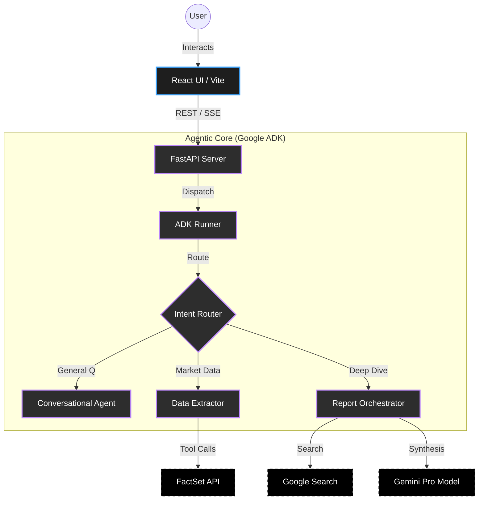
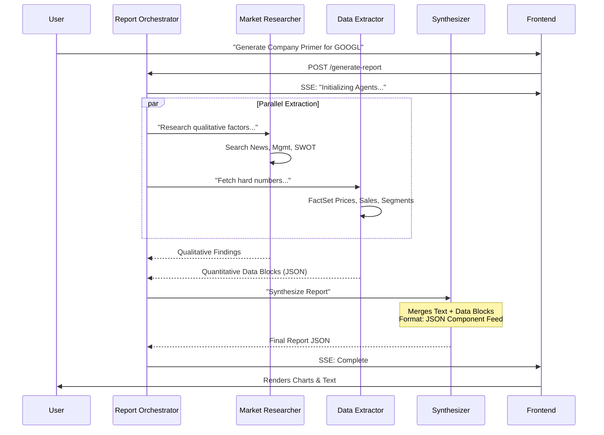

# 🚀 Stock Terminal Next-Gen (Dark Mode)

> **Empowering Financial Intelligence with Google ADK & Gemini.**

A professional-grade financial stock terminal that bridges the gap between raw market data and actionable AI insights. Featuring a glassmorphic React interface and a high-performance Agentic backend, this terminal provides real-time snapshots, deep-dive analyst workflows, and an intelligent chat assistant.

---

## ✨ Key Features
- **🧠 Agentic Orchestration**: Uses the "Gatekeeper Pattern" to route requests between real-time data providers and general knowledge tools.
- **⚡ Automatic OAuth**: Seamless FactSet authentication with a self-closing handshake window. No manual URL pasting required.
- **📊 Interactive Visualization**: Dynamic charts curate data on-the-fly using LLM-driven curation.
- **🔌 FactSet Integration**: Professional MCP toolset integration for high-fidelity financial data.
- **💬 Conversational Analyst**: A chat assistant that doesn't just talk—it executes complex workflows.
- **🔎 Vertex AI Search**: Integrated Enterprise search engine for retrieving financial documents and insights.
- **🌑 Dark Mode**: Native dark theme support for low-light environments.

---

## 📸 Gallery (Dark Mode)

### 🏛 Main Dashboard


### 📑 Report Generator ("Company Primer")


### 💬 Intelligent Assistant


---

## 🗺 Application Architecture

### 1. High-Level System Flow
The terminal uses a React Frontend communicating with a FastAPI backend via HTTP/SSE. The backend leverages the **Google Agent Development Kit (ADK)** to orchestrate complex workflows.



### 2. Report Generation Workflow (Sequential & Parallel)
A specialized "Swarm" architecture handles deep-dive report generation.



### 3. FactSet Data Agent (Tool Selection)
How the agent decides which FactSet tool to use.

```mermaid
flowchart LR
    classDef decision fill:#333,stroke:#ff9800,stroke-width:2px;
    classDef tool fill:#1a1a1a,stroke:#4caf50,color:#fff;
    
    Input["User: 'What is the PE ratio of NVDA?'"] --> Router{Tool Selection}:::decision
    
    Router -->|Prices?| GlobalPrices[FactSet_GlobalPrices]:::tool
    Router -->|Financials?| Fundamentals[FactSet_Fundamentals]:::tool
    Router -->|Estimates?| Consensus[FactSet_Estimates]:::tool
    Router -->|Competitors?| Peers[FactSet_Competitors]:::tool
    
    GlobalPrices --> Output[JSON Response]
    Fundamentals --> Output
    Consensus --> Output
```



---

## 🚀 Deployment & Replication

### 📦 Prerequisites
- **Python 3.10+** (Recommend 3.12/3.13)
- **Node.js 18+**
- **FactSet API Credentials** (Client ID & Private Key)
- **Google Cloud Project** (Vertex AI API Enabled)

### 🛠 Replication Steps

#### 1. Clone the Repository
```bash
git clone https://github.com/google-gemini/stock-terminal.git
cd stock-terminal
```

#### 2. Backend Setup (FastAPI + ADK)
We use `uv` for blazing fast Python package management.

```bash
cd backend

# 1. Create virtual environment
python3 -m venv .venv
source .venv/bin/activate

# 2. Install dependencies
uv sync
# OR
pip install -r requirements.txt

# 3. Configure Environment
cp .env.example .env
# EDIT .env with your FactSet and Google Cloud credentials
```

#### 3. Frontend Setup (React + Vite)
```bash
cd frontend

# 1. Install Node modules
npm install

# 2. Start Development Server
npm run dev
```

#### 4. Run the Application
Open two terminal tabs:

**Tab 1 (Backend):**
```bash
cd backend
source .venv/bin/activate
uvicorn main:app --reload --port 8001
```

**Tab 2 (Frontend):**
```bash
cd frontend
npm run dev
```

Access the app at `http://localhost:5173`.

### ⚙️ Environment Variables Reference
| Variable | Description |
| :--- | :--- |
| `FS_CLIENT_ID` | FactSet Machine Account User ID |
| `FS_CLIENT_SECRET` | FactSet Machine Account Private Key |
| `FS_REDIRECT_URI` | Valid OAuth Redirect URI |
| `VAIS_PROJECT_ID` | Google Cloud Project ID |
| `VAIS_LOCATION` | Vertex AI Search Location (e.g. global) |

---

## 🛠 Tech Stack

| Layer | Technologies |
| :--- | :--- |
| **Frontend** | React 19, Vite, Tailwind CSS, Recharts, Lucide, Framer Motion |
| **Backend** | FastAPI, Python 3.13, Google ADK, Uvicorn |
| **AI Engine** | Gemini 1.5 Pro / 2.0 Flash |
| **Data** | FactSet MCP, yfinance, Google Search |

---

Built with ❤️ by the **Antigravity Team**.