# 📄 Multimodal Document Chat: Enterprise Intelligence Platform

> **Next-Gen Document Analysis powered by Google Agent Development Kit (ADK) & Vertex AI**


---

## 🚀 Overview

**Multimodal Document Chat** is a robust, serverless-ready application designed to extract, embed, and intelligently chat with complex documents. It seamlessly processes text, standalone tables, charts, and images natively within PDFs. 

Built using the **Zero-Parsing Architecture** (React 19 + FastAPI + Google ADK), it delivers high-performance semantic retrieval directly backed by **Google BigQuery Vector Search** and **Gemini 3 Flash Preview**.

### ✨ Key Features & Zero-Leak Security
* **🧠 Agentic Extraction**: Utilizes **Google ADK** to run orchestrated, parallel `LlmAgent` extractions across PDF pages.
* **📊 Multimodal Grounding**: Identifies charts and graphics, converting them to rich markdown descriptions and providing bounding boxes.
* **🔍 Hyperscale Search**: Integrates directly with Google BigQuery `VECTOR_SEARCH` for lightning-fast enterprise chunk retrieval.
* **🔒 Zero-Leak Output**: Credentials and `.env` files are strictly `.gitignore`'d, executing safely with explicit permission grants.
* **⚡ Modern UI**: Beautiful, interactive React frontend featuring annotated PDF displays, citation tooltips, and source reference cards.

---

## 🏗️ Architecture & Topology

The application enforces an event-driven pipeline, transforming raw PDF data into structured embeddings with seamless multimodal chat support.

```mermaid
flowchart LR
    %% Modern Futuristic Styling Requirements
    classDef default fill:#1e293b,stroke:#475569,stroke-width:2px,color:#f8fafc;
    classDef user fill:#0f172a,stroke:#3b82f6,stroke-width:2px,color:#bfdbfe,rx:12,ry:12;
    classDef frontend fill:#020617,stroke:#6366f1,stroke-width:3px,color:#c7d2fe,rx:12,ry:12;
    classDef backend fill:#111827,stroke:#a855f7,stroke-width:3px,color:#e9d5ff,rx:12,ry:12;
    classDef ai fill:#2e1065,stroke:#d946ef,stroke-width:3px,color:#fbcfe8,rx:15,ry:15;
    classDef data fill:#064e3b,stroke:#10b981,stroke-width:3px,color:#a7f3d0,rx:12,ry:12;
    
    subgraph Client ["User Environment"]
        direction TB
        U[👤 End User]:::user
        A[⚛️ React + Vite UI]:::frontend
        U -- "Uploads PDF" --> A
    end

    subgraph API ["FastAPI Backend (Google ADK)"]
        direction TB
        B[⚡ /chat & /api/documents Endpoint]:::backend
        S[🧠 InMemorySessionService]:::backend
        P[🏃‍♂️ Parallel ADK Runner.run_async]:::backend
    end

    subgraph AI ["Intelligence Layer (Vertex AI)"]
        direction TB
        C[🤖 Extractor: Gemini 3 Flash Preview]:::ai
        D[🤖 Analyzer: Gemini 2.5 Flash]:::ai
        E[🔢 Text Embedding: 004]:::ai
    end

    subgraph Storage ["Enterprise Data"]
        direction TB
        F[(📦 Google BigQuery Vector Index)]:::data
    end

    A -- "Streaming HTTP API" --> B
    B -- "Uploads Pages" --> P
    P -- "Multimodal Extraction" --> C
    C -- "Flattened Entities" --> E
    E -- "3072d Vectors" --> F
    
    B -- "RAG Query" --> F
    F -- "Top Source Chunks" --> B
    B -- "Context + Query" --> D
    D -- "Masked Markdown + Citations" --> A
    
    %% Styles
    linkStyle default stroke:#64748b,stroke-width:2px,fill:none;
    style Client fill:#020617,stroke:#3b82f6,stroke-width:1px,stroke-dasharray: 4 4
    style API fill:#000000,stroke:#8b5cf6,stroke-width:1px,stroke-dasharray: 4 4
    style AI fill:#1e0a3c,stroke:#d946ef,stroke-width:1px,stroke-dasharray: 4 4
    style Storage fill:#022c22,stroke:#10b981,stroke-width:1px,stroke-dasharray: 4 4
```



---

## 🛠️ Replication & Setup Guide

### 1. Configure Environment

At the root of the project, create a `.env` file containing your Google Cloud targets:

```env
# Google Cloud Targeting
PROJECT_ID=your_gcp_project
GOOGLE_CLOUD_PROJECT=your_gcp_project
LOCATION=us-central1
```

*(Note: The `backend/main.py` is configured to gracefully load the `.env` from the project directory and forces `global` for preview models.)*

### 2. Local Development (`uv` strictly enforced)

**Backend:**
Use `uv` to sync dependencies and run the server.

```bash
cd backend
uv sync
uv run python main.py
```
*(Runs on port 8001)*

**Frontend:**
From the `frontend` directory, launch the React UI.

```bash
cd frontend
npm install
npm run dev
```
*(Runs on port 5173)*

---

## 🔧 Troubleshooting & Common Issues

| Error | Cause | Fix |
| :--- | :--- | :--- |
| `404 Publisher Model Not Found` | Wrong Location | Handled automatically in `main.py` by forcing `GOOGLE_CLOUD_LOCATION=global` for Gemini 3 Preview. |
| `BigQuery Dataset Error` | Missing Initialization | The backend will automatically try to create the `esg_demo_data` dataset. Ensure your service account has `BigQuery Admin` rights. |
| `No Extracted Entities` | Empty PDF / Parsing Failure | Check terminal logs for `Parallel Extraction` errors. Some image-only PDFs may require OCR features. |

---
*Built with ❤️ by the Google Cloud AI Team.*
