# Multimodal Document Chat

This project allows users to converse with documents containing both text and charts/images.

## Structure
- `backend/`: Python backend powered by Google ADK / FastAPI
- `frontend/`: React + Vite frontend for a rich, modern document chatting experience

## System Architecture Pipeline

The following diagram details the end-to-end cycle of the Multimodal Document Chat application, covering the hardware, LLMs, Google ADK setup, and Python logic.

```mermaid
graph TD
    classDef hardware fill:#1e1e1e,stroke:#4a4a4a,stroke-width:2px,color:#fff,stroke-dasharray: 5 5
    classDef software fill:#2d3748,stroke:#4fd1c5,stroke-width:2px,color:#fff
    classDef llm fill:#311b92,stroke:#b388ff,stroke-width:2px,color:#fff
    classDef frontend fill:#004d40,stroke:#64ffda,stroke-width:2px,color:#fff
    classDef backend fill:#01579b,stroke:#81d4fa,stroke-width:2px,color:#fff
    classDef db fill:#bf360c,stroke:#ffab91,stroke-width:2px,color:#fff
    classDef tool fill:#33691e,stroke:#bc00ff,stroke-width:2px,color:#fff

    subgraph UserEnvironment ["User Environment"]
        User(["👤 User"])
        FE["⚛️ React + Vite Frontend<br/>(UI, Citations, Annotated PDF Views)"]:::frontend
        User -- Uploads PDF / Asks Qs --> FE
    end

    subgraph BackendAPI ["FastAPI Backend (Port 8001)"]
        ChatEndpoint["⚡ /chat Endpoint<br/>(Handles uploads & RAG)"]:::backend
        DocEndpoint["⚡ /api/documents<br/>(Manages indexed docs)"]:::backend
        InMemorySession["🧠 InMemorySessionService<br/>(Google ADK)"]:::tool
    end
    
    FE -- "HTTP POST (Files/Message)" --> ChatEndpoint
    FE -- "HTTP GET/DELETE" --> DocEndpoint

    subgraph DocumentProcessingPipeline ["📄 Document Processing Pipeline (pipeline/agents.py)"]
        SplitPDF["✂️ split_pdf_logically()<br/>(Chunks PDF by page)"]:::software
        
        subgraph ParallelExtraction ["⚡ Parallel Extractor (Google ADK)"]
            ADKAgent["🤖 LlmAgent ('extractor_page_X')<br/>(Instruction: Find tables, charts, text)"]:::llm
            Callback["🪝 inject_pdf Callback<br/>(Injects PDF bytes)"]:::tool
            RunnerProcess["🏃‍♂️ ADK Runner.run_async()"]:::software
            
            ADKAgent -. "before_model_callback" .-> Callback
            RunnerProcess -- "executes" --> ADKAgent
        end
        
        GeminiPro["🧠 gemini-2.5-pro<br/>(Vertex AI API - Hardware)"]:::hardware
        ADKAgent -- "Multimodal Prompt" --> GeminiPro
        GeminiPro -- "Outputs: entities, bounding boxes" --> ADKAgent
        
        EmbeddingsGen["🔢 generate_embeddings_for_entities()<br/>(Vertex AI Embeddings)"]:::software
        
        DrawBBoxes["🖌️ draw_bounding_boxes()<br/>(Generates Base64 Annotated Images)"]:::software
        
        SplitPDF --> RunnerProcess
        RunnerProcess -- "Flattened Entity Results" --> EmbeddingsGen
        EmbeddingsGen --> DrawBBoxes
    end

    ChatEndpoint -- "If new file upload" --> SplitPDF

    subgraph VectorSearchRAG ["🔍 RAG & Search (pipeline/bigquery.py)"]
        BQInsert["📥 insert_embeddings_to_bq()"]:::db
        BQSearch["🔎 search_embeddings_in_bq()<br/>(cosine distance)"]:::db
        BigQuery[("📦 Google BigQuery<br/>(Vector Indexing - Hardware)")]:::hardware
        
        EmbeddingsGen -- "Stores Chunk + 3072d Vector" --> BQInsert
        BQInsert --> BigQuery
        BQSearch -- "Retrieves top chunks" --> BigQuery
    end

    ChatEndpoint -- "If message query" --> BQSearch

    subgraph ConversationalAgent ["🗣️ Chat Resolution (main.py)"]
        AnalyzerAgent["🤖 LlmAgent ('doc_analyzer')<br/>(Instruction: Ground answers w/ context)"]:::llm
        GeminiFlash["🧠 gemini-2.5-flash<br/>(Vertex AI API - Hardware)"]:::hardware
        
        AnalyzerAgent -- "Text Message + BQ Context" --> GeminiFlash
    end

    ChatEndpoint -- "Passes Retrieved Context" --> AnalyzerAgent
    AnalyzerAgent -- "Streams Markdown + Citations" --> ChatEndpoint
    ChatEndpoint -- "Returns Session + Visual Data" --> FE

    %% Context Linking
    BQSearch -- "Retrieved Content (Source IDs)" --> AnalyzerAgent
    DrawBBoxes -- "Returns b64 images to UI" --> ChatEndpoint
```

