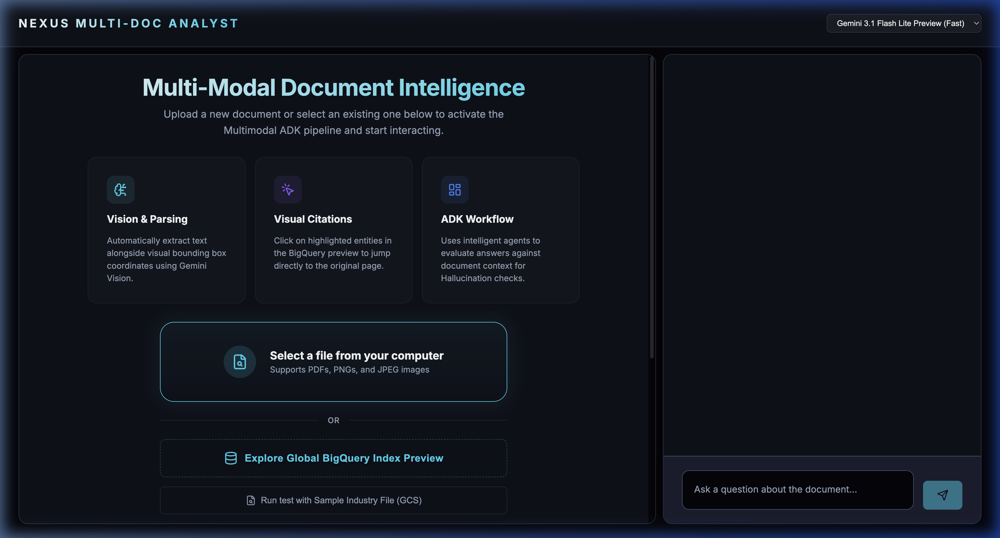
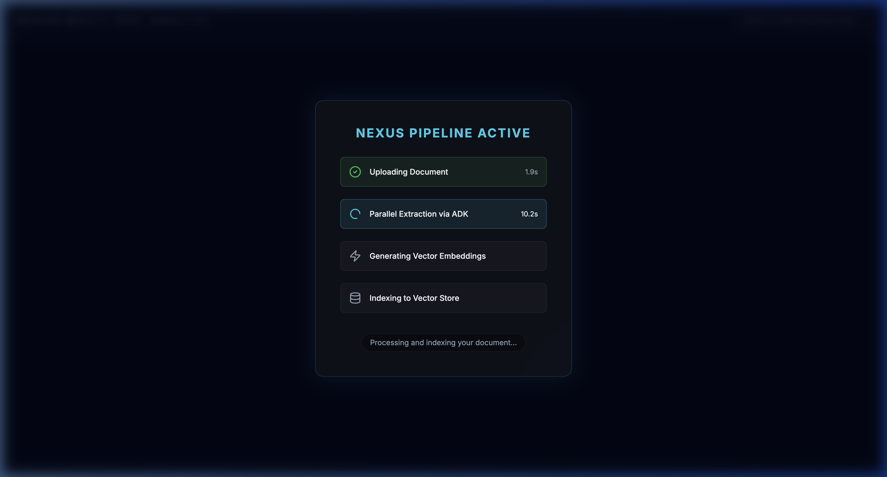
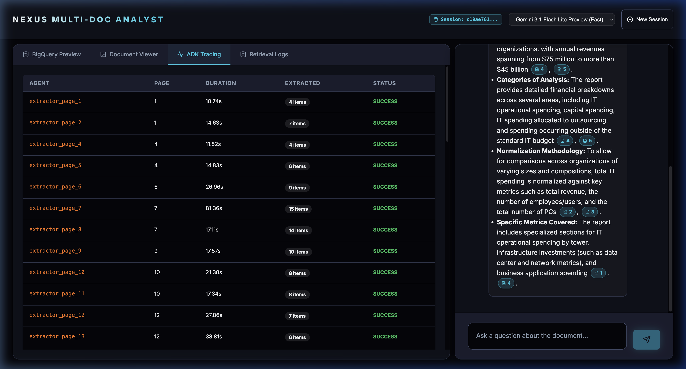
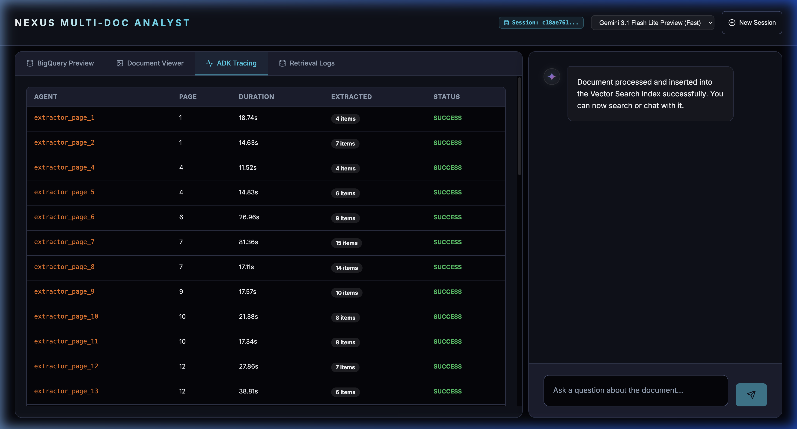

# 🌌 Multimodal Document Nexus 

> **Welcome to the Future of Enterprise Intelligence**
> Powered by Google Agent Development Kit (ADK) & Vertex AI.


The **Multimodal Document Nexus** represents a paradigm shift in document processing. Far exceeding primitive OCR, it extracts, semantically understands, and embeds entire multimodal objects—including charts, standalone tables, and nested graphics—natively from PDFs.

Built completely upon the **Zero-Parsing Architecture** (React 19 + FastAPI + Google ADK), it leverages **Google BigQuery Vector Search** and **Gemini 3 Flash Preview** to achieve sub-second, enterprise-scale semantic retrieval.

---

## 🎬 Nexus in Action

*(Click below or view the WebP showcase)*
<p align="center">
  
</p>

---

## 🛰️ Visual Interface Showcase

Experience the next-generation Glassmorphic UI featuring real-time multimodal processing status and holographic hover elements.

| **Nexus Dashboard & Grounding** | **Active Pipeline & ADK Tracing** |
|:---:|:---:|
| <br>*Futuristic Workspace* | <br>*Real-time Task Processing* |
| <br>*Holographic Source Citations* | <br>*Orchestrated Agent Tracing* |

---

## 🧬 Architectural Topology

The Nexus operates via an event-driven flow, orchestrating swarms of `LlmAgent` routines to convert unstructured data into a high-dimensional reality.

```mermaid
flowchart LR
    %% Modern Futuristic Styling Requirements
    classDef default fill:#1e293b,stroke:#475569,stroke-width:2px,color:#f8fafc;
    classDef user fill:#0f172a,stroke:#3b82f6,stroke-width:2px,color:#bfdbfe,rx:12,ry:12;
    classDef frontend fill:#020617,stroke:#6366f1,stroke-width:3px,color:#c7d2fe,rx:12,ry:12;
    classDef backend fill:#111827,stroke:#a855f7,stroke-width:3px,color:#e9d5ff,rx:12,ry:12;
    classDef ai fill:#2e1065,stroke:#d946ef,stroke-width:3px,color:#fbcfe8,rx:15,ry:15;
    classDef data fill:#064e3b,stroke:#10b981,stroke-width:3px,color:#a7f3d0,rx:12,ry:12;
    
    subgraph Client ["Observer Space (Local)"]
        direction TB
        U[👤 Operator]:::user
        A[⚛️ React 19 UI]:::frontend
        U -- "Injects PDF" --> A
    end

    subgraph API ["FastAPI Core (Google ADK)"]
        direction TB
        B[⚡ Nexus Gateway]:::backend
        S[🧠 InMemorySessionService]:::backend
        P[🏃‍♂️ Swarm Orchestrator (ADK)]:::backend
    end

    subgraph AI ["Neural Matrix (Vertex AI)"]
        direction TB
        C[🤖 Entity Extractor: Gemini 3 Flash]:::ai
        D[🤖 Context Analyzer: Gemini 2.5 Flash]:::ai
        E[🔢 Embedding Core: Gecko 004]:::ai
    end

    subgraph Storage ["Persistent State"]
        direction TB
        F[(📦 BigQuery Vector Index)]:::data
    end

    A -- "Streaming Transport" --> B
    B -- "Uploads Pages" --> P
    P -- "Multimodal Extraction" --> C
    C -- "Flattened Entities" --> E
    E -- "3072d Vectors" --> F
    
    B -- "Hybrid Search" --> F
    F -- "Contextual Chunks" --> B
    B -- "Synthesis" --> D
    D -- "Masked Markdown + Citations" --> A
    
    %% Styles
    linkStyle default stroke:#64748b,stroke-width:2px,fill:none;
    style Client fill:#020617,stroke:#3b82f6,stroke-width:1px,stroke-dasharray: 4 4
    style API fill:#000000,stroke:#8b5cf6,stroke-width:1px,stroke-dasharray: 4 4
    style AI fill:#1e0a3c,stroke:#d946ef,stroke-width:1px,stroke-dasharray: 4 4
    style Storage fill:#022c22,stroke:#10b981,stroke-width:1px,stroke-dasharray: 4 4
```

---

## 🔒 Ironclad Zero-Leak Security

As part of the **Antigravity Project Suite**, this repository enforces the absolute **Zero-Leak Protocol**. 
- Secrets, API keys, and environment variables (`.env`) are strictly sandboxed.
- The Git configuration rejects any commit attempting to exfiltrate operational keys.
- **Verification Level:** Passed ✅.

---

## 🚀 Deployment & Replication Guide

To materialize this environment on your local node, follow these stringent procedures:

### 1. Environment Synchronization
Initialize a `.env` file at the root level (`/antigravity/.env`) to link your local instance to the Google Cloud mesh:
```env
# Google Cloud Targeting
PROJECT_ID=your_gcp_project
GOOGLE_CLOUD_PROJECT=your_gcp_project
LOCATION=us-central1
```

*(Note: The `backend/main.py` is dynamically configured to traverse upwards and locate the `.env` automatically).*

### 2. Backend Initialization (Port 8001)
We enforce the use of `uv` for hyperspeed Python management and isolated environment execution.

```bash
cd backend
uv init      # If not initialized
uv sync      # Synchronize dependencies
uv run python main.py
```
> The API Gateway will ignite and bind to `localhost:8001`.

### 3. Frontend Initialization (Port 5172)
Navigate to the UI directory to assemble the React 19 visualizer.

```bash
cd frontend
npm install
npm run dev
```
> The React Interface will establish a connection on `localhost:5172`.

---

## 🔮 Diagnostic Telemetry

Should you encounter anomalies in the space-time fabric during execution:

| Anomaly Code | Root Cause | Automated Resolution Strategy |
| :--- | :--- | :--- |
| `404 Publisher Model Not Found` | Regional API Limitation | Bypassed. `main.py` forces `global` location context for Gemini 3 Preview capabilities. |
| `BigQuery Dataset Error` | Missing Initialization Matrix | The backend attempts auto-creation of `esg_demo_data`. Ensure `BigQuery Admin` IAM grants are applied to the active service account. |
| `Zero Output Extracted` | Vector Nullification | Review terminal ADK traces. Heavy image-based PDFs may require enhanced vision flags to trigger the OCR processors. |

---
*Architected with ❤️ for the Future by the Google Cloud AI Team.*
