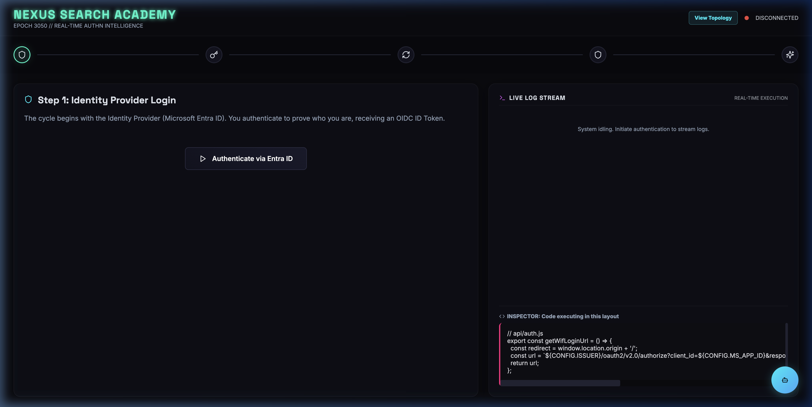
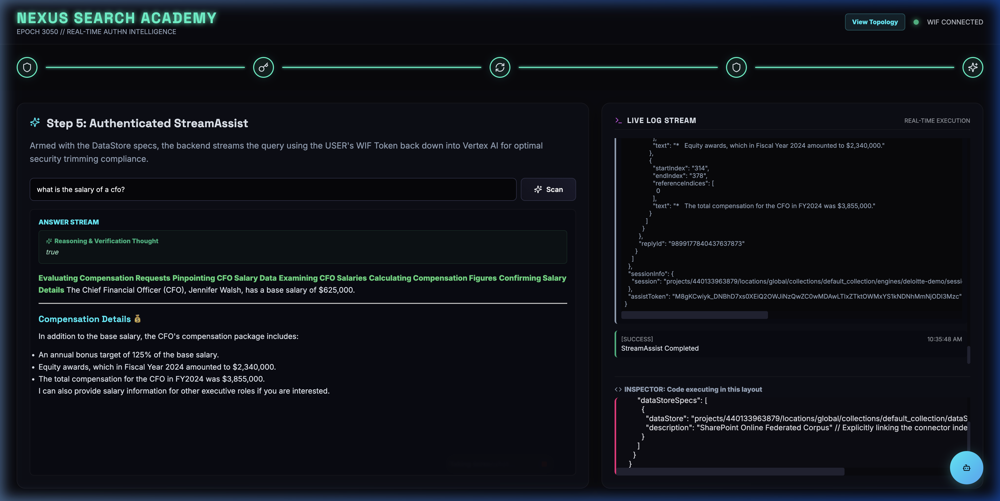
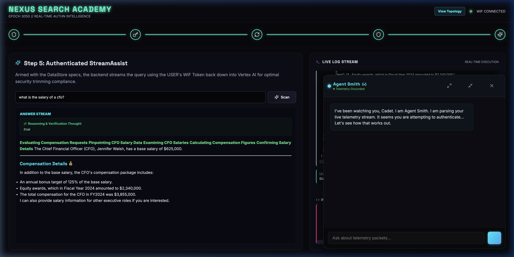

# 🌌 Nexus Search Academy (Year 3050 Edition)

<div align="center">



[-00f3ff?style=for-the-badge&logo=google-cloud&logoColor=white)](#)
[](#)
[](#)

</div>

---

## 🛰️ Overview

Welcome to the **Nexus Search Academy**, a futuristic holographic dashboard designed to strip away the black box of enterprise security and RAG operations. Guide operations through **Secure Workload Identity Federation (WIF)** translates and triggers strictly trimmed flows back down into sub-indexed frames dynamically.

To communicate with the Discovery Engine without maintaining static long-lived keys, we utilize transparent Token Exchange translation pipelines binding securely to targeted indices.

---

## 🛰️ Dashboard Dashboard Previews

### 🔬 Inner Auditing View (Step 5)
Monitor exactly which DataStores (e.g., SharePoint Online Federated Indices) are executing background queries along with raw layout configurations frames transparently.



### 🤖 Live Agent Smith stream assist
Trigger live AI prompts executing strictly isolated streaming pipelines maintaining visual audit streams collapsibly above clean narrative replies.



---

## 🛠️ Core Upgrades Layered

*   **🧠 Dynamic Reasoning Tracking Box:** Transparently separates AI intermediate "Thinking" logs (`Assessing Database...`, `Formulating Query...`) inside styled collapsible Panel overlays above Markdown descriptive layouts buffers directly!
*   **🛰️ Transparent SharePoint diagnostics Specs:** Explicit payload structures layout accurately inside debug logs fully describing direct workspace index target addresses securely without rendering dead-ends layout templates or ambiguity lists.

---

## 🧠 The Authentication Cycle

Below is the sequential architectural flowchart demonstrating how we translate corporate Identities (Microsoft Entra ID) securely into a transparent Google Cloud access credential bind.

```mermaid
%%{init: {
  'theme': 'dark',
  'themeVariables': {
    'primaryColor': '#00f3ff',
    'primaryTextColor': '#ffffff',
    'primaryBorderColor': '#00f3ff',
    'lineColor': '#ab00ff',
    'secondaryColor': '#0a0e17',
    'tertiaryColor': '#00ff66',
    'mainBkg': '#030712',
    'nodeBorder': '#00f3ff',
    'clusterBkg': '#0f172a',
    'clusterBorder': '#1e293b'
  }
}}%%
graph TD
    subgraph "Client Environment (Browser)"
        User([User 👤]) -->|1. Clicks Login| FE[Frontend App 🖥️]
        FE -->|2. Redirect to Auth| MS
        MS -->|3. Return id_token| FE
        FE -->|4. Update Code Visualiszer| FE
        FE -->|5. Send id_token Request| BE[Backend API ⚙️]
    end

    MS[Microsoft Entra ID 🔐]
    STS[Google STS 🔑]
    DE[Discovery Engine 🧠]

    BE -->|6. POST /sts/v1/token| STS
    STS -->|7. Issue Google Token| BE
    BE -->|8. executeStreamAssist| DE
    DE -->|9. SSE Stream Responses| BE
    BE -->|10. Reactive Stream| FE

    classDef chrome fill:#0b1120,stroke:#00f3ff,stroke-width:2px;
    classDef server fill:#0b1120,stroke:#ab00ff,stroke-width:2px;
    classDef provider fill:#040914,stroke:#00ff66,stroke-width:2px;
    
    class FE chrome;
    class BE server;
    class MS,STS,DE provider;
```



---

## 📖 Essential references

For concrete Python execution guidelines covering how the backend swaps security frameworks endpoints dynamically before triggerings:

*   🛰️ **[`SHAREPOINT_STS_SPEC.md`](./SHAREPOINT_STS_SPEC.md)**: Full configuration spec template mapping indices to backend pipelines correctly!

---

## 🚀 Launch Procedure

To ignite the subsystem, use the absolute controller:

```bash
# Navigate to Scratch Control
cd /usr/local/google/home/jesusarguelles/.gemini/jetski/scratch

# Fire default thrusters
./restart_academy.sh
```

*The Academy is officially online.*
