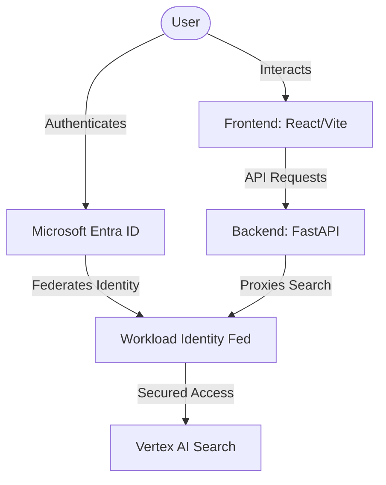
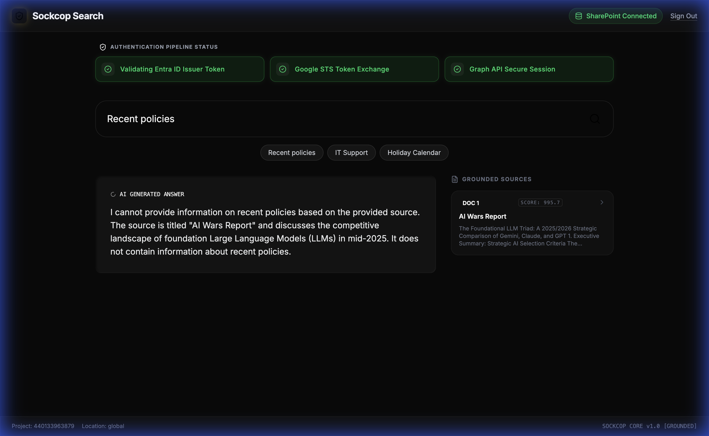
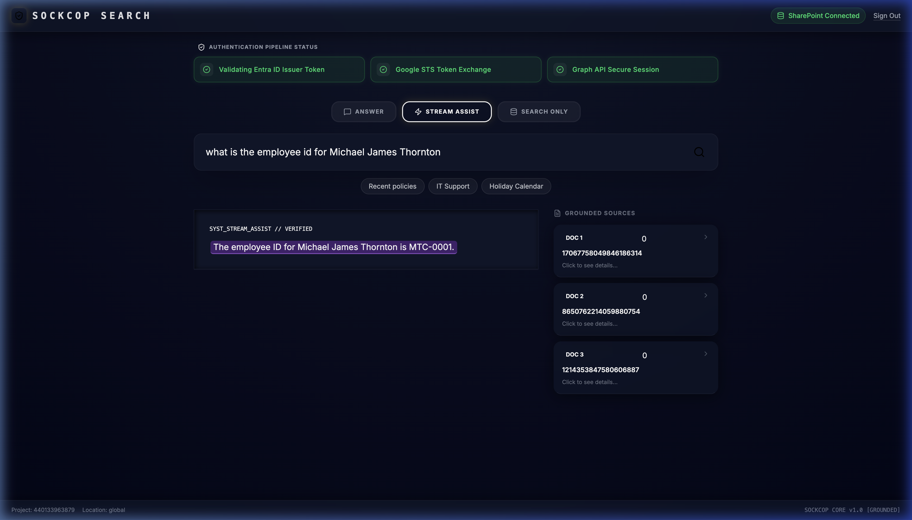
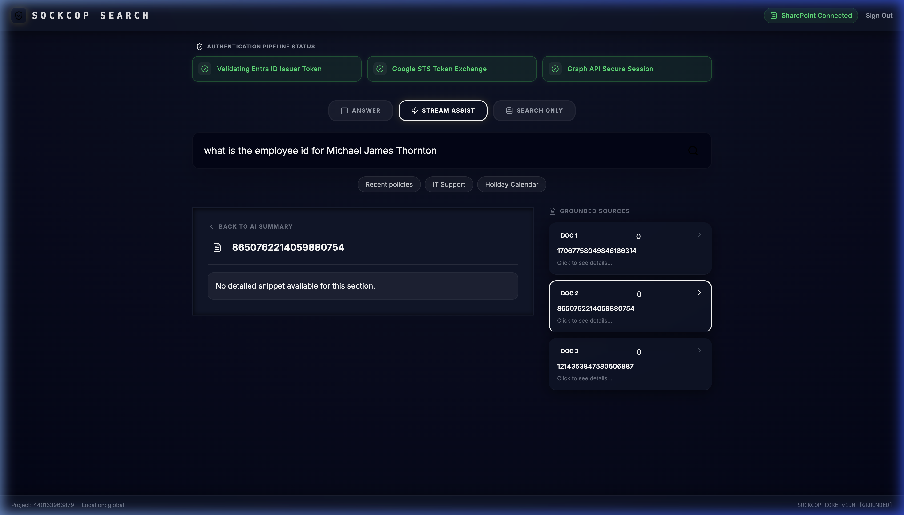
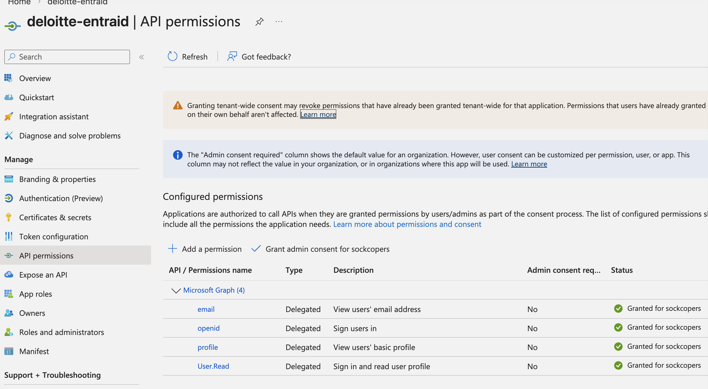
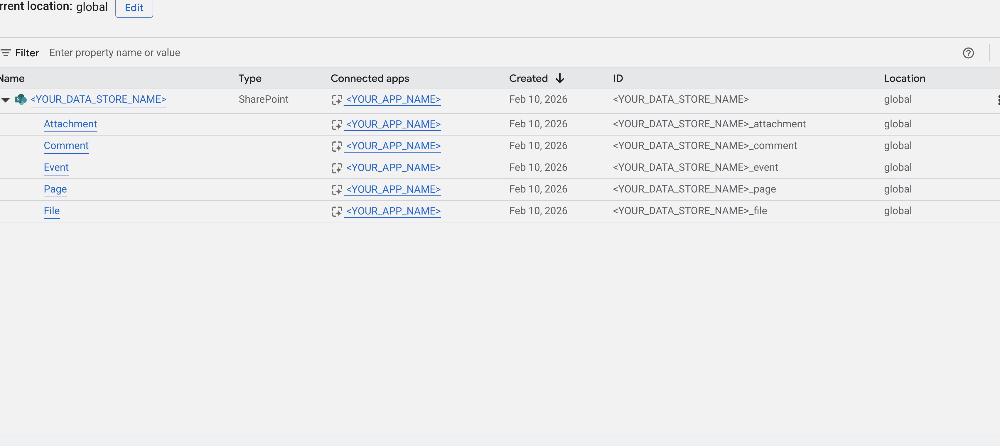

<p align="center">
  <picture>
    <source media="(prefers-color-scheme: dark)" srcset="./frontend/public/assets/hero_banner.svg">
    <source media="(prefers-color-scheme: light)" srcset="./frontend/public/assets/hero_banner.svg">
    
  </picture>
</p>

<div align="center">

[](https://opensource.org/licenses/Apache-2.0)
[](https://react.dev/)
[](https://tailwindcss.com/)
[](https://cloud.google.com/enterprise-search)
[](https://entra.microsoft.com/)

</div>

<blockquote>
  <p><b>SYSTEM LOG:</b> Sockcop Search transcends basic retrieval. It is a high-fidelity, brutalist neo-monolith acting as a secure gateway to your enterprise intelligence. It federates Microsoft Entra ID authentication signals directly into the heart of Google Cloud's Vertex AI Search (Gemini Enterprise) engine.</p>
</blockquote>

<br/>

## 🪐 ARCHITECTURE & SPECS

> **Core Engine:** FastAPI (Backend) | React, Vite, TS (Frontend)



## 📂 PROJECT STRUCTURE

```text
nexus_search_core/
├── backend/            # FastAPI Backend (Python, uv)
├── frontend/           # Modern React/Vite User Interface
├── docs/               # Architecture diagrams and documentation
└── README.md           # This file
```

<br/>

<p align="center">
  <picture>
    <source media="(prefers-color-scheme: dark)" srcset="./frontend/public/assets/arch_diagram.svg">
    <source media="(prefers-color-scheme: light)" srcset="./frontend/public/assets/arch_diagram.svg">
    
  </picture>
</p>

<br/>

<p align="center">
  <picture>
    <source media="(prefers-color-scheme: dark)" srcset="./frontend/public/assets/header_topologies.svg">
    <source media="(prefers-color-scheme: light)" srcset="./frontend/public/assets/header_topologies.svg">
    
  </picture>
</p>


<br/>

## 🔐 Authentication Duality & Identity Mapping

> **REFERENCE ARCHITECTURE:** Ensure you review the official Google Cloud documentation before modifying the baseline security protocol.
> - [Configure Workload Identity Federation (WIF) with Entra ID](https://cloud.google.com/iam/docs/workload-identity-federation-with-deployment-pipelines)
> - [Vertex AI Search: Microsoft SharePoint connector](https://cloud.google.com/generative-ai-app-builder/docs/sharepoint-connector)

The following diagram illustrates the zero-trust authentication flow across Entra ID and Google Cloud via WIF, critical for **TOPOLOGY B**:

<br/>
<p align="center">
  
</p>
<br/>

<blockquote>
  <p><b>ARCHITECTURE DUALITY:</b> The Vertex AI Search backend can be consumed via two distinct presentation layers. Choose your methodology.</p>
</blockquote>

<details open>
<summary><kbd>TOPOLOGY A</kbd> <b>Native Gemini Consumer (Agent Builder)</b></summary>
<br/>
<table>
  <tr>
    <td valign="top">
      <kbd>IDENTITY</kbd> <b>Workload Identity Federation (WIF)</b> translates Entra ID roles to Google Cloud IAM.<br/><br/>
      <kbd>EXECUTE</kbd> Navigate to <b>GCP Console</b> &gt; <b>Agent Builder</b>.<br/><br/>
      <kbd>OPERATE</kbd> Utilize the out-of-the-box <b>Preview</b> or standard web widget.<br/><br/>
      <kbd>RESULT</kbd> Immediate, zero-code access to grounded financial data using the federated identity backbone.
    </td>
    <td width="400" valign="top">
      
      <br/><br/>
      
    </td>
  </tr>
</table>
</details>

<br/>

<details open>
<summary><kbd>TOPOLOGY B</kbd> <b>Custom Neo-Monolith (Direct API)</b></summary>
<br/>
<table>
  <tr>
    <td valign="top">
      <kbd>IDENTITY</kbd> <b>Workload Identity Federation (WIF)</b> exchanges the <code>id_token</code> for a Google Access Token directly.<br/><br/>
      <kbd>EXECUTE</kbd> Deploy this repository's precise brutalist UI and FastAPI proxy.<br/><br/>
      <kbd>OPERATE</kbd> Bypasses the generic interface to call the <b>Discovery Engine API</b> safely.<br/><br/>
      <kbd>RESULT</kbd> A fully customizable, "Modern Cave" experience with <b>Sockcop</b> branding and specialized visual data structures.
    </td>
    <td width="400" valign="top">
      
    </td>
  </tr>
</table>
</details>

<br/>

## ⚡ SEARCH CYCLE & EXPERIENCE

The Sockcop Search interface is designed for high-fidelity, grounded exploration. Below is the end-to-end lifecycle of a query within the system.

<details open>
<summary><kbd>STEP 1</kbd> <b>Initial Query Input</b></summary>
<br/>
<table>
  <tr>
    <td valign="top">
      <kbd>EXECUTE</kbd> The user enters a natural language query into the search monolith. In this example, we are retrieving specific employee data from a secure repository.<br/><br/>
      <kbd>UI STATE</kbd> The terminal pulsates, indicating the system is ready to federate the identity and begin the grounded retrieval.
    </td>
    <td width="550" valign="top">
      
    </td>
  </tr>
</table>
</details>

<br/>

<details open>
<summary><kbd>STEP 2</kbd> <b>Streaming Grounded Answer</b></summary>
<br/>
<table>
  <tr>
    <td valign="top">
      <kbd>EXECUTE</kbd> The <code>streamAnswer</code> API begins returning tokens in real-time. This minimizes perceived latency and provides immediate cognitive feedback.<br/><br/>
      <kbd>UI STATE</kbd> Tokens emerge from the terminal. Simultaneously, the <b>Evaluator Agent</b> is dispatched in the background to verify every claim against the grounded source material.
    </td>
    <td width="550" valign="top">
      
    </td>
  </tr>
</table>
</details>

<br/>

<details open>
<summary><kbd>STEP 3</kbd> <b>Evaluated & Grounded Synthesis</b></summary>
<br/>
<table>
  <tr>
    <td valign="top">
      <kbd>EXECUTE</kbd> The <b>Evaluator Agent</b> completes the verification. All facts are cross-referenced with the <b>Grounded Sources</b> visible in the right panel.<br/><br/>
      <kbd>UI STATE</kbd> Verified facts are dynamically highlighted in <b>Cyber Blue</b>. Tooltips provide precise citation pointers, ensuring zero hallucination.
    </td>
    <td width="550" valign="top">
      
    </td>
  </tr>
</table>
</details>

<br/>

<details open>
<summary><kbd>STEP 4</kbd> <b>Deep Source Inspection</b></summary>
<br/>
<table>
  <tr>
    <td valign="top">
      <kbd>EXECUTE</kbd> The user clicks on a <b>Grounded Source</b> (e.g., DOC 1) to inspect the raw enterprise intelligence.<br/><br/>
      <kbd>UI STATE</kbd> A focused sidebar displays the original document text, allowing for absolute transparency and verification of the AI's synthesis.
    </td>
    <td width="550" valign="top">
      
    </td>
  </tr>
</table>
</details>

<br/>

<br/>

<p align="center">
  <picture>
    <source media="(prefers-color-scheme: dark)" srcset="./frontend/public/assets/header_config.svg">
    <source media="(prefers-color-scheme: light)" srcset="./frontend/public/assets/header_config.svg">
    
  </picture>
</p>

<blockquote>
  <p><b>SECURITY PROTOCOL:</b> Follow this specific initialization chronological order. Crucially, no credentials must be leaked or stored in your frontend.</p>
</blockquote>

###

<details open>
<summary><kbd>PHASE 1</kbd> <b>Initial Azure AD (Entra ID) App Setup</b></summary>
<br/>

<table>
  <tr>
    <td width="100" align="center" valign="top"></td>
    <td valign="top">
      <kbd>EXECUTE</kbd> Navigate to <b>Entra ID</b> &gt; <b>App registrations</b>.<br/><br/>
      <kbd>INPUT</kbd> Create the app <code>deloitte-entraid</code>.<br/><br/>
      <kbd>DEFINE</kbd> Under Authentication, add Single-page application and set redirect URI to <code>http://localhost:5173</code>.<br/><br/>
      <kbd>CONFIG</kbd> Under API Permissions, grant <code>User.Read</code>, <code>profile</code>, <code>openid</code>, and <code>email</code>.<br/><br/>
      <kbd>EXTRACT</kbd> Recover your exact payloads shown below.
      <br/><br/>
      <code>TENANT_ID: "YOUR_TENANT_ID"</code><br/>
      <code>MS_APP_ID: "YOUR_CLIENT_ID"</code><br/>
      <code>ISSUER: "https://login.microsoftonline.com/YOUR_TENANT_ID/v2.0"</code>
    </td>
    <td width="400" valign="top">
      
      <br/><br/>
      
    </td>
  </tr>
</table>

</details>

<br/>

<details open>
<summary><kbd>PHASE 2</kbd> <b>Google Cloud Workforce Identity Federation (WIF)</b></summary>
<br/>

<table>
  <tr>
    <td width="100" align="center" valign="top"></td>
    <td valign="top">
      <kbd>EXECUTE</kbd> Navigate to <b>GCP Console</b> &gt; <b>IAM &amp; Admin</b>.<br/><br/>
      <kbd>INPUT</kbd> Create pool named <code>entra-id-oidc-pool-d</code>.<br/><br/>
      <kbd>DEFINE</kbd> Add OIDC Provider. Set <b>Issuer URI</b> and <b>Client ID</b> from Phase 1.<br/><br/>
      <kbd>CONFIG</kbd> Map <code>google.subject</code> to <code>assertion.sub</code>.<br/><br/>
      <kbd>EXTRACT</kbd> Recover the <code>WIF Pool ID</code> and <code>WIF Provider ID</code>.
    </td>
    <td width="400" valign="top">
      
      <br/><br/>
      
    </td>
  </tr>
</table>

</details>

<br/>

<details open>
<summary><kbd>PHASE 3</kbd> <b>Google Cloud IAM WIF Binding</b></summary>
<br/>

<table>
  <tr>
    <td width="100" align="center" valign="top"></td>
    <td valign="top">
      <kbd>EXECUTE</kbd> Navigate to <b>GCP Console</b> &gt; <b>IAM &amp; Admin</b>.<br/><br/>
      <kbd>DEFINE</kbd> Bind permissions directly to the WIF-authenticated identities.<br/><br/>
      <kbd>INPUT</kbd> Enter the <code>principalSet://</code> identifier for the WIF pool.<br/><br/>
      <kbd>CONFIG</kbd> Assign <code>Discovery Engine Viewer</code> and <code>Vertex AI User</code> roles.
    </td>
    <td width="400" valign="top">
      
    </td>
  </tr>
</table>

</details>

<br/>

<details open>
<summary><kbd>PHASE 4</kbd> <b>SharePoint Connector App (Background Sync)</b></summary>
<br/>

<table>
  <tr>
    <td width="100" align="center" valign="top"></td>
    <td valign="top">
      <kbd>EXECUTE</kbd> Return to <b>Entra ID</b> &gt; <b>App registrations</b>.<br/><br/>
      <kbd>DEFINE</kbd> Create Service App: <code>sharepoint-datastore</code>.<br/><br/>
      <kbd>CONFIG</kbd> Under API permissions, add Application permissions for Microsoft Graph (<code>Sites.Read.All</code>, <code>Sites.Search.All</code>). <b>Grant Admin Consent</b>.<br/><br/>
      <kbd>INPUT</kbd> Generate a new <b>Client Secret</b>.<br/><br/>
      <kbd>EXTRACT</kbd> Save the <code>Client Secret</code>.
    </td>
    <td width="400" valign="top">
      
      <br/><br/>
      
    </td>
  </tr>
</table>

</details>

<br/>

<details open>
<summary><kbd>PHASE 5</kbd> <b>Gemini Enterprise Agent Builder Configuration</b></summary>
<br/>

<table>
  <tr>
    <td width="100" align="center" valign="top"></td>
    <td valign="top">
      <kbd>EXECUTE</kbd> Navigate to <b>GCP Console</b> &gt; <b>Agent Builder</b>.<br/><br/>
      <kbd>DEFINE</kbd> Connect the Entra ID Service App pipeline into the Google Cloud search indexer.<br/><br/>
      <kbd>INPUT</kbd> Create Data Store &gt; SharePoint. Provide Client ID (Phase 4), Tenant ID, and Client Secret.<br/><br/>
      <kbd>CONFIG</kbd> Define the SharePoint Site URLs to index and initiate the sync.<br/><br/>
      <kbd>EXTRACT</kbd> Recover the <code>Datastore ID</code> and <code>Engine ID</code>.
    </td>
    <td width="400" valign="top">
      
    </td>
  </tr>
</table>

</details>

<br/>

<p align="center">
  <picture>
    <source media="(prefers-color-scheme: dark)" srcset="./frontend/public/assets/header_setup.svg">
    <source media="(prefers-color-scheme: light)" srcset="./frontend/public/assets/header_setup.svg">
    
  </picture>
</p>

<blockquote>
  <p><b>OPERATION:</b> Initialize the monolith terminal sequence.</p>
</blockquote>

### 1. Backend Ignition

The backend leverages `uv` for ultra-fast dependency management.

```bash
cd nexus_search_core/backend
uv sync
uv run main.py
```

### 2. Frontend Launch

The frontend operates on Vite for HMR and rapid development.

```bash
cd nexus_search_core/frontend
npm install
npm run dev
```

