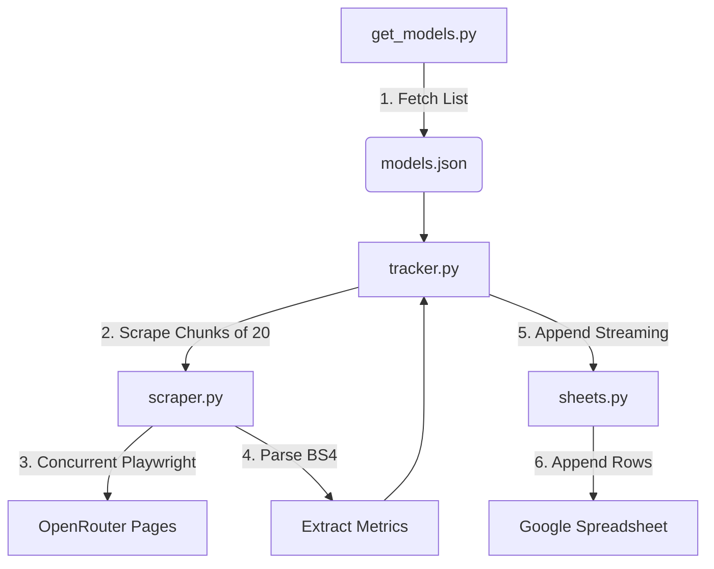

# OpenRouter Performance Stats Tracker 🚀

An automated parallel scraper that extracts provider-specific performance statistics (Latency, Throughput, Uptime) for **340+** models from the OpenRouter website and aggregates it into a single **Google Spreadsheet Dashboard**.

---

## 🛠️ System Architecture

The workflow splits responsibilities across 4 discrete asynchronous layers:



---

## 📦 File Breakdown & Snippet Analysis

### 1️⃣ `get_models.py` (The Indexer)
Fetches every model endpoint dynamically over a rapid JSON rest connection.

```python
def get_model_slugs():
    url = 'https://openrouter.ai/api/v1/models'
    r = requests.get(url)
    data = r.json()
    return [item["id"] for item in data["data"] if "id" in item]
```
> **Purpose:** Ensures continuous scraper execution knows absolute endpoints to visit today relative to model releases tomorrow!

---

### 2️⃣ `scraper.py` (The Scraper)
Uses **Playwright Async** headless browser isolate frames.

```python
# Allocated Concurrency via Semaphore Isolates
semaphore = asyncio.Semaphore(args.concurrency)

async def sem_scrape(model_id):
    async with semaphore:
        page = await browser.new_page()
        res = await scrape_model_providers(page, model_id)
        await page.close()
```
-   **Operation Logic:**
    1.  Navigates to `https://openrouter.ai/{model_id}`.
    2.  Simulates cursor clicks on the **"Providers"** frame directly.
    3.  Extracts `.innerText` layout frames traversals with `BeautifulSoup` to map columns accurately.

---

### 3️⃣ `sheets.py` (The Transmitter)
Builds connections with Google APIs using Desktop Client credential sequences.

```python
# Triggers verification console popup callback loops just once
flow = InstalledAppFlow.from_client_secrets_file('credentials.json', SCOPES)
creds = flow.run_local_server(port=8555)
```
-   **Security Protocol:** Caches session inside `token.json` preventing prompt dialogue timeouts for future cron-triggered automation runs entirely!

---

### 4️⃣ `tracker.py` (The Orchestrator)
Unifies continuous batch streams loop appending lists row-by-row.

```python
chunk_size = 20
for i in range(0, len(model_ids), chunk_size):
    chunk = model_ids[i:i + chunk_size]
    results = await scrape_batch(chunk, concurrency=args.concurrency)
    # Formats row with Timestamp Column
    append_rows(service, spreadsheet_id, rows)
```
> **Purpose:** Protects spreadsheets from **API Quota Exceeds** by doing chunk list packaging rather than monolithic stalls or full iterations blocks.

---

## 🚀 Setup & Execution 

### 1. Download User Auth Credentials
1. Create a Desktop App OAuth Client ID inside **[Google Cloud Console Credentials Screen](https://console.cloud.google.com/)**.
2. Download your JSON Secret dashboard layout and save it as **`credentials.json`** into the project root directory.
3. Enable **[Google Sheets API](https://console.developers.google.com/apis/api/sheets.googleapis.com/overview?project=254356041555)**.

### 2. Run the Workflow
```bash
cd antigravity/openrouter_tracker
uv run python3 tracker.py
```

-   **Test with Limit:** `uv run python3 tracker.py --limit 3`
-   **Customize Parallel Speed Streams:** `uv run python3 tracker.py --concurrency 10`

---

## ⏱️ Daily Automation Configuration (Cron)

To populate benchmarks unattended daily inside your OS backend daemon at **1:00 AM**:

Run `crontab -e` and append:
```bash
0 1 * * * cd /absolute/path/to/openrouter_tracker && /path/to/uv run python3 tracker.py >> tracker_cron.log 2>&1
```
