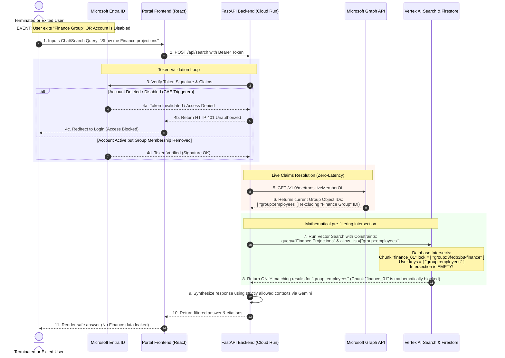

# Reference Guide: Reusing Microsoft SharePoint ACLs in Google Cloud

This document outlines the production strategy for synchronizing and enforcing Microsoft SharePoint Access Control Lists (ACLs) within Google Cloud (BigQuery & Vertex AI Search) to guarantee per-user permission compliance.

---

## 1. Core Pattern: Entra ID Security Group Propagation

We do **not** maintain a separate permissions database in Google Cloud. Instead:
1. We ingest file permissions (Entra ID Group Object IDs) from Microsoft Graph API.
2. We append these Group IDs to document chunks as metadata filters.
3. We resolve the active user's Group memberships during their session.
4. We apply the user's Group IDs as query filters at search time.

```
 [ Microsoft Entra ID ] ──────────────────────┐
          │ (Directory Group Memberships)     │ (User Login via MSAL)
          ▼                                   ▼
 [ SharePoint Online ]                 [ React Frontend ]
          │ (Document Files)                  │ (Bearer JWT Token)
          ▼                                   ▼
 [ Cloud Run Ingestion ]               [ FastAPI Backend ]
  - Extracted Chunks                    - Validates JWT
  - Attends Group IDs                   - Resolves User Groups
          │                                   │
          ▼                                   ▼
 [ Vertex AI Vector Search ] <────────────────┘
  - Index Query with Filter: 
    "allowed_groups: ANY(group_1, group_2)"
```

---

## 2. Ingestion: Extracting permissions from Microsoft Graph

During the document discovery and download phase, the Ingestion Service queries the permissions for each file.

### HTTP Request
```http
GET https://graph.microsoft.com/v1.0/drives/{drive-id}/items/{item-id}/permissions
Authorization: Bearer {Connector_Access_Token}
```

### JSON Response (Example)
```json
{
  "value": [
    {
      "id": "perm_908231",
      "roles": ["read"],
      "grantedToIdentitiesV2": [
        {
          "siteGroup": {
            "displayName": "Finance Department",
            "id": "3f4db3b8-6874-4b5b-8d02-8f92931a293f" 
          }
        }
      ]
    }
  ]
}
```
*Note: The `id` (e.g., `3f4db3b8-6874-4b5b-8d02-8f92931a293f`) is the immutable **Microsoft Entra ID Object ID** for the security group.*

---

## 3. Storage: Mapped ACLs in Vertex AI & BigQuery

### A. Vertex AI Vector Search (Index Metadata)
When uploading document chunks (embeddings) to the Vector Index, we format the metadata file as follows:

```json
{
  "id": "chunk_doc_001_p3",
  "embedding": [0.123, -0.456, ...],
  "restricts": [
    {
      "namespace": "allowed_groups",
      "allow_list": [
        "group::3f4db3b8-6874-4b5b-8d02-8f92931a293f",
        "group::employees"
      ]
    }
  ]
}
```

### B. BigQuery Metadata Catalog
For relational metadata queries, we store the allowed groups array inside the table schema:
```sql
CREATE TABLE sharepoint_catalog_ds.document_metadata (
  doc_id STRING,
  filename STRING,
  customer_scope STRING,
  allowed_groups ARRAY<STRING>  -- ["3f4db3b8-6874-4b5b-8d02-8f92931a293f", "employees"]
);
```

---

## 4. Query Time: Resolving & Filtering

### Step 1: Resolving User Groups
When the user queries the chatbot, the backend retrieves their active directory groups from Microsoft Graph API:
```python
async def get_user_entra_groups(user_bearer_token: str) -> list[str]:
    async with httpx.AsyncClient() as client:
        response = await client.get(
            "https://graph.microsoft.com/v1.0/me/transitiveMemberOf",
            headers={"Authorization": f"Bearer {user_bearer_token}"}
        )
        data = response.json()
        # Extract group Object IDs
        return [item["id"] for item in data["value"] if "id" in item]
```

### Step 2: Filtering Vector Search
When querying Vertex AI Vector Search, the backend appends the user's groups as metadata pre-filters, preventing unauthorized document context from ever being sent to the Gemini model prompt:

```python
from google.cloud import aiplatform

# Initialize index client
index_client = aiplatform.gapic.IndexServiceClient(client_options=...)

# Construct query with filter
query = aiplatform.gapic.IndexQuery(
    datapoint=aiplatform.gapic.IndexDatapoint(feature_vector=query_embedding),
    neighbor_count=5,
    # Match any allowed_groups namespace that intersects with the user's groups
    constraints=[
        aiplatform.gapic.IndexQuery.Constraint(
            namespace="allowed_groups",
            allow_list=["group::3f4db3b8-6874-4b5b-8d02-8f92931a293f", "group::employees"]
        )
      ]
)
```

### Step 3: Filtering BigQuery (Row-Level Security)
For metadata reports (BigQuery), we apply Row-Level Security policies that dynamically filter queries using the user's active groups:

```sql
CREATE ROW ACCESS POLICY user_group_filter_policy
ON sharepoint_catalog_ds.document_metadata
GRANT TO ('user:finance.lead@company.com') -- Session identity mapped in WIF
FILTER USING (
  EXISTS(
    SELECT 1 FROM UNNEST(allowed_groups) AS g 
    WHERE g IN ('3f4db3b8-6874-4b5b-8d02-8f92931a293f', 'employees')
  )
);
```

---

## 5. Handling Dynamic Permission Changes (Real-Time Enforcement)

To handle permission updates in SharePoint without rebuilding the vector database index from scratch, we employ two distinct synchronization loops:

### 1. File-Level Permission Changes (Delta Sync Crawler)
When a file's Access Control List is modified in SharePoint (e.g. group removed, inheritance broken):
*   **Change Notifications (Webhooks):** The ingestion pipeline subscribes to Microsoft Graph resource change notifications. Alternatively, it executes a delta crawl:
    `GET https://graph.microsoft.com/v1.0/drives/{drive_id}/root/delta`
*   **Permission Refresh:** The Graph API `/delta` response flags metadata updates on modified items. For these items, the crawler fetches the updated permissions:
    `GET https://graph.microsoft.com/v1.0/drives/{drive_id}/items/{item_id}/permissions`
*   **Metadata Patching:** Instead of recreating embeddings, the crawler issues a metadata patch request to update the `allowed_groups` allow-list for the existing document ID inside Vertex AI Search. This update takes effect in seconds.

### 2. User-Level Membership Changes (Zero-Latency Claim Check)
When a user is added to or removed from an Entra ID security group:
*   **No DB Sync Required:** User membership mapping is never duplicated inside Google Cloud.
*   **On-the-Fly Token Claims:** When a user submits a search query, their active Microsoft bearer token is used to call the Graph API:
    `GET https://graph.microsoft.com/v1.0/me/transitiveMemberOf`
*   **Real-time Revocation:** If a user is removed from a group, that group ID is immediately omitted from their query claims. The vector search restricts block access in real time, preventing data leaks.

---

## 6. End-to-End Flow: Handling User Deletion and Group Exits

To guarantee absolute security and explain why having static Group ID tags mapped to chunks in the GCP database is **100% secure** when group memberships change, the diagram below outlines the runtime transaction loop.

### Mermaid Sequence Diagram



### Key Security Safeguards Demonstrated

1. **Continuous Access Evaluation (CAE) (Steps 3-4):** If the user has been completely deleted or disabled in Microsoft Entra ID, Microsoft immediately flags their token as invalid. The request never makes it past the backend authentication barrier.
2. **Dynamic Key Resolution (Steps 5-6):** The backend queries Microsoft Graph in real time on every user request. The list of resolved group IDs is completely transient—it lives only for the duration of that single API thread.
3. **Pre-Filtering Constraints (Step 7-8):** Vertex AI performs metadata filtering at the hardware/database level **before** nearest-neighbor calculation. A chunk protected by a restricted group cannot be loaded into memory or returned to the application, rendering synchronization lag at the chunk level a non-issue.

