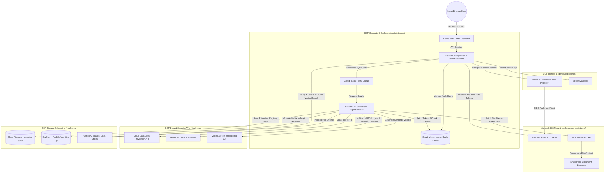
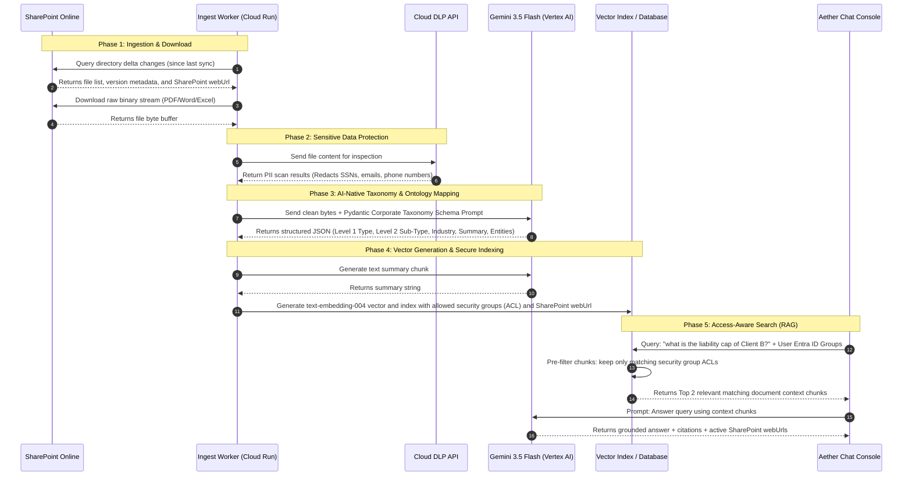

# LOW-LEVEL DESIGN (LLD): SHAREPOINT UNSTRUCTURED DOCUMENT RESTRUCTURING PIPELINE

This document provides the definitive low-level design specification for the secure, AI-powered SharePoint Document Ingestion, Classification, and Semantic Search Portal.

---

## 1. Solution & Architecture Summary

The solution is an enterprise-grade metadata extraction and semantic search platform designed to ingest unstructured documents (PDFs, Word documents, spreadsheets) from Microsoft SharePoint Online, automatically scan them for sensitive data (DLP), classify them against a three-level corporate taxonomy using **Gemini 3.5 Flash**, and index their contents securely for role-based retrieval.

### How the Solution Looks and Behaves in Production:
*   **The Ingestion Console (UI):** A clean, architectural interface where legal, finance, or HR administrators connect their Microsoft accounts, search for active SharePoint Sites, select libraries, and trigger ingestion runs.
*   **The Review Queue (HITL):** Documents pass through an active crawler. High-confidence extractions are automatically approved and indexed. Low-confidence extractions or files containing discrepancies are routed to a human-in-the-loop validation console showing Gemini's extraction rationale side-by-side with override forms.
*   **The Semantic AI Assistant:** Users query the corpus via a flat text console chat interface. Responses are generated by Gemini 3.5 Flash, grounded strictly in documents matching the user's active Microsoft Entra ID security groups, and include direct links to open the original files in SharePoint.

---

## 2. Component Diagram 1: GCP Infrastructure & Hardware Architecture

This diagram shows the target production environment, mapping out the secure boundaries, compute nodes, and managed services on Google Cloud Platform.

---

## 3. Component Diagram 2: Logical Data Flow

This diagram outlines the sequential lifecycle of a document from SharePoint ingestion through security processing, AI-native classification, vector index mapping, and search query retrieval.

---

## 4. Hardware & Infrastructure Component Descriptions

| Component Name | GCP Resource / Service | Technical Function | Tackling Strategy (Production Implementation) |
| :--- | :--- | :--- | :--- |
| **Portal Frontend** | Cloud Run (Vite React container) | Serves the user interface, role selector, document list view, and chat drawer. | Deploy as a serverless container. Configure IAM permissions to restrict public access; traffic must pass through the Google Cloud Load Balancer (GCLB) with Identity-Aware Proxy (IAP) enabled. |
| **Ingestion Backend** | Cloud Run (FastAPI container) | Handles REST APIs, orchestrates task queues, validates human edits, and manages MSAL tokens. | Run as an autoscale-to-zero container. Configure internal-only ingress (accepting requests only from GCLB/IAP and Frontend service). |
| **Ingest Worker** | Cloud Run (Background worker) | Performs heavy processing (downloads files from SPO, calls DLP, extracts using Gemini, and indexes vectors). | Configure with a high timeout limit (300s) and large memory limits (1-2GiB) to process larger PDF documents. |
| **Retry Queue** | Cloud Tasks | Manages ingestion pipeline tasks, handling rate-limiting retries (HTTP 429) from SharePoint and Gemini. | Create a Cloud Tasks queue with max concurrency throttled (e.g. 5 concurrent worker threads) to prevent exceeding API quota limits. |
| **Auth Cache** | Cloud Memorystore (Redis) | Temporarily caches active Microsoft MSAL token states and device login flows. | Enable a small, private Redis instance connected via VPC connector to the FastAPI backend. |
| **Workload Identity** | IAM Workforce Pools | Integrates Microsoft Entra ID credentials with GCP service accounts using OIDC federation. | Set up Workforce Identity Federation mapping Entra ID user claims (roles, groups) directly to Google Cloud IAM credentials. |
| **DLP Scan** | Cloud DLP API | Automatically detects and masks sensitive Personally Identifiable Information (PII). | Define a standard DLP inspection template looking for national ID numbers, emails, and phone numbers. |
| **Generative AI** | Vertex AI API | Hosts Gemini 3.5 Flash for metadata extraction, ontology generation, and RAG compilation. | Initialize Vertex AI client explicitly targeting the `global` region with the project set to your core demo project (`vtxdemos`). |
| **Embeddings API** | Vertex AI Embeddings | Generates 768-dimension vector representations using `text-embedding-004`. | Connect backend directly to the endpoint. Embeddings are generated on the fly for each processed document chunk. |
| **State Registry** | Cloud Firestore | Stores the persistent registry state of ingested documents, validation states, and confidence scores. | Deploy in Native Mode. Index documents by `id` and `state`. |
| **Audit Database** | BigQuery | Logs immutable records of human validation choices, exception escalations, and crawler sync history. | Create a single dataset (`governance_audit`) with write-only IAM permissions for the FastAPI service account. |
| **Vector Database** | Vertex AI Search | Houses the secure document vectors and handles similarity search queries. | Provision a Search Engine connected to the unstructured SharePoint data store. Configure pre-filters to execute query-level ACL filtering. |

---

## 5. Logical Component Descriptions & Process Tackling

### 1. Ingestion Crawling & Delta Sync (FR06, FR22):
*   **Logic:** The Ingest Worker queries Microsoft Graph API's `/delta` endpoint for the selected folder. This returns only files modified or added since the last crawler run.
*   **Implementation Strategy:** Store the last synchronization token (`deltaToken`) in Firestore. If the token is empty, execute a full crawl, downloading all documents; otherwise, trigger delta crawls.

### 2. AI-Native Multimodal Extraction (FR01, FR10, FR11, FR12, FR16):
*   **Logic:** Downloaded file bytes are sent directly to Gemini 3.5 Flash along with a structured Pydantic extraction template mapping to the PwC taxonomy.
*   **Implementation Strategy:** To eliminate fragile local PDF/Word conversion libraries that fail on image-based documents, leverage Gemini's multimodal capacity. Pass the document bytes with `application/pdf` or `application/vnd.openxmlformats-officedocument.wordprocessingml.document` MIME type directly in the API payload.

### 3. Human-in-the-Loop QA & Exception Handler (FR13, FR17, FR45):
*   **Logic:** If the confidence rating returned by Gemini for classification is below 80%, or if a processing exception occurs, set document state to `PENDING_QA` or `EXCEPTION` and write the failure reason.
*   **Implementation Strategy:** In the React UI, display low-confidence files in a dedicated queue. Supervisors review Gemini's verbatim extraction rationale and override tags using a dropdown form. Approving tags updates the state to `APPROVED` and refreshes the vector search index.

### 4. Access-Aware Query Retrieval (FR09, FR39):
*   **Logic:** When searching, the user's active Entra ID security groups (from their Microsoft token claims) are matched against the document's allowed security groups (`allowed_groups`).
*   **Implementation Strategy:** Perform query pre-filtering. Pass the allowed groups array as a query filter parameter to the Vertex AI Search API request:
    `filter = "allowed_groups:any(\"group::finance-all\")"`
    This prevents unauthorized document chunks from ever entering the vector search score calculation, eliminating data exposure risks at the index level.

---

## 6. Implementation & Deployment Strategy

To deploy this solution successfully into production:

1.  **Azure App Registration:** Register an application in your Microsoft Entra portal. Set the redirect URIs to the production URL, enable the Delegated Permission scopes (`User.Read`, `Sites.Read.All`, `Files.Read.All`), and retrieve the Client ID and Tenant ID.
2.  **Secret Configuration:** Save the Microsoft Client Secret (if using application credentials) inside GCP Secret Manager as `entra-ms365-mcp-client-secret`.
3.  **VPC & Networking:** Provision a Serverless VPC Access connector in `us-central1` so that Cloud Run services can query Cloud Memorystore (Redis) securely over private IP addresses.
4.  **Cloud Run Deployment:** Build the backend container image using Cloud Build and deploy to Cloud Run. Mount the required environment variables:
    *   `MS365_CLIENT_ID`
    *   `MS365_TENANT_ID`
    *   `GOOGLE_CLOUD_PROJECT=vtxdemos`
    *   `REDIS_HOST`
5.  **IAP Enablement:** Configure Google Identity-Aware Proxy (IAP) in front of the frontend Cloud Run URL, limiting portal login access to your corporate domain emails.
