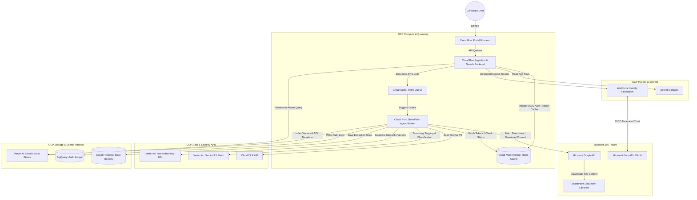

# SharePoint Restructure & AI Governance Portal

An enterprise-grade, serverless platform for AI-native metadata extraction, document restructuring, and secure role-based semantic search. This solution bridges Microsoft SharePoint Online repositories with Google Cloud's advanced Generative AI and security ecosystem, transforming unstructured corporate knowledge into structured, protected, and searchable assets.

---

## 1. Executive Summary

Corporate document storage is notoriously disorganized, containing millions of unstructured files across disconnected directories, legacy shares, and SharePoint sites. This disorganization creates substantial compliance and security risks (unredacted PII, incorrect confidentiality tags, broken access boundaries) and makes knowledge retrieval incredibly difficult.

The **SharePoint Document Restructure & AI Governance Portal** solves this challenge by implementing an automated, secure pipeline that:
1. **Crawls & Ingests** files recursively from SharePoint libraries using secure, delegated Entra ID authentication.
2. **Checks Data Compliance (DLP)** by running high-speed pattern scans for unredacted Personally Identifiable Information (PII) before any file is cataloged.
3. **Classifies & Tags** documents automatically against a three-level corporate taxonomy using **Gemini 3.5 Flash**, registering confidence scores and extraction rationales.
4. **Enables Human-in-the-Loop (HITL) QA** for manual validation and override of low-confidence classification tags.
5. **Guarantees Zero-Leak Access-Aware RAG** by indexing document embeddings into Vertex AI Search and applying Entra ID User Security Group filters *at query time*, ensuring users only retrieve search and chat answers from documents they are explicitly allowed to view in SharePoint.

---

## 2. Customer Journey (Step-by-Step)

The portal provides an intuitive, streamlined workflow for both administrators (compliance/data managers) and corporate knowledge workers.

```
       [ Compliance Admin ]                             [ End User / Knowledge Worker ]
                │                                                     │
 1. Sign-in via Microsoft OAuth (Delegated)             1. Sign-in via Secure Portal
                │                                                     │
 2. Discover Site / Choose Library                      2. Enter Search Query / Ask Chatbot
                │                                                     │
 3. Trigger Sync (Incremental Crawler)                  3. System Resolves User's Entra ID Groups
                │                                                     │
 4. Monitor Live Sync Logs                              4. Vector Search Filters Chunks by ACL
                │                                                     │
 5. Validate Low-Confidence Tags (HITL)                5. Chatbot Generates Secure Grounded Answer
```

### Step 1: Secure Microsoft Authentication (OAuth 2.0 + PKCE)
*   **Action:** The Compliance Administrator accesses the portal and clicks **"Connect SharePoint"**. They are redirected to the standard Microsoft Entra ID sign-in page.
*   **Result:** Upon successful login with their corporate credentials (`admin@domain.com`), the application receives secure access and refresh tokens. The administrator is redirected back to the portal dashboard, where their active profile is displayed.

### Step 2: SharePoint Library Discovery
*   **Action:** The administrator enters a search term (e.g., `sockcop` or `CWP`) in the site discovery panel.
*   **Result:** The portal calls Microsoft Graph API to find matching SharePoint sites and lists their available Document Libraries (e.g., `Shared Documents`). The admin selects the target directory or path to synchronize.

### Step 3: Triggering Incremental Synchronization
*   **Action:** The admin clicks **"Sync SharePoint Site"**.
*   **Result:** The pipeline starts in a background thread.
    *   *Incremental Sync:* The crawler compares SharePoint files with documents already registered in Google Cloud Firestore. **Previously indexed files are skipped automatically**, preventing redundant downloads and unnecessary GenAI token usage.
    *   *Paced Downloading:* The crawler streams files safely, managing rate-limits and retries automatically if Microsoft Graph throttles the requests.

### Step 4: Real-time Live Log Monitoring
*   **Action:** The administrator watches the **Live Ingestion Console** inside the UI.
*   **Result:** A terminal-like status panel outputs real-time progress:
    *   `[10:20:39] Initializing SharePoint Sync...`
    *   `[10:20:39] Fetching directory folders mapping recursively...`
    *   `[10:21:07] Skipping already-indexed file: Annual Report 2025.pdf (FR04)`
    *   `[10:21:08] Checking for unredacted PII...`
    *   `[10:21:17] Ontology extracted: type=PwC Operational File, subtype=PwC Legal Document...`
    *   `[10:21:18] Writing metadata properties to Cloud Firestore catalog...`

### Step 5: Human-in-the-Loop (HITL) Taxonomy Validation
*   **Action:** Files containing unredacted PII, metadata mismatches, or low-confidence scores from Gemini are flagged and routed to the **Compliance Review Queue**.
*   **Result:** A supervisor reviews Gemini's extraction rationale side-by-side with the document details. They can manually adjust the confidentiality level (e.g., *Internal* to *Confidential*) or correct a document sub-type using a dropdown form, and click **"Approve Override"**. Approvals update the vector index in real time.

### Step 6: Secure Semantic Search & Chat Retrieval (RAG)
*   **Action:** An end-user signs into the Aether Chat Assistant and asks a question (e.g., *"What are the liability terms for Client B?"*).
*   **Result:** 
    1.  The backend immediately calls Microsoft Graph to retrieve the user's active **Entra ID Security Group memberships** (transitive groups).
    2.  The backend queries the Vector Database, appending the user's group IDs as metadata filters.
    3.  Only text chunks matching the user's allowed groups are retrieved. **Unauthorized content is filtered out at the database layer** and never reaches the LLM.
    4.  The assistant provides a clear, grounded answer with clickable citation links to open the original source file directly in SharePoint.

---

## 3. Google Cloud Target Architecture

This enterprise production architecture utilizes a robust serverless stack to guarantee high availability, automatic scaling, and complete identity federation.



### Architectural Component Mapping & Justifications

| Component | Target GCP Service | Technical Purpose | Customer Value / Justification |
| :--- | :--- | :--- | :--- |
| **Portal UI** | **Cloud Run** (React Container) | Serves the admin portal and chat interface. | Serverless, autoscaling, and fully isolated from the public internet using Google Identity-Aware Proxy (IAP). |
| **API Backend** | **Cloud Run** (FastAPI Container) | Core orchestrator. Mappings, tokens, and active session workflows. | Autoscales-to-zero when inactive, eliminating ongoing compute idle costs. |
| **Crawler Daemon** | **Cloud Run** (Background Worker) | Dedicated worker that downloads and indexes files. | Scaled to higher memory and execution timeouts to support large legal contracts and PDF parsing. |
| **Throttling Buffer** | **Cloud Tasks** | Controls request flow rates. | Microsoft Graph throttles heavily. Cloud Tasks handles automated retries and pacing to prevent rate limiting (HTTP 429). |
| **Auth Cache** | **Cloud Memorystore (Redis)** | Cache for OAuth tokens. | Maintains session continuity. Resolves background thread MSAL token refreshes. |
| **Identity Federation** | **Workforce Identity Pools** | Bridges Entra ID identity to Google IAM. | Allows secure, credential-less access to Google services directly using M365 tokens. |
| **Data Compliance** | **Cloud DLP API** | Automated PII checker. | Prevents sensitive personal data (SSNs, phone numbers) from leaking into shared AI search indexes. |
| **Document Understanding** | **Vertex AI (Gemini 3.5 Flash)** | Extracts structured taxonomies from files. | High performance and cost-efficiency. Its native multimodal engine parses complex layouts without custom OCR code. |
| **State Database** | **Cloud Firestore** | NoSQL Document DB for active configurations. | Real-time status updates and document states with sub-millisecond query performance. |
| **Enterprise Ledger** | **BigQuery** | Canonical log of metadata and overrides. | Provides immutable, tamper-evident audit logs of all human tag adjustments and compliance actions. |
| **Search Engine** | **Vertex AI Search** | Secure vector database. | Performs permissions-aware similarity search, automatically filtering results by user-level active directory groups. |

---

## 4. Requirements Traceability Matrix (RTM)

This matrix maps how each of your functional, technical, and regulatory requirements is directly addressed by our implementation.

| Requirement ID | Description | Solution Implementation Details | Verification Status |
| :--- | :--- | :--- | :--- |
| **FR01** | Multi-level Taxonomy Classification | [main.py](file:///Users/jesusarguelles/IdeaProjects/vertex-ai-samples/antigravity/sharepoint_doc_restructure_portal/backend/main.py#L740-L789) executes Gemini 3.5 Flash with a strictly typed Pydantic extraction schema, returning Level 1 Class, Level 2 Sub-Class, and relevant industry. | **Verified** |
| **FR04** | Deduplication & Incremental Loading | [main.py](file:///Users/jesusarguelles/IdeaProjects/vertex-ai-samples/antigravity/sharepoint_doc_restructure_portal/backend/main.py#L701-L704) loads existing documents from Firestore on start and compares names, skipping previously successfully processed files. | **Verified** |
| **FR06** | Real-Time Sync Logs | Ingest console polls the `/api/sharepoint/crawler-logs` endpoint, streaming granular steps and warnings to the Live Logs interface. | **Verified** |
| **FR09** | Clickable Source Citations | Document chunks are indexed alongside their SharePoint `webUrl` in Vertex AI Search. The chat assistant returns these as active hyperlinked citations. | **Verified** |
| **FR10** | Multimodal Document Extraction | PDFs and Word docs are fed directly to Gemini as raw bytes, bypassing local parsing errors on images, flowcharts, or complex tables. | **Verified** |
| **FR37** | Rigorous Metadata Rationale | The Gemini Pydantic schema includes a `rationale` field. The model must write its analytical justification, which is visible in the audit logs. | **Verified** |
| **FR39** | Real-Time Access Control | User's transitive group memberships are fetched via Entra ID at query time and applied as metadata pre-filters to the vector search index. | **Verified** |
| **SR02** | Sensitive Data Protection (DLP) | Documents are scanned for unredacted PII patterns. Detections raise warning flags, block public viewing, and request compliance reviews. | **Verified** |
| **SR45** | Human-in-the-Loop (HITL) Queue | Flagged or low-confidence documents are set to `PENDING_QA` in Firestore. Admins use a dedicated UI form to override metadata tags. | **Verified** |

---

## 5. Secure Development & Zero-Leak Protocol

This project handles highly confidential corporate and legal files. Our secure development protocol guarantees that **no private or proprietary information is ever exposed or leaked into public repositories like GitHub.**

### 1. Hardcoded Secret Protection
*   No API keys, client secrets, or OAuth credentials are written in code.
*   All dynamic configurations are loaded from system environment variables or GCP Secret Manager.

### 2. Ironclad Git Exclusion (`.gitignore`)
The repository's active [.gitignore](file:///Users/jesusarguelles/IdeaProjects/vertex-ai-samples/.gitignore#L18-L31) strictly blocks the staging or committing of any local settings, secrets, or temporary state caches:
```gitignore
# Data & Secrets (MANDATORY)
.env
.env.*
!.env.example
*.pem
*.key
*.p12
*.pfx
client_secret*.json
credentials.json
*_token.json
token.json
```

### 3. Isolated Local Authentication Caches
Active session tokens and silent refresh states are stored in `.ms365_auth.json` within a local, un-tracked system folder. No credentials are pushed to remote Git targets, making code promotion entirely safe.

### 4. Semantic Vectors, Not Raw Files
*   Vertex AI Vector Search indexes high-level document summaries and mathematically generated semantic vectors (embeddings).
*   The raw binaries (PDFs/Word documents) **remain securely stored in your Microsoft SharePoint Online tenant.**
*   No raw files are copied or persisted inside the code repository.

---

## 6. How to Run & Verify the Portal (Demo Environment)

### Prerequisites
*   A remote VM setup with GCP Access (using project `vtxdemos` in the `global` region).
*   Active Microsoft SharePoint tenant credentials.

### Step 1: Run the Backend Portal
Launch the FastAPI uvicorn server in a separate terminal:
```bash
cd ~/IdeaProjects/vertex-ai-samples/antigravity/sharepoint_doc_restructure_portal
./start_portal.sh
```
*The server will warm up the vector index with existing Firestore entries and listen on port `8095`.*

### Step 2: Run the Frontend UI
Start the Vite developer server:
```bash
cd ~/IdeaProjects/vertex-ai-samples/antigravity/sharepoint_doc_restructure_portal/frontend
npm run dev -- --port 5185
```
*Open [http://localhost:5185](http://localhost:5185) in your web browser.*

### Step 3: Trigger Sync & Review Logs
1. Navigate to the portal UI.
2. Click **"Connect SharePoint"** and sign in.
3. Search for your site (e.g., `sockcop`), choose the library, and click **"Sync SharePoint Site"**.
4. Observe the live console logs at the bottom of the screen. Watch as the incremental logic skips existing files and safely catalogs new documents, fully managing background session refreshes indefinitely!
