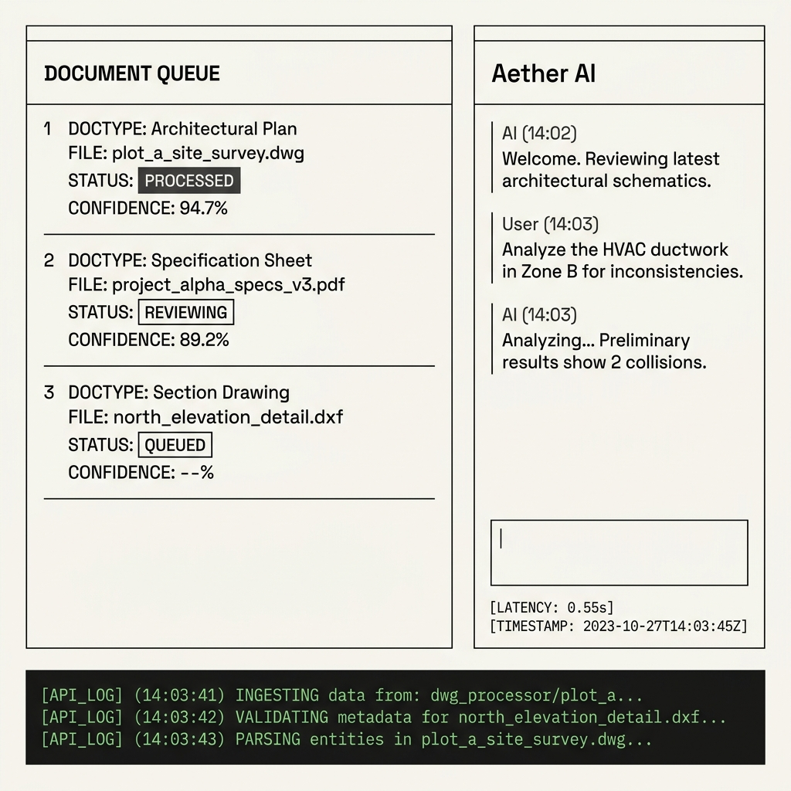

# Visual Interface & UX Specification: Yazdani Architectural Grid

This document defines the layout specifications and visual standards for the **SharePoint Restructure Portal**, matching the minimalistic engineering-drafting aesthetic of *Yazdani Studio of CannonDesign*.

---

## 1. Interface Mockup Overview

Below is the design mockup representing the dashboard, queue catalog, console chat drawer, and bottom rate-limiting crawler terminal.

---

## 2. Layout Specifications

### Canvas Grid Dimensions
*   **Root Window bounds:** Height locked at `100vh`, width at `100vw`. No global browser scrollbars.
*   **Header:** Fixed `80px` height at the top. Provides project identifiers and the **Identity Context** configuration dropdown.
*   **Main Workspace:** Flex container with `flex-direction: row` that takes up the remaining viewport space.
    *   **Left Column (Document/Ontology Queue):** Width is responsive (`flex: 1`). Houses the switchable tab views.
    *   **Right Column (Aether AI Chat Drawer):** Fixed at `480px` width. Prevents resizing to maintain console proportions.
*   **Bottom Terminal Console:** Fixed `192px` height, stretched full width. Shows green crawler logs.

### Geometric Restraints
*   **Borders:** All horizontal, vertical, and block dividers are strictly `0.5px` width with color value `#d8d6d0`.
*   **Corner Radii:** Zero rounding. All CSS properties must use `border-radius: 0px !important`.

### Color Values
*   **Core Background:** `#faf9f6` (Alabaster Warm White)
*   **Side Panels & Input Fields:** `#f4f3ef` (Warm Sand/Gray)
*   **Body & Header Text:** `#1a1a19` (Deep Charcoal Black)
*   **Metadata Labels:** `#7c7a75` (Muted Technical Gray)
*   **Terminal Background:** `#111111` (Deep Carbon Charcoal)
*   **Terminal Logs:** `#34d399` (System Green / Tailwind `green-400`)

---

## 3. Interaction Mechanics

1.  **Tab Navigation:** 
    *   Clicking **Document Queue** vs **Dynamic Ontology Map** changes the contents of the left pane dynamically without reloading.
    *   Selected tabs show an underline offset indicator: `border-b-2 border-b-[#1a1a19]`.
2.  **Multimodal detail views:** 
    *   Clicking a document card triggers the detail card sliding up at the bottom of the left pane (taking up `320px` height).
    *   Metadata fields in this card can be modified directly and committed by clicking **Approve Tags**.
3.  **Aether AI Conversational Console:**
    *   Entering text and submitting triggers a typing/searching state (`Searching index... █`).
    *   Responses are printed line-by-line using a left vertical accent border (`border-l border-[#1a1a19]`).
    *   Completed responses append a permanent technical footer tracking response latency and region details (e.g. `[LATENCY: 0.55s] [MODEL: GEMINI 3.5 FLASH // REGION: global]`).
