# 🛡️ SharePoint Sentinel: AI-Powered Sensitivity Classifier

> **Next-Gen Enterprise Data Security powered by Google Agent Development Kit (ADK) & Vertex AI**


---

## 🚀 Overview

**SharePoint Sentinel** is an intelligent agent that autonomously monitors your corporate SharePoint document libraries. It detects new or modified files and uses the advanced reasoning capabilities of **Gemini 3 Flash Preview** (via Google ADK) to analyze, classify, and tag documents based on their sensitivity.

It's not just a script; it's a **Compliance Officer in a Box**.

### key Features
*   **🧠 Agentic Architecture**: Built on **Google ADK**, using `LlmAgent` and `Runner` for robust, stateful execution.
*   **⚡ Delta Query Polling**: Efficiently fetches *only* changed files using Microsoft Graph Delta Query.
*   **📄 Universal Ingestion**: Automatically converts Office docs (PPTX, DOCX, XLSX) to text using `MarkItDown`.
*   **🔒 Zero-Leak Output**: Generates strictly structured JSON reports suitable for automated DLP pipeline integration.
*   **🌍 Global Scale**: Configured for `global` location to access the latest experimental models.

---

## 🏗️ Architecture

The agent follows an event-driven pipeline, transforming raw SharePoint data into structured intelligence.

```mermaid
graph TD
    %% Styling Definitions
    classDef base fill:#fff,stroke:#333,stroke-width:1px,color:#333;
    classDef ms fill:#eef2ff,stroke:#6366f1,stroke-width:2px,color:#4338ca,rx:10,ry:10;
    classDef api fill:#e0e7ff,stroke:#4f46e5,stroke-width:2px,color:#312e81,rx:10,ry:10;
    classDef adk fill:#faf5ff,stroke:#a855f7,stroke-width:2px,color:#6b21a8,rx:10,ry:10;
    classDef gemini fill:#fdf4ff,stroke:#d946ef,stroke-width:3px,color:#86198f,rx:15,ry:15;
    classDef out fill:#ecfdf5,stroke:#10b981,stroke-width:2px,color:#065f46,rx:10,ry:10;

    subgraph MS ["Microsoft 365 Environment"]
        direction TB
        DL["📄 Document Library"]:::ms
        API["⚡ Graph API Delta Query"]:::api
    end

    subgraph AR ["ADK Agent Runtime"]
        direction TB
        Con["🔌 SharePoint Connector"]:::adk
        Conv["🔄 MarkItDown Converter"]:::adk
        Runner["🚀 ADK Runner"]:::adk
        Agent["✨ LlmAgent (Gemini 3)"]:::gemini
    end

    subgraph IL ["Intelligence Layer"]
        direction TB
        Report["📊 classification_report.json"]:::out
        State["💾 sync_state.json"]:::out
    end

    DL -->|Change Event| API
    API -->|JSON Metadata| Con
    Con -->|Download File| Conv
    Conv -->|Text Content| Runner
    Runner -->|Prompt + Content| Agent
    Agent -->|Structured Classification| Runner
    Runner -->|Append| Report
    Con -->|Update Token| State

    %% Link Styling
    linkStyle default stroke:#64748b,stroke-width:1px,fill:none;

    %% Subgraph Styling
    style MS fill:#f8fafc,stroke:#94a3b8,stroke-width:1px,stroke-dasharray: 5 5
    style AR fill:#fcfaff,stroke:#c084fc,stroke-width:1px,stroke-dasharray: 5 5
    style IL fill:#f0fdf4,stroke:#86efac,stroke-width:1px,stroke-dasharray: 5 5
```



---

## 🛠️ Prerequisites

Before you begin, ensure you have the following:

1.  **Python 3.12+**: Managed preferably by `uv`.
2.  **Microsoft Entra ID App**:
    *   **Permissions**: `Files.Read.All`, `Sites.Read.All` (Application permissions).
    *   **Secrets**: Client ID, Tenant ID, Client Secret.
3.  **Google Cloud Project**:
    *   **APIs Enabled**: Vertex AI API.
    *   **Quota**: Access to `gemini-3-flash-preview`.

---

## ⚡ Getting Started

### 1. Installation

Clone the repository and install dependencies using `uv` (the lightning-fast Python package manager).

```bash
# Install dependencies
uv sync
```

### 2. Configuration

Create a `.env` file in the root directory. This is **CRITICAL** for authentication.

```env
# Microsoft 365 Auth
TENANT_ID=your-tenant-id
CLIENT_ID=your-client-id
CLIENT_SECRET=your-client-secret
SITE_ID=your-sharepoint-site-id
DRIVE_ID=your-drive-id

# Google Cloud Auth
GOOGLE_CLOUD_PROJECT=your-project-id
GOOGLE_CLOUD_LOCATION=global
GOOGLE_GENAI_LOCATION=global  # Force global for Gemini 3
```

#### 🔑 Obtaining Microsoft Credentials

Detailed steps to acquire the 5 required Microsoft identity values:

**A. App Registration (Tenant, Client, Secret)**
1.  **Azure Portal**: [App Registrations](https://portal.azure.com/#view/Microsoft_AAD_IAM/ActiveDirectoryMenuBlade/RegisteredApps) -> **New registration**.
    *   **Name**: `SharePoint-Sentinel`
    *   **Type**: "Accounts in this organizational directory only".
2.  **Overview Page**: Copy **TENANT_ID** (Directory ID) and **CLIENT_ID** (Application ID).
3.  **Certificates & Secrets**: Create a "New client secret". Copy the **Value** (this is your **CLIENT_SECRET**) immediately.

**B. Grant API Permissions**
1.  **API Permissions** -> **Add a permission** -> **Microsoft Graph** -> **Application permissions**.
2.  Select `Sites.Read.All` and `Files.Read.All`.
3.  **IMPORTANT**: Click **"Grant admin consent for [Your Org]"** until you see green checkmarks.

**C. Finding Site & Drive IDs**
Use [Microsoft Graph Explorer](https://developer.microsoft.com/en-us/graph/graph-explorer):
1.  **SITE_ID**: Run `GET https://graph.microsoft.com/v1.0/sites/yourtenant.sharepoint.com:/sites/YourSiteName`. The `id` in the response is your **SITE_ID**.
2.  **DRIVE_ID**: Run `GET https://graph.microsoft.com/v1.0/sites/{SITE_ID}/drives`. Copy the `id` of the target document library (e.g., "Documents").

### 3. Run the Agent

Execute the agent. It will verify your credentials, sync changes, and start classifying.

```bash
uv run python classifier_agent.py
```

---

## 📊 Output Data Model

The agent produces a **strict JSON schema** (`classification_report.json`). No parsing required.

```json
[
  {
    "file_uid": "01Y...XA",
    "filename": "Quarterly_Financials.xlsx",
    "sensitivity_level": "High",
    "contains_pii": true,
    "classification_tags": ["Financial", "Confidential", "Internal"],
    "summary": "Detailed revenue breakdown for Q3 2025 including employee payroll data.",
    "reasoning": "Contains explicit salary information and non-public revenue figures.",
    "recommended_action": "Encrypt and restrict access to Finance group."
  }
]
```

### Sensitivity Levels
| Level | Description |
| :--- | :--- |
| **High** | PII, Credentials, Financial Data. Requires encryption. |
| **Medium** | Internal memos, project plans, non-public info. |
| **Low** | Public marketing materials, generic templates. |

---

## 🔧 Troubleshooting

### Common Issues

| Error | Cause | Fix |
| :--- | :--- | :--- |
| `404 Publisher Model Not Found` | Wrong Location | Ensure `GOOGLE_CLOUD_LOCATION=global` in `.env`. |
| `429 Too Many Requests` | SharePoint Throttling | The script automatically backs off. Wait a few minutes. |
| `KeyError: 'file'` | Invalid processing | The script skips folders automatically, but check if user permissions changed. |
| `ImportError: google.adk` | Missing dependency | Run `uv sync` or `uv add google-adk`. |

---
*Built with ❤️ by the Google Cloud AI Team.*
