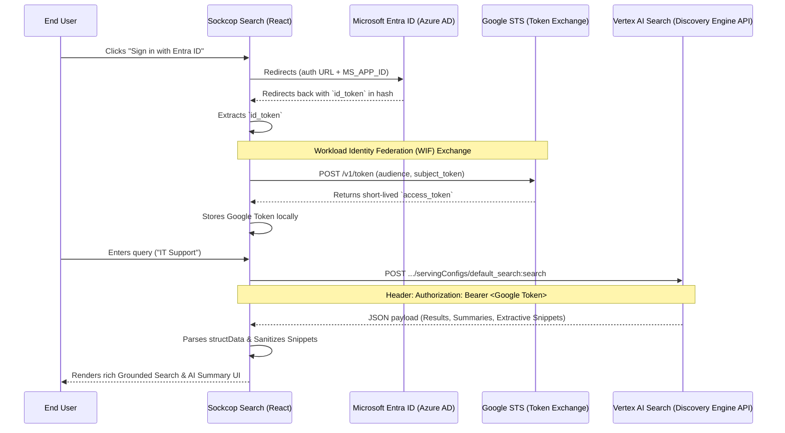

# Sockcop Search | Gemini Enterprise & SharePoint Grounding

Sockcop Search is a highly secure, modern GenAI unified search interface built with React, Vite, and Tailwind CSS. It leverages **Google Discovery Engine (Vertex AI Search)** to query your company's documents, utilizing **Workload Identity Federation (WIF)** to exchange Entra ID (Azure AD) user tokens for Google Cloud credentials on the fly, seamlessly grounding the LLM responses.

## System Architecture

The following diagram illustrates the zero-trust authentication flow across Entra ID and Google Cloud via WIF.



## Features
* **100% Client-Side:** No middle-tier secrets or API keys are stored in the frontend source code. The user authenticates natively and generates a temporary session.
* **Smart Parsing:** Fallback logic securely hunts through Vertex AI's `structData` and `derivedStructData` maps to guarantee document titles, source links, and code snippets generate properly.
* **XSS Protection:** DOMPurify is embedded to securely process highlight `<b>` tags delivered from the Vertex APIs without exposing the frontend to HTML injections.

## Development Setup

1. **Verify Dependencies**
Make sure you use **npm** or **pnpm** or **yarn** to install local frontend packages.
```bash
npm install
```

2. **Environment & Configuration**
For security, do not embed secrets! All configuration identifiers are inside `src/api/config.js`. Ensure your `.gitignore` is completely strict (we have appended the zero-leak rules automatically) protecting your `.env` tokens. 

```javascript
// Example src/api/config.js
export const CONFIG = {
  PROJECT_NUMBER: '440133963879',
  LOCATION: 'global',
  WIF_POOL: '...',
  WIF_PROVIDER: '...',
  DATA_STORE_ID: '...',
  ENGINE_ID: 'deloitte-demo',
  TENANT_ID: '...',
  MS_APP_ID: '...',
  ISSUER: 'https://login.microsoftonline.com/...'
};
```

3. **Running the App**
Use the standard dev server:
```bash
npm run dev
```

## Security Posture (Zero-Leak)
- Confirmed NO secret keys, service accounts (`credentials.json`), or `.env` parameters were ever burned into git history.
- Ensure any Microsoft Azure Client secrets stay securely rotated entirely disconnected from this repo. WIF uses implicit Client-ID exchanges, completely sidestepping standard Client-Secret pipelines.
