# Sockcop Search | Gemini Enterprise & SharePoint Grounding

Sockcop Search is a highly secure, modern GenAI unified search interface built with React, Vite, and Tailwind CSS. It leverages **Google Discovery Engine (Vertex AI Search)** to query your company's documents, utilizing **Workload Identity Federation (WIF)** to exchange Entra ID (Azure AD) user tokens for Google Cloud credentials on the fly, seamlessly grounding the LLM responses.


## Core Architecture: Workload Identity Federation Flow

The following diagram illustrates the zero-trust authentication flow across Microsoft Entra ID and Google Cloud via WIF.

```mermaid
sequenceDiagram
    box rgba(15, 23, 42, 0.4) Identity & Access Management
        participant User as End User
        participant Frontend as Sockcop Search UI
        participant EntraID as Microsoft Entra ID
        participant WIF as Google WIF Boundary 🛡️
    end
    box rgba(12, 74, 110, 0.3) Google Cloud Platform
        participant VertexAI as Vertex AI Search
        participant Gemini as Gemini 2.5 Flash
    end
    
    User->>Frontend: Clicks "Sign in with Entra ID"
    Frontend->>EntraID: Redirects for OAuth Consent
    EntraID-->>Frontend: OAuth JWT `id_token`
    
    note over Frontend,WIF: Workload Identity Federation Exchange
    Frontend->>WIF: POST /v1/token (audience, subject_token)
    WIF-->>Frontend: Short-lived Google `access_token`
    Frontend->>Frontend: Stores Google Token locally (In-Memory)
```



## Advanced Architecture: Gemini RAG Fallback Mechanism

When querying Discovery Engine, strict "Out-of-Domain" guardrails can trigger false negatives (e.g., `OUT_OF_DOMAIN_QUERY_IGNORED`), resulting in missing AI summaries even when relevant SharePoint documents are retrieved. **Sockcop Search intercepts these blocked responses, extracts metadata payloads, and delegates unstructured text generation securely to Gemini 2.5 Flash.**


## Key Features

* **Zero-Leak Stateless Architecture:** No middle-tier secrets or API keys are stored in the frontend source code. The user authenticates natively and generates a temporary session with WIF.
* **Intelligent Document Mining:** Fallback logic securely hunts through Vertex AI's `structData` and `derivedStructData` maps to guarantee document titles, source links, and massive context payloads (`extractiveSegments`) generate properly.
* **Conversational Delegation:** Bypasses legacy search UI constraints by handing raw paragraph blocks over to the most advanced Gemini models via `<PROJECT_NUMBER>/locations/us-central1` endpoints.
* **XSS Protection:** DOMPurify is embedded to securely process highlight `<b>` tags delivered from the Vertex APIs without exposing the frontend to HTML injections.

## Development Setup

1. **Verify Dependencies**
Make sure you use **npm**, **pnpm** or **yarn** to install local frontend packages.
```bash
npm install
```

2. **Environment & Configuration**
For security, do not embed secrets! All configuration identifiers are inside `src/api/config.js`. Ensure your `.gitignore` is completely strict (we have appended the zero-leak rules automatically) protecting your `.env` tokens. 

```javascript
// Example src/api/config.js
export const CONFIG = {
  PROJECT_NUMBER: 'YOUR_PROJECT_NUMBER',
  LOCATION: 'global',
  WIF_POOL: '...',
  WIF_PROVIDER: '...',
  DATA_STORE_ID: '...',
  ENGINE_ID: 'deloitte-demo',
  TENANT_ID: '...',
  MS_APP_ID: '...',
  ISSUER: 'https://login.microsoftonline.com/...'
};
```

3. **Running the App**
Use the standard dev server:
```bash
npm run dev
```

