# Sockcop Search | Native Vertex AI Answer Integration & SharePoint Grounding

Sockcop Search is a highly secure, modern GenAI unified search interface built with React, Vite, and Tailwind CSS. It leverages the **Google Vertex AI Answer API** to natively query and summarize your company's documents, utilizing **Workload Identity Federation (WIF)** to exchange Entra ID (Azure AD) user tokens for Google Cloud credentials on the fly, seamlessly grounding the LLM responses.


## Core Architecture: Workload Identity Federation Flow

The following diagram illustrates the zero-trust authentication flow across Microsoft Entra ID and Google Cloud via WIF.

```mermaid
sequenceDiagram
    box rgba(15, 23, 42, 0.4) Identity & Access Management
        participant User as End User
        participant Frontend as Sockcop Search UI
        participant EntraID as Microsoft Entra ID
        participant WIF as Google WIF Boundary 🛡️
    end
    box rgba(12, 74, 110, 0.3) Google Cloud Platform
        participant VertexAI as Vertex AI Answer API
    end
    
    User->>Frontend: Clicks "Sign in with Entra ID"
    Frontend->>EntraID: Redirects for OAuth Consent
    EntraID-->>Frontend: OAuth JWT `id_token`
    
    note over Frontend,WIF: Workload Identity Federation Exchange
    Frontend->>WIF: POST /v1/token (audience, subject_token)
    WIF-->>Frontend: Short-lived Google `access_token`
    Frontend->>Frontend: Stores Google Token locally (In-Memory)
```



## Advanced Architecture: Native Answer API Integration

Sockcop Search relies entirely on the powerful `default_config:answer` endpoint provided by Vertex AI Search. This modern endpoint natively handles the complex Retrieval-Augmented Generation (RAG) pipeline on the backend, ensuring accurate, grounded summarizations without the need for manual, client-side extraction or secondary LLM fallbacks.

```mermaid
flowchart TD
    classDef ui fill:#0f172a,stroke:#38bdf8,stroke-width:2px,color:#fff;
    classDef api border-style:dashed,fill:#1e293b,stroke:#0f172a,color:#e2e8f0;
    classDef extract fill:#082f49,stroke:#0c4a6e,color:#bae6fd;
    classDef rank text-align:center,fill:#f59e0b,stroke:#b45309,color:#fff;

    User(["👤 User Query"]) --> UI("Sockcop React UI")
    UI -- "POST /servingConfigs/default_config:answer\nAuthorization: Bearer <GCP_TOKEN>" --> VAIS{{"Vertex AI Answer API"}}:::api
    
    VAIS -- "Retrieves Documents\nSynthesizes Grounded Answer" --> Extraction["Frontend Deep Extraction\n(Answer Payload & structData)"]:::extract
    
    Extraction --> Score("Extracts Confidence Score (rank)"):::rank
    Extraction --> Link("Extracts SharePoint Source (url_for_connector)"):::rank
    Extraction --> Author("Extracts Document Metadata (author, title)"):::rank
    
    Score --> Render("Displays Generative AI Summary & Detailed Citations"):::ui
    Link --> Render
    Author --> Render
```



## UI Showcase: Native Grounding in Action

### Interactive Citation Panel
Explore grounded sources with deep metadata extraction directly from your connected datastores.


### Native Answer Generation
Vertex AI's `default_config:answer` synthesizing search results and providing fallback-free AI summarizations.


### Original Document Linking
Deeply link directly to the source datastore (e.g. Microsoft SharePoint) to read the full context.


## Key Features

* **Zero-Leak Stateless Architecture:** No middle-tier secrets or API keys are stored in the frontend source code. The user authenticates natively and generates a temporary session with WIF.
* **Native Generation Pipeline:** Replaces legacy, constrained search endpoints with the comprehensive Vertex AI Answer API. Summarization, document retrieval, and grounding citations are generated server-side in one swift request.
* **Intelligent Metadata Mapping:** The UI securely dives into the payload's `structData` schema to render a beautifully formatted citation list. This includes visual indicators for the API's internal Confidence Score (`rank`), origin author, and precise deep links mapped back to the connected SharePoint site.
* **XSS Protection:** DOMPurify is embedded to securely process highlight `<b>` tags delivered from the Vertex APIs without exposing the frontend to HTML injections.

## Development Setup

1. **Verify Dependencies**
Make sure you use **npm**, **pnpm** or **yarn** to install local frontend packages.
```bash
npm install
```

2. **Environment & Configuration**
For security, do not embed secrets! All configuration identifiers are inside `src/api/config.js`. Ensure your `.gitignore` is completely strict (we have appended the zero-leak rules automatically) protecting your `.env` tokens. 

```javascript
// Example src/api/config.js
export const CONFIG = {
  PROJECT_NUMBER: 'YOUR_PROJECT_NUMBER',
  LOCATION: 'global',
  WIF_POOL: '...',
  WIF_PROVIDER: '...',
  DATA_STORE_ID: '...',
  ENGINE_ID: 'deloitte-demo',
  TENANT_ID: '...',
  MS_APP_ID: '...',
  ISSUER: 'https://login.microsoftonline.com/...'
};
```

3. **Running the App**
Use the standard dev server:
```bash
npm run dev
```


## 🚀 Configuration Guide: Azure AD (Entra ID) & Google Cloud WIF

To securely integrate your application as a federated search connector using Gemini Enterprise capabilities, you must configure both Azure AD and GCP's Workforce Identity Federation (WIF). **Crucially, no credentials must be leaked or stored in your frontend.**

### 1. Azure AD (Entra ID) Application Setup
Create your Entra ID applications to serve as the Identity Provider (IdP) and the Datastore Connector:
* **Register a New Application:** (e.g., `deloitte-entraid`)
* **Authentication:** Configure the Redirect URIs for Web / SPA (e.g., `http://localhost:5173/`, `https://auth.cloud.google/signin-callback/...`) and ensure ID Tokens are enabled for implicit/hybrid flows.
* **API Permissions:** Grant delegated permissions appropriate for your needs.
  * For the core Entra ID app: `email`, `openid`, `profile`, `User.Read`.
  * For the SharePoint Datastore app: `Files.ReadWrite.All`, `Sites.Manage.All`, `Sites.Search.All`, `AllSites.Read`, etc.

*Example Screenshots of Entra ID Setup:*


### 2. Google Cloud WIF Configuration
Once the Azure AD app is created, configure the WIF pool and provider in GCP. 

*Run the following commands using the `gcloud` CLI, replacing the placeholder values (`YOUR_TENANT_ID`, `YOUR_CLIENT_ID`, `YOUR_CLIENT_SECRET`) with your actual Entra ID credentials.*

**Create the OIDC Provider in your Workforce Pool:**
```bash
gcloud iam workforce-pools providers create-oidc entra-id-oidc-pool-provider-de \
    --workforce-pool="entra-id-oidc-pool-d" \
    --location="global" \
    --display-name="Entra ID Provider" \
    --description="OIDC provider for Entra ID" \
    --issuer-uri="https://login.microsoftonline.com/YOUR_TENANT_ID/v2.0" \
    --client-id="YOUR_CLIENT_ID" \
    --client-secret-value="YOUR_CLIENT_SECRET" \
    --web-sso-response-type="code" \
    --web-sso-assertion-claims-behavior="merge-user-info-over-id-token-claims" \
    --attribute-mapping="google.subject=assertion.sub,google.groups=assertion.groups,google.display_name=assertion.preferred_username" \
    --attribute-condition='assertion.issuer.startsWith("https://login.microsoftonline.com/YOUR_TENANT_ID")' \
    --detailed-audit-logging
```

### 3. Google Cloud IAM Binding
Grant the necessary permissions to the federated identities so they can query the Vertex AI Answer API:

```bash
# Replace YOUR_PROJECT_ID with your actual project ID
gcloud projects add-iam-policy-binding YOUR_PROJECT_ID \
    --member="principalSet://iam.googleapis.com/locations/global/workforcePools/entra-id-oidc-pool-d/*" \
    --role="roles/discoveryengine.viewer"
```

Once configured, your frontend will securely authenticate via Entra ID, exchange the token using WIF (`entra-id-oidc-pool-d`), and query the Vertex AI Answer API natively.
