  <picture>
    <source media="(prefers-color-scheme: dark)" srcset="./public/assets/hero_banner.svg">
    <source media="(prefers-color-scheme: light)" srcset="./public/assets/hero_banner.svg">
    
  </picture>

<blockquote>
  
<b>SYSTEM LOG:</b> Sockcop Search transcends basic retrieval. It is a high-fidelity, brutalist neo-monolith acting as a secure gateway to your enterprise intelligence. It federates Microsoft Entra ID authentication signals directly into the heart of Google Cloud's Vertex AI Search (Gemini Enterprise) engine without a traditional backend.

</blockquote>

 

  <picture>
    <source media="(prefers-color-scheme: dark)" srcset="./public/assets/arch_diagram.svg">
    <source media="(prefers-color-scheme: light)" srcset="./public/assets/arch_diagram.svg">
    
  </picture>

 

  <picture>
    <source media="(prefers-color-scheme: dark)" srcset="./public/assets/header_topologies.svg">
    <source media="(prefers-color-scheme: light)" srcset="./public/assets/header_topologies.svg">
    
  </picture>

 

## 🔐 Authentication Duality & Identity Mapping

> **REFERENCE ARCHITECTURE:** Ensure you review the official Google Cloud documentation before modifying the baseline security protocol.
> - [Configure Workload Identity Federation (WIF) with Entra ID](https://cloud.google.com/iam/docs/workload-identity-federation-with-deployment-pipelines)
> - [Vertex AI Search: Microsoft SharePoint connector](https://cloud.google.com/generative-ai-app-builder/docs/sharepoint-connector)

The following diagram illustrates the zero-trust authentication flow across Entra ID and Google Cloud via WIF, critical for **TOPOLOGY B**:

```mermaid
%%{init: {
  "theme": "base",
  "themeVariables": {
    "background": "#020617",
    "primaryColor": "#0f172a",
    "primaryBorderColor": "#38bdf8",
    "primaryTextColor": "#e2e8f0",
    "secondaryColor": "#1e293b",
    "tertiaryColor": "#020617",
    "lineColor": "#22d3ee",
    "actorBkg": "#0f172a",
    "actorBorder": "#22d3ee",
    "actorTextColor": "#38bdf8",
    "actorLineColor": "#334155",
    "signalColor": "#4ade80",
    "signalTextColor": "#f8fafc",
    "noteBkg": "#064e3b",
    "noteBorder": "#10b981",
    "noteTextColor": "#a7f3d0",
    "labelBoxBkgColor": "#0f172a",
    "labelBoxBorderColor": "#f43f5e",
    "labelTextColor": "#fda4af",
    "edgeLabelBackground": "#020617",
    "fontFamily": "monospace"
  }
}}%%
sequenceDiagram
    participant User as 👤 [USR]_Operator
    participant Frontend as 💻 [SYS]_Sockcop_Client
    participant EntraID as 🗝️ [AUTH]_Entra_ID
    participant GoogleSTS as 🛡️ [SEC]_Google_STS
    participant VertexAI as 🧠 [AI]_Vertex_Search
    
    User->>Frontend: Clicks "Sign in with Entra ID"
    Frontend->>EntraID: Redirects (auth URL + MS_APP_ID)
    EntraID-->>Frontend: Redirects back with `id_token` in hash
    Frontend->>Frontend: Extracts `id_token`
    
    Note over Frontend,GoogleSTS: Workload Identity Federation (WIF) Exchange
    Frontend->>GoogleSTS: POST /v1/token (audience, subject_token)
    GoogleSTS-->>Frontend: Returns short-lived `access_token`
    Frontend->>Frontend: Stores Google Token locally
    
    User->>Frontend: Enters query ("IT Support")
    Frontend->>VertexAI: POST .../servingConfigs/default_search:search
    Note over Frontend,VertexAI: Header: Authorization: Bearer <Google Token>
    VertexAI-->>Frontend: JSON payload (Results, Summaries, Extractive Snippets)
    
    Frontend->>Frontend: Parses structData & Sanitizes Snippets
    Frontend-->>User: Renders rich Grounded Search & AI Summary UI
```

<blockquote>
  
<b>ARCHITECTURE DUALITY:</b> The Vertex AI Search backend can be consumed via two distinct presentation layers. Choose your methodology.

</blockquote>

<kbd>TOPOLOGY A</kbd> <b>Native Gemini Enterprise Interface (Zero-Code)</b>

 
<table>
  <tr>
    <td valign="top">
      <kbd>EXECUTE</kbd> Navigate to <b>GCP Console</b> &gt; <b>Agent Builder</b> &gt; <b>deloitte-demo</b>.  
      <kbd>DEFINE</kbd> Ensure the SharePoint datastore is connected and fully synced.  
      <kbd>OPERATE</kbd> Click <b>Preview</b> to utilize the out-of-the-box Gemini UI.  
      <kbd>RESULT</kbd> Instantly chat, search, and retrieve grounded financial data directly from Microsoft SharePoint without deploying any custom React code.
    </td>
    <td width="400" valign="top">
      
        
      
    </td>
  </tr>
</table>

 

<kbd>TOPOLOGY B</kbd> <b>Custom React Neo-Monolith (WIF Required)</b>

 
<table>
  <tr>
    <td valign="top">
      <kbd>EXECUTE</kbd> Utilize this repository's precise brutalist UI.  
      <kbd>DEFINE</kbd> This methodology bypasses the preview interface and calls the Discovery Engine API directly using <b>Workforce Identity Federation (WIF)</b> coupled with Entra ID.  
      <kbd>OPERATE</kbd> Follow the rigorous 6-Phase Pipeline below to orchestrate the auth handshake.
    </td>
    <td width="400" valign="top">
      
    </td>
  </tr>
</table>

 

  <picture>
    <source media="(prefers-color-scheme: dark)" srcset="./public/assets/header_config.svg">
    <source media="(prefers-color-scheme: light)" srcset="./public/assets/header_config.svg">
    
  </picture>

<blockquote>
  
<b>SECURITY PROTOCOL:</b> Follow this specific initialization chronological order. Crucially, no credentials must be leaked or stored in your frontend.

</blockquote>

###

<kbd>PHASE 1</kbd> <b>Initial Azure AD (Entra ID) App Setup</b>

 

<table>
  <tr>
    <td width="100" align="center" valign="top"></td>
    <td valign="top">
      <kbd>EXECUTE</kbd> Navigate to <b>Entra ID</b> &gt; <b>App registrations</b>.  
      <kbd>INPUT</kbd> Create the app <code>deloitte-entraid</code>.  
      <kbd>DEFINE</kbd> Under Authentication, add Single-page application and set redirect URI to <code>http://localhost:5173</code>.  
      <kbd>CONFIG</kbd> Under API Permissions, grant <code>User.Read</code>, <code>profile</code>, <code>openid</code>, and <code>email</code>.  
      <kbd>EXTRACT</kbd> Recover your exact payloads shown below.
        
      <code>TENANT_ID: "YOUR_TENANT_ID"</code> 
      <code>MS_APP_ID: "YOUR_CLIENT_ID"</code> 
      <code>ISSUER: "https://login.microsoftonline.com/YOUR_TENANT_ID/v2.0"</code>
    </td>
    <td width="400" valign="top">
      
        
      
    </td>
  </tr>
</table>

 

<kbd>PHASE 2</kbd> <b>Google Cloud Workforce Identity Federation (WIF)</b>

 

<table>
  <tr>
    <td width="100" align="center" valign="top"></td>
    <td valign="top">
      <kbd>EXECUTE</kbd> Navigate to <b>GCP Console</b> &gt; <b>IAM &amp; Admin</b>.  
      <kbd>INPUT</kbd> Create pool named <code>entra-id-oidc-pool-d</code>.  
      <kbd>DEFINE</kbd> Add OIDC Provider. Set <b>Issuer URI</b> and <b>Client ID</b> from Phase 1.  
      <kbd>CONFIG</kbd> Map <code>google.subject</code> to <code>assertion.sub</code>.  
      <kbd>EXTRACT</kbd> Recover the <code>WIF Pool ID</code> and <code>WIF Provider ID</code>.
    </td>
    <td width="400" valign="top">
      
        
      
    </td>
  </tr>
</table>

 

<kbd>PHASE 3</kbd> <b>Google Cloud IAM WIF Binding</b>

 

<table>
  <tr>
    <td width="100" align="center" valign="top"></td>
    <td valign="top">
      <kbd>EXECUTE</kbd> Navigate to <b>GCP Console</b> &gt; <b>IAM &amp; Admin</b>.  
      <kbd>DEFINE</kbd> Bind permissions directly to the WIF-authenticated identities.  
      <kbd>INPUT</kbd> Enter the <code>principalSet://</code> identifier for the WIF pool.  
      <kbd>CONFIG</kbd> Assign <code>Discovery Engine Viewer</code> and <code>Vertex AI User</code> roles.
    </td>
    <td width="400" valign="top">
      
    </td>
  </tr>
</table>

 

<kbd>PHASE 4</kbd> <b>SharePoint Connector App (Background Sync)</b>

 

<table>
  <tr>
    <td width="100" align="center" valign="top"></td>
    <td valign="top">
      <kbd>EXECUTE</kbd> Return to <b>Entra ID</b> &gt; <b>App registrations</b>.  
      <kbd>DEFINE</kbd> Create Service App: <code>sharepoint-datastore</code>.  
      <kbd>CONFIG</kbd> Under API permissions, add Application permissions for Microsoft Graph (<code>Sites.Read.All</code>, <code>Sites.Search.All</code>). <b>Grant Admin Consent</b>.  
      <kbd>INPUT</kbd> Generate a new <b>Client Secret</b>.  
      <kbd>EXTRACT</kbd> Save the <code>Client Secret</code>.
    </td>
    <td width="400" valign="top">
      
        
      
    </td>
  </tr>
</table>

 

<kbd>PHASE 5</kbd> <b>Gemini Enterprise Agent Builder Configuration</b>

 

<table>
  <tr>
    <td width="100" align="center" valign="top"></td>
    <td valign="top">
      <kbd>EXECUTE</kbd> Navigate to <b>GCP Console</b> &gt; <b>Agent Builder</b>.  
      <kbd>DEFINE</kbd> Connect the Entra ID Service App pipeline into the Google Cloud search indexer.  
      <kbd>INPUT</kbd> Create Data Store &gt; SharePoint. Provide Client ID (Phase 4), Tenant ID, and Client Secret.  
      <kbd>CONFIG</kbd> Define the SharePoint Site URLs to index and initiate the sync.  
      <kbd>EXTRACT</kbd> Recover the <code>Datastore ID</code> and <code>Engine ID</code>.
    </td>
    <td width="400" valign="top">
      
    </td>
  </tr>
</table>

 

<kbd>PHASE 6</kbd> <b>Frontend Integration (React App)</b>

 

<table>
  <tr>
    <td width="100" align="center" valign="top"></td>
    <td valign="top">
      <kbd>EXECUTE</kbd> Inject all accumulated identifiers into the Codebase.  
      <kbd>DEFINE</kbd> Update your <code>src/api/config.js</code> file.
        
<pre><code>export const CONFIG = {
  // GCP Configuration
  LOCATION: "global",
  
  // WIF Configuration (Phase 2)
  WIF_POOL: "&lt;YOUR_POOL_ID&gt;",
  WIF_PROVIDER: "&lt;YOUR_PROVIDER_ID&gt;",
  
  // Vertex AI (Phase 5)
  DATA_STORE_ID: "&lt;YOUR_DATA_STORE_ID&gt;",
  ENGINE_ID: "deloitte-demo",
  
  // Entra ID (Phase 1)
  TENANT_ID: "&lt;YOUR_TENANT_ID&gt;",
  MS_APP_ID: "&lt;YOUR_ENTRA_CLIENT_ID&gt;", 
  ISSUER: "https://login.microsoft..."
};</code></pre>
    </td>
    <td width="400" valign="top">
    </td>
  </tr>
</table>

 

  <picture>
    <source media="(prefers-color-scheme: dark)" srcset="./public/assets/header_setup.svg">
    <source media="(prefers-color-scheme: light)" srcset="./public/assets/header_setup.svg">
    
  </picture>

<blockquote>
  
<b>OPERATION:</b> Initialize the monolith terminal sequence.

</blockquote>

<table>
  <tr>
    <td>
      <kbd>EXECUTE</kbd> Install dependencies:  <code>npm install</code>  
      <kbd>EXECUTE</kbd> Start the serverless React client:  <code>npm run dev</code>
    </td>
  </tr>
</table>

