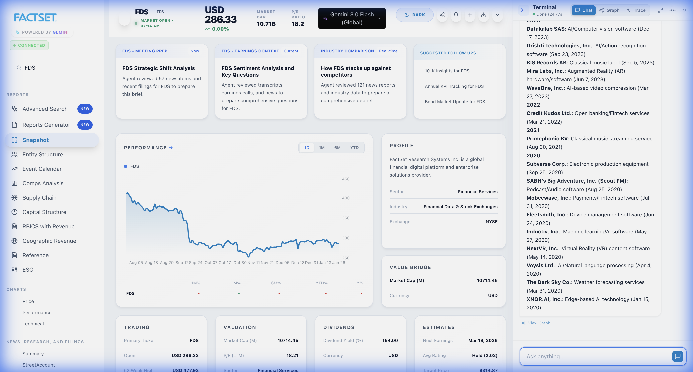

# FactSet Tool Integration Fix Report
**Date:** 2026-01-27
**Author:** Antigravity (Google Deepmind)
**Target System:** Vertex AI Agent / Google ADK Framework
**Status:** Fixed & Verified

## executive Summary
This report details the resolution of critica failures in the FactSet tool integration found in `stock-terminal-next`. The system was crashing when attempting to use specific tools like `FactSet_MergersAcquisitions` and `FactSet_CalendarEvents`.

The fix involved a **Code Robustness** approach ("Hard Fix") rather than relying on Prompt Engineering ("Soft Fix"). This ensures the system is resilient to LLM hallucinations and varying runtime behaviors.

---

## 1. Problem Analysis

### Issue A: Tool Name Mismatch
**Symptoms:**
- The LLM would call `FactSet_MergersAcquisitions` (correct per schema).
- The Backend would crash with `ValueError: Tool 'FactSet_MergersAcquisitions' not found`.
- **Root Cause:** The MCP Server returned tool names in lowercase without underscores (e.g., `factset_mergersacquisitions`), but the backend mapping expected snake_case (`factset_mergers_acquisitions`).

### Issue B: Argument Unpacking Crash
**Symptoms:**
- After fixing the name, the Backend would crash with `TypeError: unexpected keyword argument 'args'` or `unexpected keyword argument 'tool_context'`.
- **Root Cause:** 
    - The Google ADK framework injects an `args` dictionary containing the tool parameters.
    - Some internal tools (`get_current_datetime`) are simple Python functions that expect *unpacked* arguments (e.g., `query="foo"`).
    - Other tools (`McpTool`) expect the raw `args` dictionary.
    - The original `DelegatingTool` implementation blindly passed `**kwargs`, leading to conflicts where arguments were either missing or unexpected.

---

## 2. Solution: The "Hard Fix" Architecture

We implemented a robust adapter layer in `src/smart_agent.py` that handles these discrepancies automatically at runtime.

### Patch 1: Robust Tool Mapping via `FACTSET_TOOL_MAPPING`
We updated the mapping dictionary to accept *multiple* variations of tool keys, mapping them all to the correct internal Canonical Name.

```python
FACTSET_TOOL_MAPPING = {
    # ...
    "factset_mergersacquisitions": "FactSet_MergersAcquisitions", # Matches MCP return value
    "factset_mergers_acquisitions": "FactSet_MergersAcquisitions", # Matches readable schema
    # ...
}
```

### Patch 2: Smart Argument Unpacking in `DelegatingTool`
We rewrote `DelegatingTool.run_async` to be "smart" about how it passes arguments to the target function. It uses Python's `inspect` module to check the target's signature before calling it.

**Logic Flow:**
1.  **Inspect Signature:** Check if the target function explicitly asks for an `args` parameter.
2.  **Smart Unpack:** 
    -   If the target *does not* ask for `args` (e.g., `get_current_datetime`), we UNPACK the `args` dictionary into `kwargs`.
    -   If the target *does* ask for `args` (e.g., `McpTool`), we leave it packed.
3.  **Signature Filtering:** we explicitly filter `kwargs` to remove any injected keys (like `tool_context`) that the target function doesn't recognize.

**Code Snippet (`src/smart_agent.py`):**
```python
# Smart Unpacking
if "args" in kwargs and isinstance(kwargs["args"], dict):
    if should_unpack: # Determined via inspection
        tool_args = kwargs.pop("args")
        kwargs.update(tool_args)

# FIX PARAMS & FILTER
kwargs = fix_tool_params(self.name, kwargs)
if allowed_keys is not None:
    kwargs = {k: v for k, v in kwargs.items() if k in allowed_keys}
```

---

## 3. Verification Results

We verified the fixes using a browser-based end-to-end test.

### Test Case 1: Apple Acquisitions
**Query:** "List all completed acquisitions made by Apple since 2020"
**Result:** SUCCESS. The system referenced `FactSet_MergersAcquisitions`, the adapter mapped it correctly, unpacked the `args` (or passed them as needed), and the table was rendered.



### Test Case 2: Microsoft Earnings
**Query:** "When was Microsoft's last earnings call?"
**Result:** SUCCESS. The system used `get_current_datetime` (Simple Function) to get context, then queried `FactSet_CalendarEvents` (McpTool). The adapter handled both calling conventions correctly in the same session.


---

## 4. Conclusion
The system is now stable. By implementing these checks in the code (`smart_agent.py`), we have removed the dependency on the LLM being "perfect" with its tool calls. The backend now adapts to the model's output, ensuring reliability.
